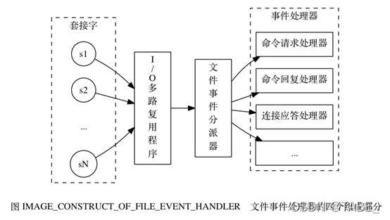
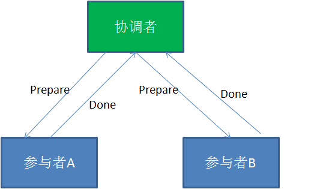

# 后端社招面试题收集

## Golang相关
问题合集：[Go程序员面试笔试宝典](https://golang.design/go-questions/)

### GC算法
原理、触发时机、优缺点

[Golang垃圾回收(GC)介绍](https://liangyaopei.github.io/2021/01/02/golang-gc-intro/)

### Golang 里的逃逸分析是什么？怎么避免内存逃逸？
[什么是逃逸分析](http://t.zoukankan.com/sunsky303-p-13839355.html)：
Go 程序会在 2 个地方为变量分配内存，一个是全局的堆(heap)空间用来动态分配内存，另一个是每个 goroutine 的栈(stack)空间。对于Go语言，开发者在定义变量时不需要关心变量是分配到堆上还是栈上，这一判断是由编译器完成的，叫做逃逸分析(escape analysis)。

逃逸分析的原理：
如果函数内定义的变量被外部引用了，比如函数返回了该变量的指针，那么这个变量就不能随着函数的结束而回收，因此会被分配到堆上。
Go中的变量只有在编译器可以证明在函数返回后不会再被引用的，才分配到栈上，其他情况下都是分配到堆上。

逃逸分析有什么作用：
在堆上分配和在栈上分配的一个很大区别就是性能开销。在栈上分配内存的开销很小，仅需要两个CPU指令PUSH和POP就能完成分配和回收。而在堆上分配内存则需要Go的垃圾回收进行清理，带来很大的额外开销。因此，减少在堆上分配的内存，可以减少GC的压力，提升运行速度。
还有一个作用就是让coder可以专注于代码编写而不用关心内存的分配问题

如何避免内存逃逸：
我们可以在编译时使用`go build -gcflags '-m'`命令来观察变量的逃逸情况。除此之外，我们也可以关注一些容易发生逃逸的情况：

1. 指针逃逸。比如函数中定义了局部变量，但是函数返回了该变量的指针并且被外部引用，那么这个变量就会逃逸到堆上。但是编译器进行逃逸分析后，如果考察到在函数返回后，此变量不会被引用，那么还是会被分配到栈上。因此在对象频繁创建和删除的场景下，我们可以考虑传值而不是传指针。
2. `interface{}`动态类型逃逸。因为`interface{}`可以表示任意的类型，在编译期间很难确定它的具体类型，因此也会发生逃逸，比如`fmt.Println()`
3. 栈空间不足。比如递归函数实现不当时导致栈溢出。比如切片过大，超出栈大小限制，可能会分配在堆上。因此，有时不一定要用切片代替数组
4. 切片进行append操作，可能涉及到重新分配内存，编译期间无法确定大小
5. 闭包函数。如果闭包函数内访问了外部变量，那么访问的这个变量将会一直存在，直到该函数被销毁。

### 调度器、GMP模型
M:N模型是指，N个goroutine在M个线程上执行。

goroutine相比线程的优势：内存占用、切换/创建/销毁的代价都更小

GMP模型：


- `g`：一个`g`表示了一个goroutine，主要包含了当前goroutine栈的一些字段
- `m`：代表一个操作系统的线程，goroutine需要调度到`m`上运行。`m`可以理解为“machine”
- `p`：一个抽象的处理器，可以理解为**Logical Processor**。`m`需要获得`p`才能运行`g`

早期版本的Golang是没有P的，调度是由G与M完成。 这样的问题在于每当创建、终止Goroutine或者需要调度时，需要一个全局的锁来保护调度的相关对象。 全局锁严重影响Goroutine的并发性能。

### select用法
select语句会选择case中能够执行的语句去执行，有点类似switch。但是和switch的区别在于case后面不是判断条件，而是通信操作（channel）。如果多个case同时就绪时，select会随机地选择一个执行；如果没有 case 可运行，它将直接进入default分支，如果没有default分支，它将阻塞，直到有 case 可运行。

对于case条件语句中，如果存在channel值为nil的读写操作，则该分支将被忽略，可以理解为从select语句中删除了这个case语句。
select只会执行一次，如果想要轮询，需要在外层加一个`for{}`；select中如果使用`break`，跳出的只是select，而不是外层的for循环

select 的好处：多路复用，避免阻塞，不用等待每个并发的任务都返回结果，而是只要有结果就可以处理

[select的常用场景](https://www.jianshu.com/p/de4bc02e7c72)：
- 随机选取/竞争选举：
```
    select {
    case i := <-ch1:
        fmt.Printf("从ch1读取了数据%d", i)
    case j := <-ch2:
        fmt.Printf("从ch2读取了数据%d", j)
    case m := <- ch3
        fmt.Printf("从ch3读取了数据%d", m)
    ...
    }
```
- 超时处理（保证不阻塞）：
```
select {
    case str := <- ch1
        fmt.Println("receive str", str)
    case <- time.After(time.Second * 5): 
        fmt.Println("timeout!!")
}
```
- 检查channel是否已满
- 阻塞主协程不退出

### context用法
- 传值功能：一般用于记录logid，追踪请求链路日志
- cancel/超时功能：可以用于控制goroutine的退出，一旦发出取消信号（超时or cancel），当前上下文和子上下文都会被取消。
```go
select {
case <-ctx.Done():
	fmt.Println("main", ctx.Err())
}
```

### slice底层、扩容的问题

### map底层
golang使用拉链法解决冲突，即相同hash值的键值对存在一个类似链表（其实是数组）的结构中。

查找/插入过程：首先计算key的hash值，这个值就用于在数组`[]bmap`中定位键值对的位置，`[]bmap`是定义在`hmap`的`buckets`结构中。定位到具体的`bmap`之后，`bmap`中有两个数组，一个用于存放key，一个用于存放value，用于解决冲突。查找的时候，先在存放key的数组中找到key，再通过偏移量去另一个数组中取到value

整体结构如下图：


bucket数量等于2^B。`bmap`中的数组最多只能存8个元素，如果超过了8个，会存到`hmap`里的`extra`结构中，可以理解为溢出桶。正常buckets中的`bmap`通过自己的`overflow`字段可以关联到溢出桶中的数据：


扩容时机：
- 负载因子过大（元素个数/bucket数量）。意味着可能很多bucket都快要装满了
- overflow的bucket过多。有时元素数量很少，但溢出桶数量也很多，可能是因为插入很多元素又删除很多元素又插入很多元素

扩容方式：
- 第一种情况，将bucket数量翻倍，渐进式扩容，将老bucket的内容逐渐迁移到新bucket，老bucket等待GC
- 第二种情况，创建新的等量bucket，重新迁移到新桶中。使得同一个 bucket 中的 key 排列地更紧密。

参考：
- [Go Map实现原理](https://segmentfault.com/a/1190000039101378)
- [Go Map扩容](https://blog.csdn.net/weixin_45743893/article/details/122927041)

### sync.Map原理
`sync.Map` 的实现原理可概括为：

*   通过 read 和 dirty 两个字段将读写分离，读的数据存在只读字段 read 上，将最新写入的数据则存在 dirty 字段上
*   读取时会先查询 read，不存在再查询 dirty，写入时则只写入 dirty
*   读取 read 并不需要加锁，而读或写 dirty 都需要加锁
*   另外有 misses 字段来统计 read 被穿透的次数（被穿透指需要读 dirty 的情况），超过一定次数则将 dirty 数据同步到 read 上
* 写入的时候如果read中存在则会更新read？
*   对于删除数据则直接通过标记来延迟删除

参考：[源码解读 Golang 的 sync.Map 实现原理](https://juejin.cn/post/6844904100287496206)

### channel底层
基础：
*   向一个`nil channel`发送或者接收消息，会一直阻塞；
*   向一个已经关闭的`channel`发送消息，或者关闭一个已经关闭的channel，会引发panic；
*   `channel`关闭后不可以继续向`channel`发送消息，但可以继续从`channel`接收消息；
*   当`channel`关闭并且缓冲区为空时，继续从从`channel`接收消息会得到一个对应类型的零值。

数据结构：
```go
type hchan struct {
    qcount   uint           // channel中元素个数
    dataqsiz uint           // channel中循环队列的长度
    buf      unsafe.Pointer // 缓冲区数据指针
    // channel中元素大小
    elemsize uint16 
    // 是否已关闭
    closed   uint32
    // channel中元素类型
    elemtype *_type // element type
    sendx    uint   // 发送操作处理到的位置
    recvx    uint   // 接收操作处理到的位置
    recvq    waitq  // 因为接收操作阻塞的goroutine列表
    sendq    waitq  // 因为发送操作阻塞的goroutine列表

    // lock protects all fields in hchan, as well as several
    // fields in sudogs blocked on this channel.
    lock mutex
}

type waitq struct {
	first *sudog
	last  *sudog 
	// sudog表示一个在等待列表中的 Goroutine，该结构中存储了两个分别指向前后 runtime.sudog 的指针以构成链表
}
```

创建channel的过程，三种情况：
1. 当缓冲区大小为0，或者channel中元素大小为0时，只需分配`hchan`必需的空间即可；
2. 当channel元素类型不是指针时，则只需要为`hchan`和缓冲区分配一片**连续内存空间**，空间大小为缓冲区数组空间加上`hchan`必需的空间
3. 默认情况，缓冲区包含指针，则需要为`hchan`和缓冲区分别分配内存

发送过程，三种情况：
1. 如果当前 Channel 的 `recvq` 上存在已经被阻塞的 Goroutine，那么会直接将数据发送给该 Goroutine 并将其设置成下一个运行的 Goroutine（调用`runtime.goready()`将其状态置为`Grunnable`并等待执行）；
2. 如果 Channel 存在缓冲区并且其中还有空闲的容量，会直接将数据存储到缓冲区`sendx`所在的位置上；
3. 当 Channel 没有接收者能够处理数据时，发送操作会被阻塞。会将当前goroutine打包成一个`sudog`结构体，将其加入该channel的发送等待队列`sendq`中，之后则调用`goparkunlock`将当前Goroutine设置为`_Gwaiting`状态，等待被唤醒。唤醒之后，会执行清理工作并最终释放对应的`sudog`结构体

接收数据的过程：
1.  如果 Channel 为空，那么会直接调用 `runtime.gopark` 挂起当前 Goroutine；
2.  如果 Channel 已经关闭并且缓冲区没有任何数据，`runtime.chanrecv` 会直接返回；
3.  如果 Channel 的 `sendq` 队列中存在挂起的 Goroutine，会将 `recvx` 索引所在的数据拷贝到接收变量所在的内存空间上并将 `sendq` 队列中 Goroutine 的数据拷贝到缓冲区；
4.  如果 Channel 的缓冲区中包含数据，那么直接读取 `recvx` 索引对应的数据；
5.  在默认情况下会挂起当前的 Goroutine，将 `runtime.sudog` 结构加入 `recvq` 队列并陷入休眠等待调度器的唤醒；

参考：
- 清晰明了：https://draveness.me/golang/docs/part3-runtime/ch06-concurrency/golang-channel/
- 配合着看：[深入理解Golang之channel](https://juejin.cn/post/6844904016254599176)
- 超级深入：[深入 Go 并发原语 — Channel 底层实现](https://halfrost.com/go_channel/)

### sync.Mutex底层
https://colobu.com/2018/12/18/dive-into-sync-mutex/

互斥锁有两种状态：正常状态和饥饿状态。

在正常状态下，所有等待锁的goroutine按照**FIFO**顺序等待。唤醒的goroutine不会直接拥有锁，而是会和新请求锁的goroutine竞争锁的拥有。新请求锁的goroutine具有优势：它正在CPU上执行，而且可能有好几个，所以刚刚唤醒的goroutine有很大可能在锁竞争中失败。在这种情况下，这个被唤醒的goroutine会加入到等待队列的前面。 如果一个等待的goroutine超过1ms没有获取锁，那么它将会把锁转变为饥饿模式。

在饥饿模式下，锁的所有权将从unlock的goroutine直接交给交给等待队列中的第一个。新来的goroutine将不会尝试去获得锁，即使锁看起来是unlock状态, 也不会去尝试自旋操作，而是放在等待队列的尾部。

如果一个等待的goroutine获取了锁，并且满足一以下其中的任何一个条件：(1)它是队列中的最后一个；(2)它等待的时候小于1ms。它会将锁的状态转换为正常状态。

源码，加锁过程：
*   如果互斥锁处于初始化状态，会通过置位 `mutexLocked` 加锁；
*   如果互斥锁处于 `mutexLocked` 状态并且在普通模式下工作，会进入自旋，执行 30 次 `PAUSE` 指令消耗 CPU 时间等待锁的释放；
*   如果当前 Goroutine 等待锁的时间超过了 1ms，互斥锁就会切换到饥饿模式；
*   互斥锁在正常情况下会通过 [`runtime.sync_runtime_SemacquireMutex`](https://draveness.me/golang/tree/runtime.sync_runtime_SemacquireMutex) 将尝试获取锁的 Goroutine 切换至休眠状态，等待锁的持有者唤醒；
*   如果当前 Goroutine 是互斥锁上的最后一个等待的协程或者等待的时间小于 1ms，那么它会将互斥锁切换回正常模式；

### 实现一个生产者消费者模型
生产者不断生产，放到结果队列，消费者获取结果，并发、异步处理。当成果队列中没有数据时，消费者就进入饥饿的等待中；而当成果队列中数据已满时，生产者则面临因产品挤压导致CPU被剥夺的下岗问题。

```go
func Producer(ch chan <- string) {
    var msg string
    // XXX 给msg赋值
    ch <- msg
}

func Consumer(ch <- chan string) {
    // 无消息则阻塞
    for {
        select {
            case msg := <- ch:
                // XXX 处理msg
        }
    }
}

func main() {
    buffer := 64 // 结果队列的大小
    ch := make(chan string, buffer)
    
    go Producer(ch)
    go Consumer(ch)
    
    select{} // 阻塞main函数
}
```

### 实现一个单例模式
基于互斥锁：
```go
import (
    "sync"
    "sync/atomic"
)

type singleton struct {}

var (
    instance    *singleton
    initialized uint32
    mu          sync.Mutex
)

func Instance() *singleton {
    if atomic.LoadUint32(&initialized) == 1 {
        return instance
    }

    mu.Lock()
    defer mu.Unlock()

    if instance == nil {
        defer atomic.StoreUint32(&initialized, 1)
        instance = &singleton{}
    }
    return instance
}
```

基于```sync.Once```：
```go
var (
    instance *singleton
    once     sync.Once
)

func Instance() *singleton {
    once.Do(func() {
        instance = &singleton{}
    })
    return instance
}
```

### [代码]三个goroutine，按顺序打印123
三个channel：
```go
func main() {
   ch1 := make(chan int)
   ch2 := make(chan int)
   ch3 := make(chan int)
   wg := sync.WaitGroup{}
   wg.Add(1)
   go func() {
      defer wg.Done()
      for x := 0; x < 5; x++ {
         <-ch1
         fmt.Println("1")
         ch2 <- 0
      }
   }()
   wg.Add(1)
   go func() {
      defer wg.Done()
      for x := 0; x < 5; x++ {
         <-ch2
         fmt.Println("2")
         ch3 <- 0
      }
   }()
   wg.Add(1)
   go func() {
      defer wg.Done()
      for x := 0; x < 5; x++ {
         <-ch3
         fmt.Println("3")
         ch1 <- 0
      }
   }()

   ch1 <- 0 // 记得这一步，否则死锁
   wg.Wait()
}
```

进阶：交替打印1和2，只允许使用一个无缓冲channel
```go
func print12() {
   ch := make(chan int)

   go func() {
      fmt.Println(1)
      ch <- 0 // 保证先打印1
      for i := 1; i < 10; i++ {
         <-ch
         fmt.Println(1)
         ch <- 0
      }
   }()

   go func() {
      for i := 0; i < 10; i++ {
         <-ch
         fmt.Println(2)
         ch <- 0
      }
   }()
   
    select{}
}
```

## MySQL

### B+树和B树的区别
- IO次数少：B+树的中间结点只存放索引，数据都存在叶结点中，因此中间结点可以存更多的数据，让索引树更加矮胖；
- 范围查询效率更高：B树需要中序遍历整个树，只B+树需要遍历叶结点中的链表；
- 查询效率更加稳定：每次查询都需要从根结点到叶结点，路径长度相同，所以每次查询的效率都差不多

### OLTP和OLAP数据库的概念

### 分库分表是什么意思
也就是数据表的水平拆分（垂直拆分指的是按照业务拆成多个表）；水平拆分指的是原本同一张表，按照某个字段的某个规则（范围、哈希、时间等等）拆分到多个表/多个库当中存储，每个表包含一部分数据。

好处：
- 减轻高并发压力，提升系统稳定性和负载能力
- 对应用透明，改造较少

缺点：
- 拆分规则难以抽象
- 数据多次扩展，难度与维护量大
- 带来分布式事务的问题

### 乐观锁的实现方式
- 悲观锁：认为数据随时会被修改，因此每次读取数据之前都会上锁，防止其它事务读取或修改数据；应用于**数据更新比较频繁**的场景；
- 乐观锁：操作数据时不会上锁，但是更新时会判断在此期间有没有别的事务更新这个数据，若被更新过，则失败重试；适用于**读多写少**的场景。乐观锁的实现方式有：
    - 加一个版本号或者时间戳字段，每次数据更新时同时更新这个字段（CAS）；
    - 先读取想要更新的字段或者所有字段，更新的时候比较一下，只有字段没有变化才进行更新

### 间隙锁的原理,解决了什么问题
间隙锁（Gap Locks），给一条记录加上间隙锁意味着不允许在这条记录前面的间隙插入新记录。比如聚簇索引上两条连续的记录主键id分别为“3”、“8”，那么给id为“8”的这条记录加上间隙锁意味着其他事务不能在(3, 8)这个区间插入记录。间隙锁可以在RR（可重复读）隔离级别下解决幻读的问题。

间隙锁是加在记录前面的间隙的，那么如何防止别的事务在最后一条记录的后面插入幻影记录呢？其实只需要在页面的Supremum记录（表示该页面中最大的记录）上加一个间隙锁就行了。

还有一个`Next-Key Locks`，可以看成是记录锁和间隙锁的结合，既锁住了一条记录，也锁住了记录前面的间隙。

当然，解决幻读问题除了使用间隙锁，使用MVCC也可以

## Redis

### 关系型和非关系型数据库的区别
- 前者高度组织化结构化数据；后者存储的数据结构不固定更加灵活，可以减少一些空间和时间的开销
- 后者更加容易水平扩展
- 前者支持结构化查询语言，支持复杂的查询功能和表关联。后者只能进行简单的查询
- 前者支持事务，具有ACID特性。后者则是CAP，最终一致性

### Redis有什么优点？
单线程：并发安全；高性能；原语与数据结构丰富；采用广泛，踩坑成本低

单线程为何能支撑高并发？
- 纯内存操作
- 底层使用C语言实现
- 单线程操作避免了频繁的上下文切换，避免了加锁等操作
- 采用了非阻塞I/O多路复用机制

### Redis相比Memcache的优势
1. memcached所有的值均是简单的字符串，Redis作为其替代者，支持更为丰富的数据类型

2. Redis的速度比memcached快很多

3. Redis可以持久化其数据

4. Redis支持数据的备份，即master-slave模式的数据备份。

### Redis的单线程模型
Redis 内部使用文件事件处理器，这个文件事件处理器是单线程的，所以 Redis 才叫做单线程的模型。

相应的操作有连接应答（accept）、读取（read）、写入（write）、关闭（close），这些操作都会产生一个文件事件，文件事件分派器会根据事件类型调用相应的事件处理器。

对于文件事件，采用IO多路复用来同时监听多个套接字



参考：https://blog.csdn.net/TABE_/article/details/122524784

### zset的数据结构
[Skip List--跳表（全网最详细的跳表文章没有之一）](https://www.jianshu.com/p/9d8296562806)
为什么不用红黑树；往跳表添加一个元素的过程

### 字典原理
底层有两张hash表ht[0]和ht[1]，一般情况下只使用ht[0]，在rehash过程中才会用到ht[1]。

采用拉链法解决冲突，新添加的元素被保存到链表的表头位置。

会根据负载因子进行扩展或收缩，使用渐进式rehash。先计算出ht[1]所需的空间，然后迁移键值对，迁移完成后，释放ht[0]，将ht[1]设置为ht[0]，在ht[1]创建一个空白哈希表。

开始rehash时，会将`rehashidx`设置为0，逐渐递增，从0开始将ht[0]哈希表上的键值对rehash到ht[1]，完成之后将`rehashidx`置为-1. 在这个过程中，如果需要查找，会先找ht[0]再找ht[1]，而新添加的键值对一律会被保存到ht[1]。

### Redis有哪些持久化方式？

### 主从复制原理

### Sentinel机制

### Raft算法选举领头sentinel的过程
在每一个选举周期（epoch）内，每个sentinel都会向其他sentinel请求投票给自己。每个sentinel投票的原则是先到先得，先收到哪个sentinel的请求就投票给哪个sentinel，每个sentinel在一个选举周期内只会投票一次。

如果一个选举周期内，有一个sentinel获得了超过半数的投票，则可以成为领头sentinel。如果没有，则进入下一个选举周期

### 集群是如何实现的

### 什么是脑裂问题
一个集群中的 master 恰好网络故障，Sentinel选举出了新的master，此时集群中存在两个master。而client可能还没切换到新的master，还在往老的master写数据。当老的master网络恢复的时候，会作为slave被挂到新的master上，因此这段时间接收到的client的数据就丢失了。

### 如何处理热key问题
热key问题是指：突然有几十万甚至更大的请求去访问redis上的某个特定key。这样会造成流量过于集中，达到Redis单实例瓶颈。

处理热key问题分为“降频”和“止损”两大思路。降频：
- 增加本地缓存
- 增加热key副本，比如不同接口场景使用不同的key（即使value是相同的）；比如通过随机数取模分散到多个Key

止损：封禁、限流、降级，返回默认值或空值；是最后的兜底方案，避免对系统稳定性的影响

### 大Key有什么问题
如何定义大key：
- string类型超过10kb
- hash/list/set/zset 类型的元素个数超过5000个，或者总大小超过10MB

带来的问题：
- Redis 是单线程模型，小KV场景的QPS极限在10万左右，即单次QPS平均延时是10微秒。Big Key 会带来 socket I/O 和 内存 malloc 的耗时增加，程度也是微妙级别，进而较大影响 Redis 吞吐量。
- Big Key 可能导致网络拥塞和数据倾斜，对于10KB的数据，假设QPS是一万，网络流量可以达到 100MB/s，已经接近千兆网卡的极限。
- Big Key 的内存频繁申请和释放都比较耗时，还可能阻塞在 AOF fsync，严重时导致慢查询。
- Big Key 占用了输入和输出缓冲区，可能导致网络连接被意外关闭，严重时导致进程OOM。

### Redis 缓存穿透、雪崩、击穿如何解决？
缓存穿透：
访问一个不存在的key，会导致总是无法命中缓存，从而请求DB
解决方案：1. 为不存在的key也设置一个过期时间较小的缓存；2. 使用布隆过滤器，如果key不存在，一定可以拦截掉

缓存击穿：
某个key过期的时候，突然有大量的请求过来，导致DB压力过大
解决方案：1. 使用一个setnx分布式锁，获取到锁之后才去请求DB并将值更新到缓存，否则重试get缓存；2. 设置一个不过期的key，但是后台线程异步刷新

缓存雪崩：
某一时间大量key过期，大量请求打到DB。与缓存击穿的区别：雪崩是很多 key，击穿是某一个key 缓存
解决方案：设置过期时间的时候每个key增加一个随机的时间，避免同一时间大量过期

### 过期策略 & 内存淘汰策略
key的过期策略：
定期删除+惰性删除：所有对键的访问都会先触发惰性删除策略（对CPU友好，内存不友好）。除此之外，定期删除的任务每次运行时，都按顺序从一定数量的数据库中随机取出一定数量的键进行检查并删除过期键。

为什么不采用定时删除策略（设置TTL的时候创建一个timer）？
虽然对内存友好，但对CPU不友好。如果同一时间大量key过期，会严重影响性能

内存淘汰机制：
- noeviction：内存满了，不接受新写入数据，直接报错
- LRU：最近最少使用
- random：随机逐出
- 过期LRU：即设置了过期时间的键空间中使用LRU
- 过期random
- 在设置了过期时间的键空间中，有更早过期时间的key优先移除

### 分布式锁的几种实现方式、优缺点
setnx有什么缺点、如何优化

使用redis加分布式锁的正确方式：
1. 加锁：`SET lockKey requestId NX PX 30000`；也就是`SETNX`(set if not exists) + `expire`
2. 业务操作完成之后，主动释放锁；但是只能释放当前requestId的锁
3. 或者达到超时时间，redis自动释放锁

容易踩的坑：
1. 加锁非原子命令：即先setnx，再expire，这时万一expire失败了，则锁可能永远无法释放
2. 业务主动释放锁的时候，没有判断requestId，把其他线程的锁释放了。比如：A加了锁，expire了，然后B获取到了锁，A执行完成，直接把B的锁释放了
3. 释放锁的操作非原子问题：主动释放锁，涉及到：读取、判断和删除，这是非原子的，如果非要解决，可以使用LUA脚本保证原子
4. 锁超时问题：业务执行完成之前，锁就expire了。可以使用自动续期的方案，即轮询设置锁超时时间

推荐阅读：
- [聊聊分布式锁](https://mp.weixin.qq.com/s/-N4x6EkxwAYDGdJhwvmZLw)
- https://juejin.cn/post/6844904082860146695#heading-2

### 布隆过滤器原理
对数据进行N次哈希（不同的哈希函数），得到N个值，然后去BitMap中对比，如果这N个值在BitMap中全都存在，说明这个数据**可能存在**；如果不存在，则说明这个数据**一定不存在**。可以用来判断某个元素是否已经存在于集合中。

优点：
- 空间复杂度低，使用了BitMap
- 时间复杂度低，和集合中总的元素数量无关，只和哈希函数的数量有关
- 保密性强，不存储元素本身

缺点：
- 有一定的误判率（"可能存在"），可以通过增加哈希函数的方式减少误判率
- 删除某个元素很困难
- 无法获取元素本身

## Kafka

### 为什么要使用mq？
- 异步处理（提升体验降低延迟）
- 解耦（模块划分）
- 削峰

mq会带来哪些问题：
- 系统复杂性增加，需要保证消息队列稳定性
- 重复消息问题，需要保证消费幂等
- 消息丢失问题，需要确保消息发送的可靠性
- 消息堆积问题

### Kafka 的消费者如何做消息去重? 

### 如何保证顺序消费

### 如何保证高可用
怎么做到的高吞吐
零拷贝原理
如何保证消息不丢失

### 如何做到幂等

### rebalance过程

### 副本备份的过程

### 数据索引如何实现的？

### 介绍一下 Kafka 的 ConsumerGroup 

### 零拷贝的原理

## 系统设计
system design primer

### 实现分布式限流功能

利用redis的原子自增和过期淘汰策略

1. 固定窗口/滑动窗口策略

  - 限流器的计数存放在redis中，用redis的过期淘汰策略实现限流器的计数的定期更新 

  - 例如针对 接口A 限流 10000 QPS。redis的key为：“接口A”，value为计数值 - 每次接口调用Redis用INC原子自增命令，自增1，并设置过期时间为1s 

  - 初次调用时，因为redis中该key没有，就直接设置为1，并设置过期时间为1s

  - 在这一秒以内的后续调用，每次都自增1 - 客户端拿到自增后的值如果没有超过限制10000，就放行 - 如果超过 10000 限制，就不放行，说明超限了

  - 细节实现：为避免超限后无谓的redis调用，第一次发现超限时可以记录该值的TTL时间，例如只过去100ms就有1w个请求过来，剩下的900ms就不用请求redis而是直接返回超限即可。不然这种情况会给redis带去额外无谓的流量，例如前面的例子，不做这个细节逻辑的话，redis的请求量是 10w QPS

  - 精度可调节。假如限流阈值很大，比如100w，可以把INC自增步进/步长调整大一些，例如100，那么redis的QPS直接降低100倍，为1w QPS

固定窗口存在的问题就是，流量的进入往往是不均匀的，有可能导致一个窗口内的计数器被提前计满，导致资源不能充分利用。所以改进版为滑动窗口策略。

当然，滑动窗口的实现还是只能将计数的粒度切的更细，比如固定窗口为1分钟，滑动窗口切为1s来计数，而再往细粒度切就没什么意义，反而会增大资源损耗

2. 漏桶/令牌桶算法
上面的策略会丢弃请求，而令牌桶算法则能最大限度的处理请求。这里的桶可以看作一个缓冲区，比如消息队列

漏桶算法：固定流量的出桶速率。用一个全局计数器计数桶中的流量数量，入桶+1，出桶-1.


令牌桶算法：固定令牌的进桶速率。令牌以固定速率生成并放入桶中，有流量过来时，从桶中获取令牌，没获取到则丢弃。


### 分布式事务的概念
CAP理论、BASE理论

什么是分布式事务：在分布式场景下实现事务，保证事务的特性（ACID）

为什么会有分布式事务：一些业务场景需要分布式系统中的多个服务和系统共同协作，而不只是依赖单机数据库。比如银行转账、下订单减库存等，无法在一个数据库事务中实现。

CAP理论、为什么不能同时满足：
CAP 是 Consistency、Availability、Partition tolerance 三个单词的缩写，分别表示一致性、可用性、分区容忍性。CAP理论指分布式系统只能满足CAP中的任意两个。

1. 一致性 Consistency
是指写操作后的读操作可以读取到最新的数据状态，当数据分布在多个节点上，从任意结点读取到的数据都是最新的状态。
实现：主从同步的过程中，需要先将从数据库的该资源锁定，以免读取到旧数据（如果有对该资源的请求，会返回错误）

2. 可用性 Availability
任何事务操作都可以得到响应结果，且不会出现响应超时或响应错误。
实现：意味着从数据库有可能会返回旧数据

3. 分区容忍性 Partition tolerance
分布式系统的节点挂掉或者网络通信失败，系统仍可对外提供服务。
实现：主从架构

显然，P是分布式系统需要具备的基本能力。因此，分布式系统一般需要满足CP或者AP

BASE理论：
由于无法满足CAP，因此很多分布式系统采用的是BASE，即Basically Available（基本可用）、Soft state（软状态）和 Eventually consistent （最终一致性），可以理解为对CAP中AP的扩展，牺牲了强一致性而变为最终一致性
1. 基本可用：分布式系统在出现故障时，允许损失部分可用功能，保证核心功能可用。如电商网站交易付款出现问题了，商品依然可以正常浏览。
2. 软状态：由于不要求强一致性，所以BASE允许系统中存在中间状态（也叫软状态），这个状态不影响系统可用性，如订单的"支付中"、“数据同步中”等状态，待数据最终一致后状态改为“成功”状态。 
3. 最终一致性：经过一段时间后，所有节点数据都将会达到一致。

参考：https://baijiahao.baidu.com/s?id=1717325036148461851

### 如何保证分布式事务一致性
1. XA协议 -- 两阶段提交（2PC）
XA是由X/Open组织提出的分布式事务的规范，包含两阶段提交（2PC）和三阶段提交（3PC）两种实现

在XA协议中包含着两个角色：事务协调者和事务参与者。

第一阶段（prepare）：协调者发送prepare请求，参与者执行相关事务，写入redo和undo log，但是不提交；向协调者返回“完成”消息


第二阶段（commit）：协调者发送commit请求，参与者提交事务，释放锁资源，向协调者返回“完成”消息。如果前面的阶段有参与者没有返回完成消息，则这一阶段，协调者会发送abort请求，参与者进行事务回滚

不足：
- 性能问题：参与者只有在commit之后才会释放资源
- 协调者单点故障问题：一旦协调者挂掉，参与者收不到commit或者abort消息，就会无法完成事务
- 丢失消息导致的不一致问题：在第二阶段，如果网络问题导致部分参与者没收到消息，就会导致节点之间数据不一致

2. 三阶段提交（3PC）
包含了三个阶段，分别是准备阶段、预提交阶段和提交阶段，对应的英文是：CanCommit、PreCommit 和 DoCommit。可以理解为在2PC的基础上引入了最开始的CanCommit阶段 + 超时机制

最开始的CanCommit阶段只是会检查是否有条件进行事务，而不会更新数据。因为有超时机制，所以如果参与者没收到协调者的命令，则会自动提交（PreCommit之后）或者放弃（CanCommit之后）。

解决了协调者单点故障的问题，但是性能问题和不一致的问题仍然没有根本解决

3. TCC（Try, Confirm, Cancel）
逻辑类似于2PC，但是是用于业务代码层面进行实现，并且可以跨数据库、业务系统，因此适用于特定业务场景下自己实现分布式事务。

Try：请求各个系统预留资源
Confirm：执行事务，需要保证幂等，因为失败会重试
Cancel：相当于回滚，也需要保证幂等

4. 本地消息表
业务先执行事务，成功之后往消息表里写一条消息（比如MySQL）；后台用一个线程轮询，轮询到消息之后，再进行下一步操作；如果操作失败会重试，操作成功则删掉这条消息

适用于可异步操作，且后续操作失败也无需回滚的业务

5. 消息事务
类似本地消息表，但是将写消息、轮询、消费等逻辑都借助mq来实现。具体来说，先往mq里写一条half消息（即现在这个消息对消费者还不可见），业务执行成功后，发送消息，如果业务执行失败，则取消消息。下游收到消息后进行下一步操作

参考：
- https://zhuanlan.zhihu.com/p/183753774
- https://blog.csdn.net/u012811805/article/details/121313006

### UUID生成算法
- MySQL主键自增id
- Redis `Incr`命令自增
    - 优点：实现方便；id连续且递增
    - 缺点：容易暴露业务信息；性能较差；水平扩展难
- snowflake：1b 不用 + 41b timestamp + 10b worker id + 12b sequence id
    - 41b时间戳，最小时间单位为毫秒，可以用69年
    - 12b的counter，每毫秒内递增，单机每毫秒最多4096个ID
    - 优点：全局唯一，趋势递增；缺点：时钟回拨受影响（解决：可以带上版本号）
    
### 什么是Service Mesh
Service Mesh 是处理服务间通信的基础设施层，为服务治理提供一种解决方案。

为什么引入Mesh：
- 语言碎片化。微服务框架的一些功能需要用多种语言实现一遍
- 推动更新框架是一件困难的事
- 业务侵入性强

Mesh的作用：
- 服务发现、服务治理
- 出流量治理：RPC超时配置、比例丢弃、机房调度、熔断配置、重定向集群、负载均衡
- 入流量治理：访问控制、单实例限流、集群限流、过载控制

### 服务发现原理
实例挂掉了如何发现，还会访问到吗

大致：实例服务启动之后，向一个类似配置中心的地方注册自己的ip-port以及对应服务；配置中心应该会定时检查实例心跳，如果实例挂掉了则从服务节点列表里移除对应的ip。配置中心向下游同步配置主要是靠推，因此压力不会很大。

### 负载均衡算法
- 轮询（轮转）：将请求按顺序逐一分配到不同服务器
- 指定权重：在轮询的基础上指定权重
- 随机
- ip hash：每个ip做hash之后确定访问的服务器。对session管理比较友好
- url hash：对url做hash之后访问特定服务器。对本地缓存比较友好
- 最小连接数：分配给连接数最少的服务器

### 什么是一致性hash
一致性哈希将整个哈希值空间组织成一个虚拟的圆环。假设某哈希函数H的值空间为0-2^32-1，整个空间按顺时针方向组织。0和2^32-1在零点中方向重合。

下一步将各个服务器使用Hash进行一个哈希，具体可以选择服务器的ip或主机名作为关键字进行哈希，这样每台机器就能确定其在哈希环上的位置


接下来使用如下算法定位数据访问的相应服务器：将数据key使用相同的函数Hash计算出哈希值，并确定此数据在环上的位置，从此位置沿环顺时针“行走”，第一台遇到的服务器就是其应该定位到的服务器。

容错性和可扩展性：如果一台服务器宕机，受影响的仅仅是环上的一部分数据，其他数据不受影响。如果新增一台服务器，也是同理。

另外，一致性哈希算法在服务节点太少时，容易因为节点分部不均匀而造成数据倾斜问题。此时可以使用虚拟节点，即对每一个服务节点计算多个哈希，每个计算结果位置都放置一个此服务节点，具体做法可以在服务器ip或主机名的后面增加编号来实现。

### LSM-Tree原理

### 设计一个海量的评论系统
支持快速大量的写入及任意翻页的需求

https://juejin.cn/post/6907187734696165389

大量写入：分布式存储+id分配策略
排序（比如按时间逆序）：可以采用zset。若评论被删除也需要在索引中删除

### 设计一个朋友圈系统（Feed流系统）
https://zhuanlan.zhihu.com/p/259562762

三种模式：
- 写扩散（推模式）：发布者发布之后，往每个接收者的feed流列表里写入一条记录，对写入性能的要求比较高，但是读取时很轻松
- 读扩散（拉模式）：接收者在请求feed流列表的时候，实时拉取所有发布者的feed流然后排序返回
- 推拉结合：比较好的方式，大V采用读扩散，避免写入量级过大，普通用户采用写扩散

存储：
- 发布者自身的feed流数据
- 订阅关系表
- 接收者的feed流数据

### 设计一个短URL系统
https://soulmachine.gitbooks.io/system-design/content/cn/tinyurl.html

存储使用MySQL，包含字段：原始URL、原始URL的md5（方便快速索引）、短URL

输入原始url之后，先查找是否已经存在，不存在则生成

生成方式：使用长度为7的字符串，一个字符取值为[a-zA-z0-9]一共62种可能，因此能覆盖的个数是62的7次方。每次生成新的短url时，使用自增id生成器，然后将自增id转换为字符串（**字符串可以看作是62进制**）

需要注意的一些问题：
- 为了支持统计来源，原始url到短url可以支持一对多映射
- 预防攻击：限制同一IP访问，限制同一url的生成
- 重定向方式：302重定向（临时重定向）。如果使用301永久重定向的话，搜索引擎就会直接跳转到真实网址，无法进行一些数据统计

### 设计一个热榜系统/排行榜
https://cloud.tencent.com/developer/article/1839898

上亿用户、实时排行榜

如果用户量少，QPS不高：MySQL记录用户id+对应分值，每隔一段时间order by XXX limit XXX

高并发：redis zset，理论上能存2^32条数据，单实例10W QPS。并且直接就能取到topN

### 如何对海量大文件进行排序
map-reduce的思想，分而治之，先分开处理，最后归并。

比如一个20GB的大文件，每一行是一个字符串，内存只有1G，可以先取模将其分为多个小文件，足够在内存中装下。之后分别对这些小文件排好序，然后再将多个小文件进行多路归并排序（比如堆排序），最终得到一个有序的文件。

### 异地多活原理
http://kaito-kidd.com/2021/10/15/what-is-the-multi-site-high-availability-design/

## 计算机网络、操作系统
waking-up

- select、epoll；什么是IO多路复用
- 三次握手、打开url的过程、https加密过程、TCP与UDP区别。。。
- 自旋锁和互斥锁有什么区别
- 进程的调度，时间片轮转算法
- 进程、线程、协程区别

## Linux、Git

- linux命令，查看端口占用，cpu负载，内存占用
- awk、sort
- merge、rebase
- 查看文件行数：`wc -l FILE`

## 简历项目
- 项目解决了哪些问题
- 遇到了哪些问题，如何解决的
- 有什么设计上的缺点，可以如何解决（重新设计会怎么优化）？

### 平时使用redis的场景
- 分布式锁
- 读缓存

### 公司用的什么隔离级别
已提交读

### 平时使用mq的场景
- 下游消费：订单-分群；收藏-复习

### Mongo的优势
为什么要用mongo？（文档型、大数据量）；为什么不用XXX（持久化的redis）？（支持简单的where条件查询语句）
Mongo的索引原理

### 说说遇到过的内存泄露的场景
- client全局初始化一次；否则OOM
- db.Row()没释放导致hang住
- 消息队列的goroutine一直创建

### 线上出现问题如何排查
定位问题：性能问题（OOM等，pproof）or 逻辑问题（错误日志高，看日志，看最近上线的改动）or QPS问题（错误率升高，加机器，看最近改动）

### 技术问题
- 消息频控：分布式锁+延时消息（10min内的所有消息转化为10min后的唯一一条消息）
- json数据太大：存tos，分布式事务

### 性能优化的思路
- 看日志追查耗时链路
- 常见优化：内存计算优化、MySQL优化、循环转为批量

### 重构的新服务，如何验证无bug？
1. 显然是不可能靠直接线上小流量测试的，容易出事故
2. 并且涉及到一个下游rpc，它的请求结果可能每次都不一样（比如推荐接口）

离线记录老服务线上的所有请求&response，单独做验证，对比新老服务结果是否一致

### 用户维度的统计数据，如何生产&记录？
spark/flink，流式消费，记录到线上的NoSQL，redis比较贵，可以用mongo/levelDB之类的

## Behavior Question

### 看机会的时候，主要考虑的是待遇、平台、人员还是什么其他因素？

### 为什么要考虑出来看看呢？

”现在自己的技术成长有点碰到瓶颈，加上一直对您公司钦慕有加”

### 前司吸引你和你不太喜欢的地方

### 同事如何评价你，你如何评价自己？

### 职业规划是什么


## 参考面经
- https://aleiwu.com/post/interview-experience/
- https://baijiahao.baidu.com/s?id=1673463686606943206&wfr=spider&for=pc
- https://blog.csdn.net/m0_68850571/article/details/123844147
- https://www.nowcoder.com/discuss/690021?type=post&order=recall&pos=&page=1&ncTraceId=&channel=-1&source_id=search_post_nctrack&gio_id=7AE616CCD6CCE821054160B7406C4AC0-1656373566240
- https://juejin.cn/post/7090416655909519374
- https://juejin.cn/post/7072149750673309704
- https://www.nowcoder.com/discuss/837006?type=post&order=recall&pos=&page=1&ncTraceId=&channel=-1&source_id=search_post_nctrack&gio_id=7AE616CCD6CCE821054160B7406C4AC0-1656373566240