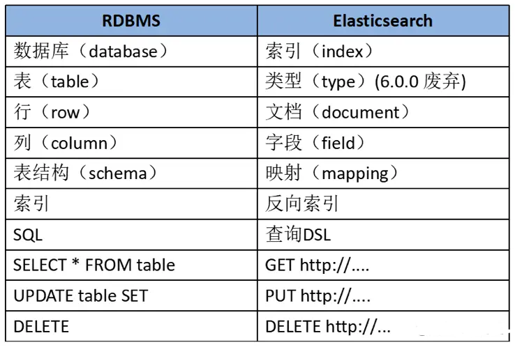
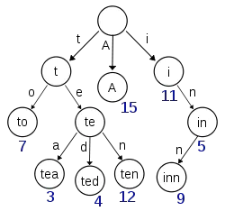
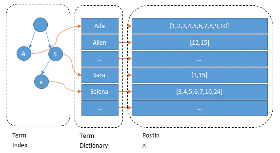
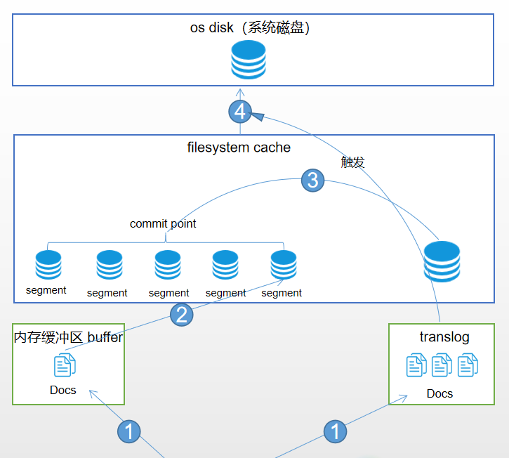

# Elastic Search

- [基础概念介绍](#基础概念介绍)
    - [节点(Node)](#节点node)
    - [分片(Shard)](#分片shard)
    - [索引(Index)](#索引index)
    - [文档(Document)](#文档document)
- [ES和传统数据库的一些概念对照](#es和传统数据库的一些概念对照)
- [倒排索引](#倒排索引)
- [近实时化搜索](#近实时化搜索)
- [数据一致性](#数据一致性)
- [参考](#参考)

# 基础概念介绍
## 节点(Node)
一个ES实例称为一个节点，而集群是由多个节点组成。节点分为三种类型：

- 主节点：负责管理集群范围内的所有变更 ，例如增加、删除索引，或者增加、删除节点等。 主节点并不需要涉及到文档级别的变更和搜索等操作。
- 数据节点：存储数据和其对应的倒排索引 。 默认每一个节点都是数据节点（包括主节点）
- 协调节点：协调节点，只作为接收请求、转发请求到其他节点、汇总各个节点返回数据等功能的节点，均衡每个节点的负载

## 分片(Shard)
 一个索引中的数据保存在多个分片中，相当于水平分表。当你的集群规模扩大或者缩小时， ES会自动的在各节点中迁移分片，使得数据仍然均匀分布在集群里。

一个分片可以是主分片（primary shard）或者副本分片（replica shard）。每一个节点上都只会保存主分片或者其对应的一个副本分片，相同的副本分片不会存在于同一个节点中。如果集群中只有一个节点，则副本分片将不会被分配。

## 索引(Index)
和MySQL中的数据库/数据表的概念差不多，是数据管理的顶层单位

## 文档(Document)
索引中的单条记录称为文档，和MySQL中的一行记录的概念类似，使用json格式表示

# ES和传统数据库的一些概念对照

ES中类型（Type）的概念现在已经废弃，一个Index就相当于一张数据表。反向索引（倒排索引，Inverted Index）之后会介绍。

# 倒排索引
每一个文档都对应一个document ID。倒排索引会按照指定语法对每一个文档进行分词，得到所有的分词terms，然后维护一张表，列举所有文档中出现的terms以及它们出现的文档ID和出现频率。比如如果有一个索引中有这几个文档：

| ID  | Text        |
| :-- | :---------- |
| 1   | aa bb cc dd |
| 2   | bb dd       |
| 3   | aa bb cc    |
| 4   | aa dd       |

那么为Text这个字段建立的倒排索引就是：

| Term | Posting List |
| :--- | :----------- |
| aa   | [1,3,4]      |
| bb   | [1,2,3]      |
| cc   | [1,4]        |
| dd   | [1,2,4]      |

分词的结果就叫Term，而Posting List是一个数组，存储了所有包含Term的文档ID。通过倒排索引我们就能很快进行查找。不过，当Term的数量变得很多时，如何快速进行查找呢？

ES为Term建立了一个索引，类似一颗字典树，叫做 Term Index：

通过Term Index可以定位到一个Term的offset，再通过offset到Term Dictionary中找到对应的Posting List。Term Dictionary就是一个数组：

除此之外，结合[FST(Finite State Transducers)](https://zhuanlan.zhihu.com/p/366849553)的压缩技术，可以使term index缓存到内存中。从term index查到对应的term dictionary的block位置之后，再去磁盘上找term，大大减少了磁盘随机读的次数。FST以字节的方式存储所有的term，这种压缩方式可以有效的缩减存储空间，使得term index足以放进内存。

通过上述途径，我们可以更快速高效的检索到term对应的posting list，进而检索到对应的文档信息也就更快速了（posting list也有对应的[压缩方式](https://www.jianshu.com/p/4aea8af7a9ea)来使内存利用最大化，这里不多赘述）。

# 近实时化搜索
一个新的文档的写入过程如下：

- 阶段一，该文档会被写入内存缓冲区，同时日志被记录到translog，用于故障恢复
- 阶段二，refresh：内存缓冲区的documents每隔一秒会被refresh（刷新）到filesystem cache（介于内存和磁盘之间，写入的代价会比fsync写入磁盘要低，避免性能瓶颈）中的一个新的segment中，segment就是索引的最小单位，此时segment将会被打开供检索。也就是说一旦文档被刷新到文件系统缓存中，其就能被检索使用了，这也是es近实时性（Near Real-Time，NRT）的关键。
- 阶段三，merge：每秒都会有新的segment生成，这将意味着用不了多久segment的数量就会爆炸，所以这时，我们急需将零散的segment进行合并。ES通过后台合并段解决这个问题。小段被合并成大段，再合并成更大的段。然后将新的segment打开供搜索，旧的segment删除。
- 阶段四，flush：当translog大到一定程度，将会发生一个commit操作也就是全量提交，这个就是flush的时机。流程如下：
    - 内存缓冲区中的docs被写入到filesystem cache中新的segment，打开供检索使用
    - 内存缓冲区被清空
    - 向磁盘写入一个新的commit point用于标记
    - 文件系统缓存中的所有数据被fsync刷到磁盘
    - translog清空，创建一个新的translog

# 数据一致性
ES 数据并发冲突控制是基于的乐观锁和版本号的机制。

一个document第一次创建的时候，它的_version内部版本号就是1；以后，每次对这个document执行修改或者删除操作，都会对这个_version版本号自动加1；哪怕是删除，也会对这条数据的版本号加1(假删除)。

客户端对es数据做更新的时候，如果带上了版本号，那带的版本号与es中文档的版本号一致才能修改成功，否则抛出异常。如果客户端没有带上版本号，首先会读取最新版本号才做更新尝试，这个尝试类似于CAS操作，可能需要尝试很多次才能成功。乐观锁的好处是不需要互斥锁的参与。

同时，因为我们ES本身支持分布式的部署，所以我们也需要考虑不同节点上的数据同步问题。ES节点更新之后会向副本节点同步更新数据(同步写入)，直到所有副本都更新了才返回成功。

# 参考
- [elastic guide](https://www.elastic.co/guide/cn/elasticsearch/guide/current/near-real-time.html)
