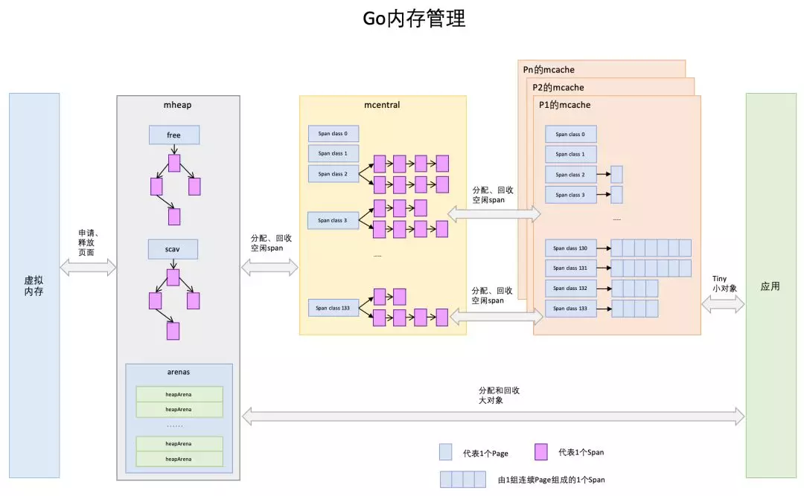

# Go Dive
Golang的一些底层原理解析，在这篇笔记里我主要想学习的部分有：

- [Slice与Map的底层实现](#常用数据结构)
- [Golang内存管理](#go-内存管理)
- [Golang Memory Model（内存模型）](#golang-memery-model)
- [垃圾回收](#golang-gc)
- [调度器 Scheduler](#golang-scheduler)
- [并发（sync包）](#sync包相关)

-------

# 常用数据结构
[Golang 基本数据结构](./golang/Golang基本数据结构.md)

# Go 内存管理
这里的内存管理一般指的是堆内存管理，因为栈上的内存分配和回收非常简单，不需要程序操心，而堆内存需要程序自己组织、分配和回收，用于动态分配内存。Golang内存管理的主要思想源自Google的 `TCMalloc`算法，全称`Thread-Caching Malloc`，核心思想就是把内存分为多级管理，从而降低锁的粒度。即为每个线程预分配一块缓存（Thread-cache），线程申请小内存时，可以从缓存分配内存，这样做有两个好处：

1. 不必每次申请内存时都向操作系统申请，避免了系统调用，提升速度
2. 由于这块缓存（Thread-cache）是每个线程独有的，因此不存在多个线程竞争的问题，多个线程同时申请小内存时，从各自的缓存分配，**无需加锁**，进一步提升速度

`TCMalloc`算法这里就跳过了，直接介绍Go的内存管理，两者比较相似。



首先介绍一下Go内存管理的基本概念和数据结构：

## Page
操作系统对内存管理以页为单位，不过这里的页不是操作系统中的页，它一般是操作系统页大小的几倍，x64下Page大小是8KB

## `mspan`
Go中内存管理的基本单元，一组连续的Page组成1个Span。`mspan`这个数据结构主要包含以下信息：

- 链表中上一个和下一个`mspan`的地址（简单说，`mspan`是一个**双向链表**）
- 起始地址（这组page的起始地址）
- `spanClass`，一个0~`numSpanClasses`(常量，134)之间的值，可以理解为对这个`mspan`的分类，或者叫它的规格，之后详细介绍，简单说就是不同spanClass的`mspan`可以存储的对象大小是不一样的
- 其他信息......

## `mcache`
与 Thread-Cache 类似，每个线程绑定一个`mcache`（具体来说是每个P绑定一个`mcache`）。这样小对象直接从`mcache`分配内存，不用加锁

`mcache`这个数据结构中保存了各种spanClass的`mspan`：

```go
type mcache struct {
    alloc [numSpanClasses]*mspan // numSpanClasses = = _NumSizeClasses << 1，即2*67 = 134
}
```

`mcache`中的`alloc`是一个大小为134的数组，其中的每个元素都是一个`mspan`双向链表，并且同一个链表上的内存块大小是相同的，相当于按照spanClass给不同规格的`mspan`分类存储在数组中进行管理（可以参考上面的图），这样可以根据申请的内存大小，快速从合适的`mspan`链表选择空闲内存块。

## `mcentral`
为所有`mcache`提供按照spanClass分好类的`mspan`资源（实际代码中每1个spanClass对应1个`mcentral`），当某个`mcache`的某个spanClass的`mspan`中的内存被分配光时，它会向`mcentral`申请一个对应spanClass的`mspan`。当`mcache`内存块多时，可以放回`mcentral`。`mcentral`被所有工作线程共享，因此需要加锁访问（获取和归还）

```go
// 保留重要成员变量
type mcentral struct {
    // 互斥锁
    lock mutex 
    
    // 规格
    sizeclass int32 
    
    // 尚有空闲object的mspan链表
    nonempty mSpanList 
    
    // 没有空闲object的mspan链表，或者是已被mcache取走的msapn链表
    empty mSpanList 
    
    // 已累计分配的对象个数
    nmalloc uint64 
}
```

`mcache`从`mcentral`获取和归还`mspan`的流程：

- 获取
加锁；从`nonempty`链表找到一个可用的`mspan`；并将其从`nonempty`链表删除；将取出的`mspan`加入到`empty`链表；将`mspan`返回给工作线程；解锁。

- 归还
加锁；将`mspan`从`empty`链表删除；将`mspan`加入到`nonempty链表；解锁。

## `mheap`
是堆内存的抽象，把从OS申请出的内存页组织成`mspan`，并保存起来。当`mcentral`没有空闲的`mspan`时，会向`mheap`申请。而`mheap`没有资源时，会向操作系统申请新内存。同样需要加锁访问

`mheap`里保存了2棵二叉排序树（见第一张大图），按`mspan`的page数量进行排序：

1. `free`：`free`中保存的`mspan`是空闲并且非垃圾回收的`mspan`。
2. `scav`：`scav`中保存的是空闲并且已经垃圾回收的`mspan`。

如果是垃圾回收导致的`mspan`释放，`mspan`会被加入到`scav`，否则加入到`free`，比如刚从OS申请的的内存也组成的`mspan`。

堆区总览：


主要关注图里的`spans`和`arena`区域，`spans`区域存放`mspan`的指针，而`arena`区域就是实际分配内存的地方，被分割成以页为单位，再把页组合起来成为Go的内存管理的基本单元`mspan`，`mspan`数据结构里面存放的起始地址信息就是指向的`arena`区域。`bitmap`区域标识`arena`区域哪些地址保存了对象，并且用4bit标志位表示对象是否包含指针、GC标记信息。

## 内存分配
当为一个对象分配内存时，Golang首先根据申请的内存大小将对象进行分类：


Tiny对象指大小在1Byte到16Byte之间并且不包含指针的对象，使用`mcache`的tiny分配器直接分配；

而超过32KB的大对象直接从`mheap`上分配，与`mcentral`向`mheap`申请内存的流程大致相同；

下面主要介绍小对象的内存分配流程。

之前说过，`mspan`是Golang内存管理的基本单元，所以当小对象申请内存时，Golang需要做的就是：从`mcache`中寻找合适的`mspan`进行分配；而`mcache`中保存的`mspan`双向链表又是以spanClass进行分类的（`mcache`中的`alloc`数组），所以第一步就是计算出对象申请的内存大小对应的spanClass：

1. 计算sizeClass，因为得到了sizeClass我们才能计算出spanClass。在Golang里sizeClass一共有67种，可以理解为对内存大小的一个分类，不同sizeClass可以保存的大小是不一样的。每个sizeClass可以保存的大小是用一个数组写死在了源码里（空间换时间）：

```go
const _NumSizeClasses = 67

var class_to_size = [_NumSizeClasses]uint16{0, 8, 16, 32, 48, 64, 80, 96, 112, 128, 144, 160, 176, 192, 208, 224, 240, 256, 288, 320, 352, 384, 416, 448, 480, 512, 576, 640, 704, 768, 896, 1024, 1152, 1280, 1408, 1536,1792, 2048, 2304, 2688, 3072, 3200, 3456, 4096, 4864, 5376, 6144, 6528, 6784, 6912, 8192, 9472, 9728, 10240, 10880, 12288, 13568, 14336, 16384, 18432, 19072, 20480, 21760, 24576, 27264, 28672, 32768}
```

举个例子，如果一个对象大小在(0, 8]byte之间，对应的sizeClass就是1（往右取数组下标），对象大小在(8, 16]byte之间，对应的sizeClass就是2

2. 根据sizeClass计算spanClass

```go
numSpanClasses = _NumSizeClasses << 1 // 2 * 67 = 134
```

可以发现sizeClass一共是67，而这里spanClass是`_NumSizeClasses`的两倍，原因在于为了加速之后内存回收的速度，`mspan`也是做了区分的，在`mcache`中的`alloc`数组里保存的`mspan`，有一半分配的对象不包含指针，另一半则包含指针，对于无指针对象的`mspan`在进行垃圾回收的时候无需进一步扫描它是否引用了其他活跃的对象。

sizeClass到spanClass的计算如下：

```go
// noscan为true代表对象不包含指针
func makeSpanClass(sizeclass uint8, noscan bool) spanClass {
    return spanClass(sizeclass<<1) | spanClass(bool2int(noscan))
}
```

得到spanClass之后，就可以从`mcache`中选择相应的`mspan`进行分配；如果`mcache`中没有相应规格的`mspan`，则会向`mcentral`申请；如果`mcentral`没有合适的`mspan`（`nonempty`和`empty`链表里都没有合适的`mspan`），则会向`mheap`申请；如果`mheap`没有，则会向操作系统申请。

`mcentral`向`mheap`申请时，`mheap`优先从`free`中搜索可用的`mspan`，如果没有找到，会从`scav`中搜索可用的`mspan`，如果还没有找到，它会向OS申请内存，再重新搜索2棵树，必然能找到`mspan`。如果找到的`mspan`比需求的大，则将其分割成2个`mspan`，其中1个刚好是需求大小，把剩下的再加入到`free`中去，然后设置需求`mspan`的基本信息，然后交给`mcentral`。

## 推荐阅读
推荐两篇不错的文章，结合着看，更加清晰：

- [Go内存分配那些事，就这么简单！](https://mp.weixin.qq.com/s/3gGbJaeuvx4klqcv34hmmw)
- [图解Go语言内存分配](https://qcrao.com/2019/03/13/graphic-go-memory-allocation/)

# Golang Memery Model
在同一个Goroutine中，如果我们有下面的语句：

```go
a = 1
b = 3
```

我们可以保证这几条赋值语句是按顺序执行的。但是，对于另一个Goroutine来说，它所观察到的顺序可能不是我们在代码里看到的顺序，比如，它可能先观察到`b = 3`，然后`a = 1`。至于原因可以了解一下CPU缓存一致性协议MESI，以及有了MESI之后为什么还会有缓存一致性问题。

那这会造成什么问题呢？比如我们可以看一下下面这些有问题的代码：

```go
var a, b int

func f() {
	a = 1
	b = 2
}
func main() {
	go f()
	print(a)
    print(b)
}
```

打印出来的a和b的值可能是赋值之后的，也可能是0

再来看另一个有问题的代码：

```go
var a string
var done bool

func setup() {
    a = "hello, world"
    done = true
}

func main() {
    go setup()
    for !done {}
    print(a)
}
```

我们创建了`setup`线程，用于对字符串a的初始化工作，初始化完成之后设置done标志为true。main函数所在的主线程中，通过`for !done {}`检测done变为true时，认为字符串初始化工作完成，然后进行字符串的打印工作。

但是Go语言并不保证在main函数中观测到的对done的写入操作发生在对字符串a的写入的操作之后，因此程序很可能打印一个空字符串。更糟糕的是，因为两个线程之间没有同步事件，`setup`线程对done的写入操作甚至无法被main线程看到（可能始终在CPU寄存器中），main函数有可能陷入死循环中。

因此，Go内存模型其实是一个概念，指定了某些条件，在这些条件下，可以保证在一个Goroutine中对一个共享变量的写入，可以被另一个Goroutine观察到。

## 什么是 Happens Before
就是字面意思，两个语句`a = 1; b = 3`只有三种情况：

1. `a = 1` happens before `b = 3`
2. `a = 1` happens after `b = 3`
3. `a = 1` and `b = 3` happen concurrently

如果对一个变量的赋值操作w要保证被另一个读取操作r观察到，运用 Happens before 概念，我们可以得出需要满足如下条件：

- w happens before r
- 任何其他对变量的赋值操作要么happens before w，要么happens after r

下面介绍一些在Go编程中可以确定是 happens before 的语句（不全，更详细的可以参考官方文档）

## init()
如果在`package a`中导入了`package b`，那么`package b`的`init()` happens before `package a`的`init()`

## channel
- 对一个channel的发送操作 happens before 接收操作完成
- 对一个channel进行`close()` happens before 接收到零值
- 对一个无缓冲channel的接收操作 happens before 发送操作完成（意思就是发送会阻塞，直到被接收）
- 带缓冲的channel也是一样，超出缓冲区的发送会阻塞

对于最开始的那几段有问题的代码，解决办法就是通过同步原语来给两个事件明确排序。可以用`sync.Mutex()`，也可以用``channel

## 推荐阅读
关于 Golang Memory Model，就推荐一篇文章，[官方文章](https://golang.org/ref/mem)，讲的很清楚

# Golang GC
三色标记法，直接看：

[Golang垃圾回收(GC)介绍](https://liangyaopei.github.io/2021/01/02/golang-gc-intro/)

# Golang Scheduler
Go的运行时（Runtime）管理着调度、垃圾回收以及goroutine的运行环境，本次主要介绍调度器（scheduler）。


为什么需要调度器？主要是为了方便高并发程序的编写。线程是CPU调度的实体，但线程切换还是有一定代价的。Goroutine更加轻量，程序员只需要面对Goroutine，由scheduler将Goroutine调度到线程上执行。

所谓M:N模型就是指，N个goroutine在M个线程上执行。

## goroutine和线程的区别

1. 内存占用
创建一个 goroutine 的栈内存消耗为 2 KB，实际运行过程中，如果栈空间不够用，会自动进行扩容。创建一个 thread 则需要消耗 1 MB 栈内存，而且还需要一个被称为 “a guard page” 的区域用于和其他 thread 的栈空间进行隔离。

对于一个用 Go 构建的 HTTP Server 而言，对到来的每个请求，创建一个 goroutine 用来处理是非常轻松的一件事。而如果用一个使用线程作为并发原语的语言构建的服务，例如 Java 来说，每个请求对应一个线程则太浪费资源了，很快就会出 OOM 错误（OutOfMermoryError）。

2. 创建和销毀
Thread 创建和销毀都会有巨大的消耗，因为要和操作系统打交道，是内核级的，通常解决的办法就是线程池。而 goroutine 因为是由 Go runtime 负责管理的，创建和销毁的消耗非常小，是用户级。

3. 切换
当 threads 切换时，需要保存各种寄存器，以便将来恢复：

16 general purpose registers, PC (Program Counter), SP (Stack Pointer), segment registers, 16 XMM registers, FP coprocessor state, 16 AVX registers, all MSRs etc.

而 goroutines 切换只需保存三个寄存器：Program Counter, Stack Pointer and BP。

一般而言，线程切换会消耗 1000-1500 纳秒，一个纳秒平均可以执行 12-18 条指令。所以由于线程切换，执行指令的条数会减少 12000-18000。

Goroutine 的切换约为 200 ns，相当于 2400-3600 条指令。

因此，goroutines 切换成本比 threads 要小得多。

## 调度器：M，P和G
调度器的底层实现主要有三个数据结构：`m`, `p`, `g`

- `g`：一个`g`表示了一个goroutine，主要包含了当前goroutine栈的一些字段
- `m`：代表一个操作系统的线程，goroutine需要调度到`m`上运行。`m`可以理解为“machine”
- `p`：一个抽象的处理器，可以理解为**Logical Processor**，通常P的数量等于CPU核数（GOMAXPROCS）。`m`需要获得`p`才能运行`g`

早期版本的Golang是没有P的，调度是由G与M完成。 这样的问题在于每当创建、终止Goroutine或者需要调度时，需要一个全局的锁来保护调度的相关对象。 全局锁严重影响Goroutine的并发性能。

先看一张图理解`g`，`m`，`p`之间的交互关系：


每个`p`都维护了一个自己的LocalQueue，里面是一个`g`的队列，除此之外还有一个全局的GlobalQueue，存储全局可运行的goroutine，这些`g`还没有被分配到具体的`p`。当一个goroutine被创建，或者变为可执行状态（runnable）时，就会被放到LocalQueue或者GlobalQueue中。如果LocalQueue还有剩余空间就会放到LocalQueue中，否则就会把LocalQueue中的一部分goroutine和待加入的goroutine放入GlobalQueue中。

当一个`g`执行结束时，`p`会将其从队列中取出，从队列中选择下一个可运行的`g`放到`m`上执行，选择的顺序如下：

1. 有一定概率先从GlobalQueue中寻找（每61次找一次）
2. 从LocalQueue中寻找
3. 如果前面都没有找到，会通过`runtime.fundrunnable()`进行阻塞查找：
    1. 从LocalQueue、GlobalQueue中查找
    2. 从网络轮询器（network poller）中查找（之后会介绍）
    3. 如果没有找到，尝试从其他`p`的LocalQueue中进行工作偷窃（work stealing），会随机选择一个`p`，并“偷”过来这个`p`的LocalQueue中一半的`g`

## 系统调用
当`g`需要进行系统调用时，分两种情况，如果是阻塞的系统调用（syscall），那么运行当前`g`的`m`就会从依附的`p`上摘除（detach），然后创建一个新的`m`来服务于这个`p`。当系统调用完成之后，这个`g`就会被重新放入之前`p`的LocalQueue等待调度，而之前detach的`m`则会休眠，加入到空闲线程中（不会销毁，以避免频繁的创建和销毁线程，损失性能）。


对于非阻塞的情况，当前`g`会被绑定到网络轮询器（network poller）上，等系统调用结束，当前`g`才会回到之前的`p`上等待调度。


## 抢占式调度
在 Go1.14 之前，是基于协作的抢占式调度。 runtime在程序启动时，会自动创建一个系统线程，运行sysmon()函数，在整个程序生命周期中一直执行。sysmon()会调用retake()函数，retake()函数会遍历所有的P，如果一个P处于执行状态， 且已经连续执行了较长时间，就会设置它的抢占标志位，这将导致该P中正在执行的G进行下一次函数调用时，会通过调用dropg()将G与M解除绑定；再调用globrunqput()将G加入全局runnable队列中。最后调用schedule() 来用为当前P设置新的可执行的G。

因此，如果在goroutine内部没有一些`time.Sleep()`，channel，函数调用之类的触发调度的抢占点，那么有可能该goroutine就会一直执行，如果是无限循环，也不会被调度走，就有可能会导致其他goroutine不能得到调度。Go 1.14引入基于信号的抢占之后，这个问题得到了解决。

## 推荐阅读
- [Go语言设计与实现-调度器](https://draveness.me/golang/docs/part3-runtime/ch06-concurrency/golang-goroutine/)，比较深入，源码级别，不确定或者想知道更细节的地方可以参考这篇文章
- [深度解密Go语言之scheduler - qcrao](https://qcrao.com/2019/09/02/dive-into-go-scheduler/)


# sync包相关
effective-go里有一些内容了，记个TODO，之后再补：

- https://qcrao.com/2019/07/22/dive-into-go-channel/
- https://qcrao.com/2020/04/20/dive-into-go-sync-pool/
- https://qcrao.com/2020/05/06/dive-into-go-sync-map/
- https://colobu.com/2018/12/18/dive-into-sync-mutex/

## 互斥锁如何实现公平
如果多个 goroutine 都在请求同一个锁，`sync.Mutex` 是如何实现分配公平的呢？我们可以从`Mutex`的注释中理解：

> 

    互斥锁有两种状态：正常状态和饥饿状态。

    在正常状态下，所有等待锁的 goroutine 按照FIFO顺序等待。唤醒的 goroutine 不会直接拥有锁，而是会和新请求锁的 goroutine 竞争锁的拥有。新请求锁的 goroutine 具有优势：它正在 CPU 上执行，而且可能有好几个（注：可以减少调度开销；充分利用缓存），所以刚刚唤醒的 goroutine 有很大可能在锁竞争中失败。在这种情况下，这个被唤醒的 goroutine 会加入到等待队列的前面。 如果一个等待的 goroutine 超过 1ms 没有获取锁，那么它将会把锁转变为饥饿模式。

    在饥饿模式下，锁的所有权将从 unlock 的 goroutine 直接交给交给等待队列中的第一个。新来的 goroutine 将不会尝试去获得锁，即使锁看起来是 unlock 状态, 也不会去尝试自旋操作，而是放在等待队列的尾部。

    如果一个等待的 goroutine 获取了锁，并且满足一以下其中的任何一个条件：(1)它是队列中的最后一个；(2)它等待的时候小于1ms。它会将锁的状态转换为正常状态。

    正常状态有很好的性能表现，饥饿模式也是非常重要的，因为它能阻止尾部延迟的现象。

