# MongoDB 介绍：从存储引擎到分布式架构

- [基础概念](#基础概念)
    - [NoSQL与RDBMS的区别](#nosql与rdbms的区别)
    - [为什么要使用MongoDB？](#为什么要使用mongodb)
    - [概念对比](#概念对比)
    - [BSON数据格式](#bson数据格式)
    - [_id主键](#_id主键)
- [WiredTiger 存储引擎](#wiredtiger-存储引擎)
    - [索引实现](#索引实现)
    - [Cache](#cache)
    - [写入原理](#写入原理)
        - [Checkpoint](#checkpoint)
    - [Cache Eviction](#cache-eviction)
    - [MVCC](#mvcc)
- [分布式架构](#分布式架构)
    - [Replica Set 副本集](#replica-set-副本集)
        - [数据同步机制](#数据同步机制)
        - [选举机制](#选举机制)
    - [分片集群架构](#分片集群架构)
        - [分片方式](#分片方式)
- [参考](#参考)

# 基础概念

MongoDB 是目前主流的 NoSQL 数据库之一，由 C++ 语言编写，与关系型数据库和其它的 NoSQL 不同，MongoDB 使用了**面向文档**的数据存储方式，将数据以类似 JSON 的方式存储在磁盘上

  

## NoSQL与RDBMS的区别

*   NoSQL是非关系型数据库，相比传统的RDBMS（Relational Database Management System）只能支持高度结构化的数据（预先定义表结构），NoSQL支持的数据结构更加灵活（几乎不需要预先定义数据结构），因此节省了一些时间和空间上的开销；
    

*   RDB支持结构化查询语言，支持复杂的查询功能和表关联。NoSQL只能进行简单的查询
    

*   NoSQL中不需要维护数据之间的关系，不支持join操作，仅追求最终一致性，因此更加容易水平扩展。而RDB的很多操作（比如事务）还是依赖于单机系统，保证强一致性，因此不容易水平扩展
    

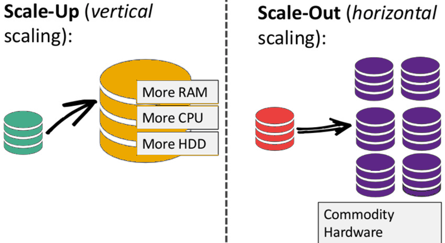

*   由于NoSQL非常利于分布式部署，因此它的特点是能支持大数据量（TB级）、高可用（CAP理论）
    

  

## 为什么要使用MongoDB？

*   分布式场景：**高可用、****大数据****量**
    

*   面向文档的数据库：存储的**数据结构非常灵活**，对于插入的文档的数据结构没有任何限制，同一张表里也能存储不同结构的记录；**文档解析性能**非常优秀，适用于结构复杂的一些数据（比如层层嵌套的json数据）
    

*   介于非关系型数据库和关系型数据库之间：作为NoSQL数据库，同时还支持一些类似SQL的查询方式，比如按字段查询、范围查询、正则表达式查询、聚合查询等，使得**数据查询也很方便**
    

  

## 概念对比

通过将MongoDB与RDBMS中的概念进行对比，更有利于理解Mongo的一些概念：

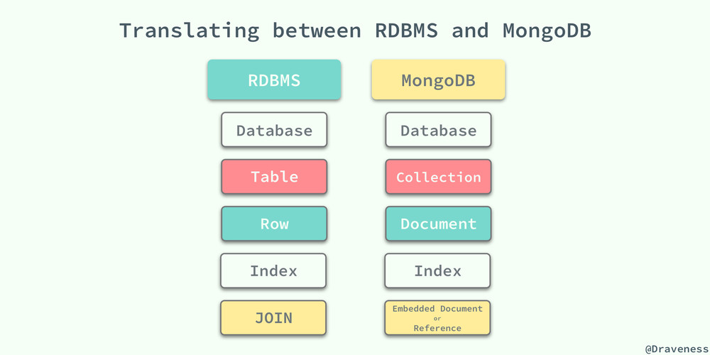

*   Collection：相当于MySQL中的表的概念，Mongo中叫做集合
    

*   Document：MySQL中相当于一条记录，Mongo中叫做一个文档
    

*   Field：Mongo文档中的字段，相当于MySQL中的一个Column（字段）
    

  

## BSON数据格式

MongoDB中的文档是以bson的格式进行存储的，BSON（Binary JSON）是一种类似json的数据格式，但是其支持了**更多的数据类型**：

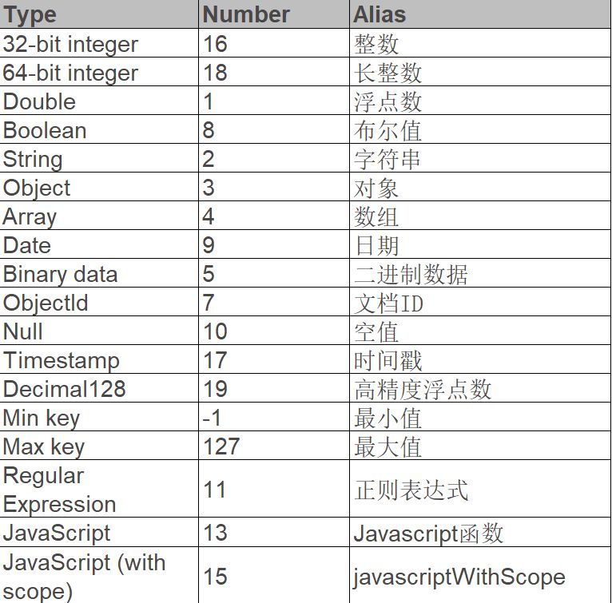

除此之外，BSON相比JSON还具有**更快的****遍历****速度**：在JSON中，要跳过一个文档进行数据读取，需要对此文档进行扫描才行，需要进行麻烦的数据结构匹配，比如括号的匹配，而BSON对JSON的一大改进就是，它会将JSON的每一个元素的长度存在元素的头部，这样你只需要读取到元素长度就能直接seek到指定的点上进行读取了。

  

## _id主键

MongoDB会为每一个插入的文档都默认添加一个`_id`字段，相当于这条记录的主键，用于保证每条记录的唯一性。由于MongoDB是适用于分布式场景的，因此这个全局唯一的`_id`需要使用一种分布式唯一ID的生成算法。

  

MongoDB采用的是类似Snowflake的分布式ID生成算法：

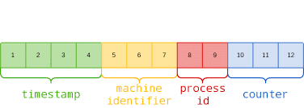

其中包括：

*   4-byte Unix 时间戳
    

*   3-byte 机器 ID
    

*   2-byte 进程 ID
    

*   3-byte 计数器(初始化随机)
    

  

# WiredTiger 存储引擎

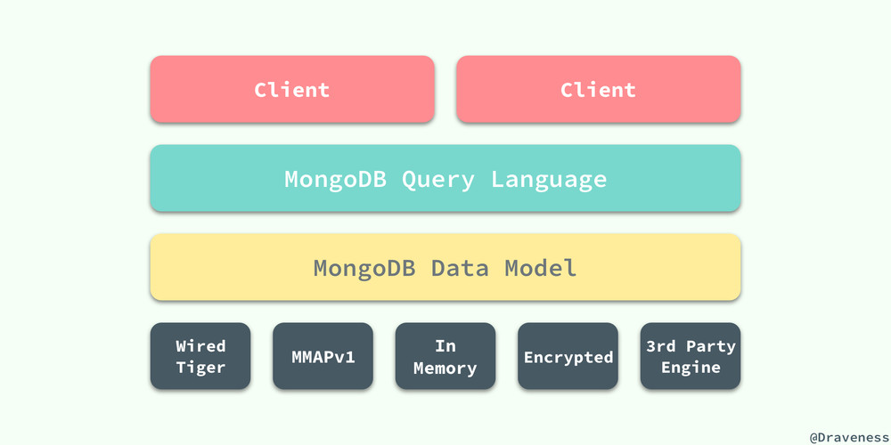

与MySQL类似，MongoDB底层也使用了『可插拔』的存储引擎以满足用户的不同需要。最新版本默认的存储引擎是「Wired Tiger」

  

## 索引实现

Wired Tiger存储引擎使用了B+树实现索引，关于索引的数据结构到底用的是B树还是B+树，我在不同的博客里看到了不同的说法，但是最终确认应该是B+树（[参考](https://stackoverflow.com/questions/5520311/what-mongo-index-algorithm-is-using-binary-tree)）

  

关于B+树的实现原理这里就不介绍了，还是看MySQL最经典。可以参考之前的分享：

*   [InnoDB 索引原理与使用](https://bytedance.feishu.cn/docs/doccn99mAdAARrMROkbMgsaE1Kd)
    

*   [数据库中常用索引介绍](https://bytedance.feishu.cn/docx/doxcn11P6w03KJNQwtBKUVzSOig)
    

  

在v5.3版本之后，MongoDB可以支持**聚簇索引**（[参考](https://www.mongodb.com/docs/v6.0/core/clustered-collections/)）

  

## Cache

类似MySQL，Wired Tiger也是使用「页」作为与磁盘交互的基本单位，但是不同于MySQL的是，WT在磁盘上的数据组织方式和内存中是不同的，在磁盘上的数据一般是经过压缩以节省空间和读取时的IO开销。当从磁盘向内存中读取数据时，一般会经过解压缩、将数据重新构建为内存中的数据组织方式等步骤。

  

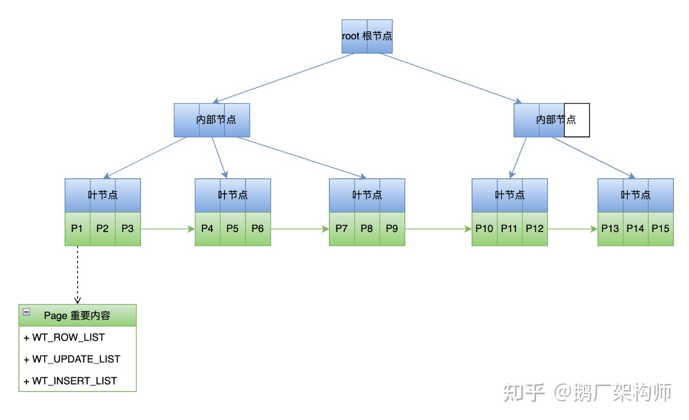

  

上图是Page在内存中的数据结构，是一个典型的B+ Tree，每个叶节点的Page上有3个重要的list：WT\_ROW、WT\_UPDATE、WT\_INSERT：

*   内存中的B+树：是一个checkpoint。初次加载时并不会将整个B+树加载到内存，一般只会加载根节点和第一层的数据页，后续如果需要读取数据页再从磁盘加载
    

*   叶节点Page的 WT\_ROW：是从磁盘加载进来的数据数组
    

*   叶节点Page的 WT\_UPDATE：是记录数据加载之后到下个checkpoint之间，该叶节点中被修改的数据
    

*   叶节点Page的 WT\_INSERT：是记录数据加载之后到下个checkpoint之间，该叶节点中新增的数据
    

  

## 写入原理

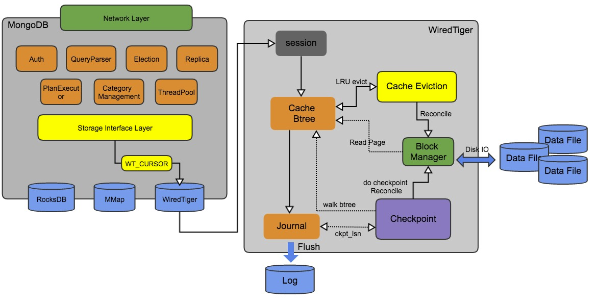

对于数据页的修改（update、insert、delete）都是在内存中的，因此需要有一定的机制来保证修改的持久化。在Wired Tiger中，达到一定的条件之后，就会触发生成一次**Checkpoint**，类似于MySQL中的Checkpoint概念。在生成新的Checkpoint的过程中，会将在内存中做过修改的脏页刷到磁盘。当系统崩溃时，下次重启恢复就从最新的Checkpoint开始恢复。从3.6版本开始，默认配置是**60s做一次checkpoint**。

  

除了Checkpoint机制，Wired Tiger也使用了Write Ahead Log（预写式日志）来保证持久化，叫做**Journal**，类似于MySQL中的redo log。默认使用了压缩算法节省空间。

  

Journal日志默认**100****ms****/约100MB**/其他情况（如客户端提供了强制刷盘的参数）刷一次盘。Wired Tiger会自动删除老的日志，只保留从上次checkpoint开始恢复需要的日志

  

### Checkpoint

生成Checkpoint的流程主要可以分为两步，第一步是遍历内存中的数据页，将所有脏页刷到磁盘中；第二步是会将一些metadata刷到磁盘中。在系统启动时，就会根据checkpoint的metadata来构建内存中的B+树结构。Checkpoint元数据包含的信息（略）如图所示：

  

更多细节可以参考：

*   [WiredTiger系列3:Checkpoint/Block Mgr-CSDN博客](https://blog.csdn.net/qq_35192280/article/details/114766331)
    

*   [WT-checkpoint官方文档](https://source.wiredtiger.com/develop/arch-checkpoint.html)
    

  

## Cache Eviction

Wired Tiger中的读写都是基于内存的，这样大大利用了内存的高速读写性能，但是内存终究是有限的，当内存使用率达到一定的阈值时，Wired Tiger将会按照**LRU****算法**清理内存中的数据页，可能是未做过修改的数据页或者做过修改的脏页，从而释放一定的内存空间。这个过程就叫做**Cache Eviction**（内存逐出）

  

Eviction的**触发时机**包括：

*   WT的Cache空间的使用率达到一定阈值（80%）
    

*   Cache中的脏页占用空间的百分比达到一定阈值
    

*   Cache中有单个数据页的大小超过一定的阈值时
    

  

Cache Eviction流程包含**Evict Pass（选取）**和**Evict Page（淘汰）**两个步骤。

  

选取阶段是一个阶段性扫描的过程，一次扫描可能并不会扫描内存中全部的B+树，每次扫描结束时会记录当前扫描到的位置，下次扫描时直接从上次结束的位置开始。

扫描过程中，如果 page 满足淘汰条件，则会将 page 添加到一个 **evict** **queue****（逐出****队列****）**中，如果evict queue 填充满了或者本次扫描遍历了所有 B+树，则结束本次扫描。

之后会对 evict queue 中的page进行评分，用于执行**LRU****算法**，评分的依据包括每个page当前的访问次数、page类型等。

  

接下来进行 evict page（淘汰）阶段，这个阶段其实就是对 evict queue 中的page进行回收（可能需要刷盘）。其中刷盘的步骤在WT里称为 **Reconcile**，指的就是将内存中的page格式转化为磁盘的格式然后写入到磁盘的过程。

  

## MVCC

Wired Tiger使用**MVCC**机制实现了不同的隔离级别。在事务开始读取时，会生成一个**快照（snapshot）**，类似于MySQL中ReadView的概念，快照保存了当前系统中所有活跃的事务id。

对于每一条数据，都会维护一个**版本链**，最新的修改总是会直接append到链表头上，版本链上的每个版本都记录了做出修改的事务id。

因此，当对一条记录进行读取的时候，是从链表头根据版本对应的事务id和本次读事务的 snapshot 来判断是否可读，如果不可读，向链表尾方向移动，直到找到读事务能读取的数据版本。

  

基于snapshot，Wired Tiger实现了三种隔离级别：

*   **Read-Uncommited**（未提交读）：其实就是脏读，不需要使用snapshot，总是读取版本链上最新的数据
    

*   **Read-Commited**（已提交读）：可以读到已提交的数据，可能会产生幻读。实现方式就是在每次读取之前都生成一次snapshot
    

*   **Snapshot-Isolation**（快照隔离）：相当于MySQL中的可重复读，只在事务开始的时候做一次snapshot，之后的读取都基于这个snapshot
    

  

# 分布式架构

MongoDB的一大优势是支持分布式部署，从而提供高可用、高可扩展等特性。因此接下来将会介绍一下MongoDB的分布式部署的架构

  

## Replica Set 副本集

副本集（Replica Set）简单来说就是一份数据会在多个实例上保存，即保存了数据的多个副本，节点之间通过**主从模式**进行数据同步，从而可以实现**读写分离**。同时，副本集还支持**故障自动恢复**，即节点之间相互有心跳，在主节点挂掉时可以进行重新选举，从而实现**高可用**。

  

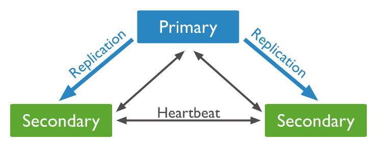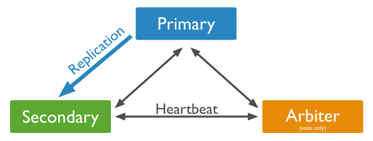

  

MongoDB副本集的架构是由一个**主节点（Primary）**、一个或多个**从节点（Secondary）**、0个或1个**仲裁节点（Arbiter）**组成：

*   主节点负责接收写入请求，并且会对从节点进行数据同步
    

*   从节点从主节点同步数据，如果主节点挂掉会参与选举。读请求是否由从节点处理是根据客户端配置决定的
    

*   仲裁节点不存储数据，只负责选举时投票
    

节点之间会定时（2s）互相发送**心跳**，如果从节点在10秒内没有收到主节点的响应就会判断主节点下线。

  

### 数据同步机制

主节点和从节点之间使用**oplog**进行数据同步，类似于MySQL中的binlog。oplog会记录数据变更的信息，从节点持续从 Primary 拉取新的 oplog 并在本地进行回放以达到同步的目的。oplog是幂等的，多次回放产生的结果相同

  

### 选举机制

选举用于确定副本集的Primary节点，当副本集初始化，或者主节点挂掉时，会触发选举；选举使用**raft****算法**，当某个节点获得超过半数的投票时，可以成为主节点，因此副本集部署时一般会使用奇数个节点。

  

选举成功之后，选举出来的主节点会有一个追赶（**Catchup**）操作，即会先检查其它节点是否有比自己更新的oplog，如果没有就直接即位，如果有就先把数据同步过来再即位。

  

## 分片集群架构

分片就是为了进行水平扩展，从而使得数据库能够支撑海量数据存储。MongoDB的分片类似于Redis的集群（cluster）概念，将所有的数据按照一定的规则分散在多个shard上进行存储，每个shard只管理自己的一部分数据。整体架构如下：

  

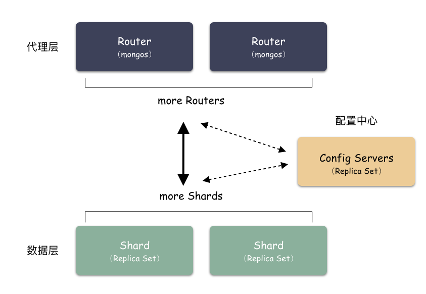

  

*   代理层 mongos：根据分片规则，决定client的读/写请求需要路由到哪一个shard进行处理
    

*   配置中心 config servers：负责存储集群的各种元数据和配置，如分片地址。也是以副本集的方式部署的
    

*   数据层 Shard：用于存储数据，每个shard也是以副本集的方式部署的。
    

  

在一个shard内部，MongoDB还会把数据分为**chunks**，每个chunk代表这个shard server内部一部分数据；如果单个chunk过大，则会将其进行切分。

  

因此，数据的增长会让一个shard中的chunk数量变得越来越多，可能会导致各个shard之间chunk数量的不平衡。当shard之间最大和最小的chunk数量差值超过一定阈值时，MongoDB就会启动**balancer**，进行**数据均衡**，将chunk从数量多的shard移动到数据少的shard上。

  

### 分片方式

用户可以指定使用集合的某个字段作为**shard key**（分片键），使用这个字段作为分片的依据。分片键必须有索引。根据分片键进行分片的策略主要有两种：

*   **哈希****分片**：优点在于各个shard的数据分布基本均匀
    

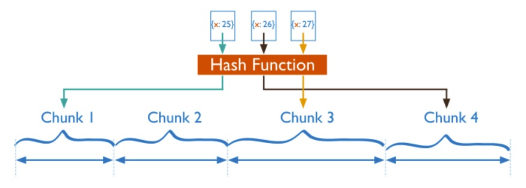

*   **范围****分片**：优点在于可以对分片键进行范围查找，缺点在于如果shard key有明显递增（或者递减）趋势，则新插入的文档多会分布到同一个chunk，无法扩展写的能力
    

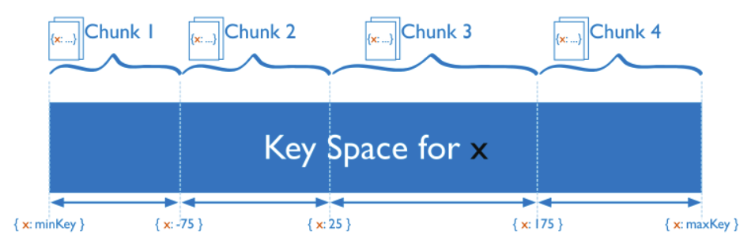

  

# 参考

**MongoDB****整体**

*   [♥MongoDB教程 - Mongo知识体系详解♥](https://pdai.tech/md/db/nosql-mongo/mongo.html)
    

*   [了解 MongoDB 看这一篇就够了 - 知乎](https://zhuanlan.zhihu.com/p/87722764)
    

*   [MongoDB分享](https://bytedance.feishu.cn/docx/doxcnL5jdDWekCzCFIn30cmRvwe)
    

**基础概念**

*   [NoSql的易扩展性](http://t.zoukankan.com/leftfist-p-4257882.html)
    

*   [『浅入浅出』MongoDB 和 WiredTiger - 面向信仰编程](https://draveness.me/mongodb-wiredtiger/)
    

**WiredTiger简介**

*   [官方文档-WT简介](https://www.mongodb.com/docs/manual/core/wiredtiger/)
    

*   [解密未来数据库设计:MongoDB新存储引擎WiredTiger实现(事务篇)](https://mp.weixin.qq.com/s?__biz=MzAwMDU1MTE1OQ==&mid=2653547303&idx=1&sn=c8bd7648fe94d570ca2ba307eb92b212&scene=21#wechat_redirect)
    

**WiredTiger -- 数据页**

*   [7-10倍写入性能提升:剖析WiredTiger数据页无锁及压缩黑科技](https://mp.weixin.qq.com/s?__biz=MzAwMDU1MTE1OQ==&mid=2653547449&idx=1&sn=f2854a3652fda00a0a25a7cd33b44045&scene=21#wechat_redirect)（感觉很难读）
    

*   [WiredTiger系列1:数据页详解-CSDN](https://blog.csdn.net/qq_35192280/article/details/112971258)
    

**WiredTiger -- Cache Eviction**

*   [WiredTiger系列2:Eviction详解-CSDN博客](https://blog.csdn.net/qq_35192280/article/details/114638897)
    

*   [MongoDB 3.0挂起原因？WiredTiger实现：一个LRU cache深坑引发的分析](https://mp.weixin.qq.com/s?__biz=MzAwMDU1MTE1OQ==&mid=2653547778&idx=1&sn=fe59b6e6821179e72595867db500ad71&scene=0)