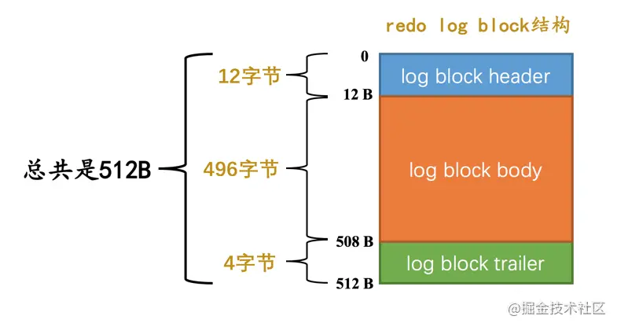

# MySQL

- [服务端处理请求的过程](#服务端处理请求的过程)
- [InnoDB引擎中一条记录是怎样存储的](#innodb引擎中一条记录是怎样存储的)
    * [Compact 行格式](#compact-行格式)
    * [Dynamic和Compressed行格式](#dynamic和compressed行格式)
- [InnoDB数据页的结构](#innodb数据页的结构)
    * [Page Directory](#page-directory)
- [索引](#索引)
    * [回表的代价](#回表的代价)
    * [索引的选择](#索引的选择)
- [InnoDB的Buffer Pool](#innodb的buffer-pool)
    * [LRU链表](#lru链表)
    * [Flush链表](#flush链表)
- [查询优化](#查询优化)
    * [单表查询](#单表查询)
    * [表连接的原理](#表连接的原理)
    * [子查询的执行方式](#子查询的执行方式)
    * [查询优化](#查询优化)
- [事务之redo log](#事务之redo-log)
    * [redo日志格式](#redo日志格式)
    * [redo日志的写入过程](#redo日志的写入过程)
    * [Log Sequence Number](#log-sequence-number)
    * [Checkpoint](#checkpoint)
    * [崩溃恢复](#崩溃恢复)
- [事务之undo log](#事务之undo-log)
    * [Insert对应的undo日志](#insert对应的undo日志)
    * [Delete对应的undo日志](#delete对应的undo日志)
    * [Update对应的undo日志](#update对应的undo日志)
- [事务的隔离级别与MVCC](#事务的隔离级别与mvcc)
    * [事务并发执行会遇到的问题](#事务并发执行会遇到的问题)
    * [SQL的四种隔离级别](#sql的四种隔离级别)
    * [MVCC](#mvcc)
- [锁](#锁)
    * [InnoDB中的行级锁](#innodb中的行级锁)
    * [InnoDB锁的内存结构](#innodb锁的内存结构)
- [参考资料](#参考资料)

## 服务端处理请求的过程


## InnoDB引擎中一条记录是怎样存储的
页是MySQL中磁盘和内存交互的基本单位，也是MySQL管理存储空间的基本单位。一个页一般是16KB，当记录中的数据太多，当前页放不下的时候，会把多余的数据存储到其他页中，这种现象称为行溢出。

记录在磁盘上的存放方式称为“行格式”，InnoDB存储引擎到现在为止设计了4种不同类型的行格式，分别是`Compact`、`Redundant`、`Dynamic`和`Compressed`行格式。

### Compact 行格式


- **变长字段长度列表**

对于`varchar()`，`text`，或者以变长字符集（比如utf-8）存储的`char()`，等数据类型，存储多少字节的数据是不固定的，因此InnoDB会在记录的开头存储这些变长字段的真实数据占用的字节长度，形成一个变长字段长度列表，在这个列表中各变长字段占用的字节数按照列的顺序**逆序存放**。

变长字段长度列表中只存储值为 非NULL 的列内容占用的长度，值为 NULL 的列的长度是不储存的 。并不是所有记录都有这个 变长字段长度列表 部分，比方说表中所有的列都不是变长的数据类型的话，这一部分就不需要有。

- **NULL值列表**

如果表中没有允许存储 NULL 的列，则 NULL值列表 也不存在了，否则将每个允许存储NULL的列对应一个二进制位，二进制位按照列的顺序**逆序排列**。二进制位值为1表示该列的值为NULL。

MySQL规定NULL值列表必须用整数个字节的位表示，如果使用的二进制位个数不是整数个字节，则在字节的高位补0。

- **记录头信息**

由固定5个字节组成，之后讲数据页结构的时候会详细解释字段代表的含义


- **记录的真实数据**

除了我们自己定义的列数据以外，MySQL会为每个记录默认的添加一些列（也称为隐藏列），包括row_id（DB_ROW_ID）、transaction_id（DB_TRX_ID）和roll_pointer（DB_ROLL_PTR）

InnoDB表对主键的生成策略：优先使用用户自定义主键作为主键，如果用户没有定义主键，则选取一个`Unique`键作为主键，如果表中连`Unique`键都没有定义的话，则InnoDB会为表默认添加一个名为row_id的隐藏列作为主键。所以我们从上表中可以看出：InnoDB存储引擎会为每条记录都添加 transaction_id 和 roll_pointer 这两个列，但是 row_id 是可选的（在没有自定义主键以及Unique键的情况下才会添加该列）。

### Dynamic和Compressed行格式

这两种行格式类似于COMPACT行格式，只不过在处理行溢出数据时有点儿分歧，它们不会在记录的真实数据处存储字符串的前768个字节，而是把所有的字节都存储到其他页面中，只在记录的真实数据处存储其他页面的地址。

Compressed行格式和Dynamic不同的一点是，Compressed行格式会采用压缩算法对页面进行压缩，以节省空间。

## InnoDB数据页的结构
之前说过页是MySQL管理存储空间的基本单位，一个页一般是16KB。MySQL一次会将整个页加载到内存中（原因：内存速度远大于磁盘速度）。现在来看一下InnoDB中存放表中记录和索引的页的结构。了解了索引页的结构可以帮助我们了解后面使用索引查找为什么那么快。

先看数据页的结构，整体如下图：


比较简单的一些字段快速过一下：File Header和Page Header 是一些通用信息，其中用于存放记录的数据页的 File Header 中有FIL_PAGE_PREV和FIL_PAGE_NEXT，用于将多个页连成双向链表，如下图：


File Trailer 用于校验页是否完整（为保证从内存中同步到磁盘的页的完整性，在页的首部和尾部都会存储页中数据的校验和和页面最后修改时对应的LSN值，如果首部和尾部的校验和和LSN值校验不成功的话，就说明同步过程出现了问题），Infimum + Supremum 是两个虚拟的行记录，代表最小和最大记录。每当插入一条记录时，都会从 Free Space部分申请空间划到 User Records 部分，直到Free Space空间用尽，意味着这个页已经用完了。

现在我们想要看到插入一堆记录之后，这些记录在页中是怎样组织起来的。首先回顾一下上一节说过的一条记录的格式，其中有个记录头信息，这个很关键，记录头信息里有几个值得我们现在关注的字段：

- `heap_no`：这个属性代表当前记录在本页中的位置，其中页的 Infimum + Supremum 这两条虚拟记录始终占有`heap_no`为0和1的两个值，后面插入的用户记录按照大小，`heap_no`依次递增，这里说的记录大小，对于一条完整的记录来说，就是主键的大小。对于一条索引记录来说，就是索引列的大小。
- `record_type`：这个属性表示当前记录的类型，一共有4种类型的记录，0表示普通记录，1表示B+树非叶节点记录，2表示最小记录，3表示最大记录。我们自己插入的记录就是普通记录，它们的record_type值都是0，而最小记录和最大记录的record_type值分别为2和3
- `n_owned`：下面讲页目录的时候会讲，页中的数据会分组，`n_owned`属性表示每组中的最大记录拥有的记录数，也就是该组内有多少条记录
- `next_record`：表示从当前记录的真实数据到下一条记录的真实数据的地址偏移量（回顾一下一条记录的格式，每条记录的真实数据是在记录头信息之后）。因此，这其实是个单向链表。并且，这个链表的顺序并不是按照插入顺序，而是按照`heap_no`类似的记录大小的顺序，Infimum虚拟记录在最开始，Supremum虚拟记录在最后面。删除记录之后这个链表也会发生变化。

直观的看一下这个链表：


这里插入一个小问题，为啥`next_record`要指向记录头信息和真实数据之间的位置呢？为啥不干脆指向整条记录的开头位置，也就是记录的额外信息开头的位置呢？

因为这个位置刚刚好，向左读取就是记录头信息，向右读取就是真实数据。我们前边还说过变长字段长度列表、NULL值列表中的信息都是逆序存放，这样可以使记录中位置靠前的字段和它们对应的字段长度信息在内存中的距离更近，可能会提高高速缓存的命中率。

我们看到了页中的记录是用链表组织起来的，但这还不够，因为要在一个页中根据主键快速找到一条记录还是很慢，而快速查找的关键就在页的`Page Directory`结构中。`Page Directory`差不多就是为页内存放的记录做了一个目录，方便快速查找。

### Page Directory
刚刚讲记录的`n_owned`属性的时候说过，一个页中的记录会被分为几组（如何分组马上就讲），每组的最大一条记录的`n_owned`属性表示该组有多少条记录。而 Page Directory 中存放的就是每组的最大一条记录的地址偏移量（被称为槽，slot），Page Directory 就是由 slot 组成的。

那么是如何进行分组的呢？对于最小记录 Infimum 所在的分组只能有 1 条记录，最大记录 Supremum 所在的分组拥有的记录条数只能在 1-8 条之间，剩下的分组中记录的条数范围只能在是 4-8 条之间。所以每插入一条记录的时候，都会根据这条记录的大小匹配到该记录应该属于哪个槽，如果这个槽的记录数还没有满8个，那么就加入这个组，如果满了，会拆分成两个组，一个4条记录，一个5条记录，在页目录中新增一个槽。


那么，在一个页中根据主键快速查找一条记录的过程就是：通过二分法确定该记录所在的槽，再通过`next_record`形成的链表定位到记录

## 索引
如果只有之前讲的数据页，虽然在页内可以实现根据主键快速定位记录，但我们可以看到在有很多页的情况下还是只能遍历。所以我们需要更强大的方式来定位数据。

索引的数据结构是一个B+树，在非叶子节点上的目录项页，页中的每条目录项记录都存储了一个主键值和页号，这个主键值就是页号对应的页中的最小的主键值。在叶子节点上，则存储了完整的用户记录页。


上边介绍的，在叶子节点里存放完整的用户记录的索引，其实就是聚簇索引，也就是根据主键值进行排序的索引，并且在叶子节点存放了完整的用户记录。InnoDB存储引擎会自动的为我们创建聚簇索引。另外，在InnoDB存储引擎中，聚簇索引就是数据的存储方式（所有的用户记录都存储在了叶子节点），也就是所谓的索引即数据，数据即索引。

而我们还可以为一张表创建其他列的索引，叫做二级索引，特点是排序使用的条件就不是主键，而是指定的列（先按列的值排序，一样的情况下再用主键值排序），非叶子节点上存储的就是列值、主键值和页号，叶子节点上存储的不是完整的用户记录，而是只有列值和对应的主键值。


所以为了根据指定列的条件定位到用户记录，需要先根据这个二级索引的B+树定位到主键值，再根据主键值去聚簇索引上找到完整的用户记录，这个过程也叫做**回表**

我们也可以为一张表创建联合索引，本质上也是二级索引。比如我们为两个列c2和c3创建了联合索引(idx_c2_c3)，那么在索引B+树上排序的规则就是先根据c2列的值排序，相同的情况下再根据c3列的值排序。非叶子节点上记录的是c2列和c3列的值以及页号，叶子节点上存储的是c2和c3列的值以及主键值。

简单提一下 MyISAM 的索引方式，MyISAM 的索引和数据是分开存储的，叶子节点中存放的只有主键值和行号，之后根据行号再去快速定位到用户记录，因此 MyISAM 中建立的索引相当于全都是二级索引。

了解了索引的原理之后我们能看出来几件事情：

1. 索引的代价

可以看出，索引虽然好用，但不能想建就建，还是有代价的，一个是空间上的代价，每个二级索引都需要一颗B+树去存储，第二是时间上的代价，创建更新和删除记录的时候索引的B+树也需要同步修改，性能自然也会受到影响。

2. 联合索引的生效条件

最左匹配原则

3. 字符串匹配

如果是为字符串类型的列创建的索引，在指定条件进行查询的时候，只有精确匹配或者前缀匹配的情况下才能使用到索引。因为字符串的大小比较是按照字符顺序逐个往后比较的。比如 `select * from users where name  like 'li%'`可以用到`name`列的索引，但`select * from users where name  like '%li%'`就无法使用`name`列的索引

4. 排序和分组使用索引会更快

Order by 和 Group by 后面的列，如果不使用索引，那么就需要先回表读取到记录之后，再在内存或者磁盘中进行排序或分组（Filesort，文件排序），这样就意味着很慢。

### 回表的代价
什么是回表上面已经说过了。在根据主键id去聚簇索引上查找完整的用户记录时，由于这些主键id很大概率不是相连的，而在聚簇索引中记录是根据主键id值排列的，所以根据这些并不连续的id值到聚簇索引中访问完整的用户记录可能分布在不同的数据页中，这样读取完整的用户记录可能要访问更多的数据页，这种读取方式我们也可以称为随机I/O。一般情况下，顺序I/O比随机I/O的性能高很多。

当要回表的记录很多时，会造成大量的随机I/O，严重影响性能。因此，这种情况下，最好使用**覆盖索引**，即需要查询的列只包含索引列，比如我们有一个`idx_name_age`的联合索引，那么最好使用`select name, age from users where ...`，这样就避免了回表。

### 索引的选择
前面说过了建立索引是有代价的，所以我们希望选取正确的索引。

1. 为where , group by , order by 后面的列建立索引。当然where 后面的查询条件不是都要建立索引，而是要找到区分度大的列
2. 索引列的类型尽量小。比如整数类型，有TINYINT、MEDIUMINT、INT、BIGINT这么几种。数据类型越小，查询时比较操作越快，并且占用的空间也小
3. 对于大字符串，可以只为字符串的前缀建立索引。这样可以减少空间占用，提升比较的性能。当然这样的话是在使用order by 排序时就没法使用索引了
4. 不要创建冗余索引。最常见的就是为联合索引的最左边一列单独创建一个索引，根据索引的原理我们可以知道这样是没有必要的
5. 表连接的条件上创建索引（连接的原理，外连接，访问一次驱动表确定列，再根据条件查询并匹配多次被驱动表）

最后，在写查询语句时也需要注意，需要让索引列单独出现在表达式的一侧，比如：

1. `WHERE my_col * 2 < 4`
2. `WHERE my_col < 4/2`

这两个查询语句只有第二个才能用到索引。

## InnoDB的Buffer Pool
虽然InnoDB是基于磁盘的存储引擎，但是磁盘交互的速度还是太慢了，不可能每次都去读取磁盘。因此我们需要有缓存，在MySQL中，Buffer Pool就是一片连续的内存空间，用来缓存页的数据。默认128M，也可以自己设置。

Buffer Pool 的空间主要可以分为两部分，一部分是缓存的页的数据，每个缓存页的大小都是16KB，一部分是控制信息，如图：


当MySQL从磁盘中读取了一个页的时候，这个页就会被放入Buffer Pool中缓存起来。MySQL为Buffer Pool维护了一个**free链表**（链表的基节点是单独申请的内存空间），用于存放空闲的缓存页的控制块的信息。这样当需要将磁盘上的页放入缓存页时，就可以从free链表中找到空闲的缓存页，缓存数据，然后把该缓存页对应的节点从free链表中移除。

那么当需要读取一个页时，MySQL如何知道这个页是否已经在 Buffer Pool中被缓存了呢？定位一个页，用表**空间号+页号**就可以了，因此，可以用一个哈希表来进行定位。

由于现实情况下往往都是多线程环境，对Buffer Pool的一些操作需要加锁，单一的Buffer Pool可能会影响速度，因此在Buffer Pool特别大的时候（至少超过1G），我们可以把它们拆分成若干个小的Buffer Pool，每个Buffer Pool都称为一个实例，它们都是独立的，独立的去申请内存空间、管理各种链表，所以在多线程并发访问时并不会相互影响，从而提高并发处理能力。

### LRU链表
Buffer Pool的大小终究是有限的，如果已经没有空闲的缓存页了，而这时又从磁盘加载了新的页，必然需要将旧的缓存页移除，那么如何决定移除哪些缓存页呢？Buffer Pool的最终目的还是提高**缓存命中率**，因此这里采用的算法就是LRU（选择最近最少使用的缓存页进行移除），LRU的算法就不介绍了。

虽然旧的缓存页的淘汰策略有了，但是如果仅仅使用最简单的LRU，还是会遇到一些问题，比如预读机制导致缓存的页不一定会用到但又淘汰了已经缓存的页；全表扫描时会导致淘汰掉访问频率非常高的页。因此，MySQL的Buffer Pool其实分成了两部分，一部分叫做**young区域**，用于存放热点数据，一部分叫做**old区域**，存储访问频率不是很高的页；两者的比例取决于系统变量`innodb_old_blocks_pct`。

从磁盘中加载的页首先会放到old区域中（放到old区域的头部），如果超过了一定的时间间隔（系统变量`innodb_old_blocks_time`），又再次对这个页进行访问，那么这个页就会被移到young区域的头部（这样能有效避免全表扫描时访问频率不高的页被加入young区域）。

当然，对于这个LRU链表，还有很多优化策略，比如为了不频繁的移动young区域的节点，只有在访问的页面位于young区域的1/4的后边时，才将其移动到young区域头部，从而提升性能。还有一些其他的优化策略就不一一介绍了。

### Flush链表
如果修改了某个缓存页的数据，那么它就和磁盘上的数据不一致了，这样的缓存页叫做dirty page，我们需要在特定的时机将dirty page的改动同步到磁盘上（频繁的立即同步会严重影响性能因为磁盘很慢）。MySQL会通过一个**Flush链表**来维护dirty page的信息，来记录哪些页是需要将来同步到磁盘的。

后台有专门的线程每隔一段时间负责把脏页刷新到磁盘，这样可以不影响用户线程处理正常的请求。主要有两种刷新路径：

- 扫描LRU链表，发现dirty page就刷新到磁盘
- 从flush链表中刷新一部分页面到磁盘

如果后台刷新脏页的进度比较慢，导致用户线程在准备加载一个磁盘页到Buffer Pool时没有可用的缓存页，这时就会尝试看看LRU链表尾部有没有可以直接释放掉的未修改页面，如果没有的话会不得不将LRU链表尾部的一个脏页同步刷新到磁盘（和磁盘交互是很慢的，这会降低处理用户请求的速度）。

## 查询优化
这部分其实就是搞懂对于我们写的SQL语句，MySQL是怎么执行的，比如是会全表扫描，还是走聚簇索引，还是二级索引，等等。为了了解查询优化，首先我们需要来看两部分，在进行单表查询时有哪些方法，以及表连接是什么原理。

### 单表查询
也就是`select * from users where email = "XXX"`这样的语句，对一张表进行查询。有以下几种方式：

1. const：通过主键或者unique键与常数的等值比较来定位一条记录。这种访问方法是非常快的，因为可以直接通过索引B+树唯一确定一条记录（或者找不到记录）。
2. ref：对不是unique的二级索引进行等值比较（包括NULL），可能会定位到多条记录
3. ref_or_null：对某个二级索引，既有进行等值比较的条件，又有对其等于NULL的比较条件，这时会分别找出来id，再一起回表。比如`select * from users where email = "XXX" or email = NULL`
4. range：对聚簇索引或者二级索引进行范围查找，比如`key1 in (?)`，`key1 > ?`这种。
5. index：不需要回表，直接在二级索引的B+树上就能取到所需的信息。比如`select key1, key2 from users where key2 = ?`（假设有联合索引`idx_key1_key2`），这种情况下虽然key2不是索引，但仍然可以只扫描这个联合索引的B+树，成本比全表扫描小的多
6. all：全表扫描

但是我觉得，上面这几种方式没必要记住，因为拿到一个简单的单表查询语句，我们一般情况下自己就能分析出它会怎么被执行。接下来可以看一下更复杂的情况，索引合并（index merge），也就是可以在一次查询中用到多个二级索引。索引合并有三种情况。

1. Intersection

第一种是`Intersection`，也就是求交集，比如`where`条件里用到了两个二级索引的等值匹配的查询条件，并且是用`AND`连接的，那么就可以分别在这两个索引的B+树上找到符合条件的主键值，然后计算这两组主键值的交集，最后进行回表。

比如`select * from users where key1 = ? and key2 = ?`，这个语句就可以分别在key1和key2的索引B+树中过滤出符合条件的记录，然后计算出主键值的交集，再进行回表操作取出完整记录

对于Intersection方法，有两个地方需要注意，第一是，为什么不通过key1过滤出结果集，回表之后再根据key2的条件过滤呢？原因就在于成本，读取二级索引的操作是顺序IO，而回表操作是随机IO，如果根据key1过滤出的结果非常多，这时性能损耗就比较大了。

第二个需要注意的是，MySQL在求主键值的交集时，需要两部分（或者多部分）的主键值都是有序排列的，如果使用某个二级索引过滤出来的主键值不是有序排列的，也就意味着无法使用Intersection的方法（因为还需要先排序，性能降低）。比如说：

`select * from users where key1 = ? and key2 > ?`

这个语句通过key2过滤出来的主键值就不是排好序的，因此不能使用Intersection方法。

再比如如果有联合索引`idx_part1_part2`：

`select * from users where key1 = ? and part1 = ?`

根据part1过滤出来的条件也不是按照主键值排好序的，因为联合索引的叶子节点上，是先按照part1排序，再按照part2排序，最后按照主键值排序。所以这个语句也不能使用Intersection方法。

根据主键值必须是有序排列的原理，我们可以知道如果查询条件中对主键列进行范围匹配，还是可以用到Intersection方法：

`select * from users where key1 = ? and id > ?`

2. Union
和上面情况类似，不过这次是求并集，对应的是`where`查询条件用`OR`连接起来的情况。其他要求和Intersection是类似的。

3. Sort-Union
Union的条件和Intersection一样苛刻，需要根据二级索引过滤出来的主键值是有序的。而Sort-Union就没那么苛刻，即使过滤出来的主键值不是有序的，也可以先对其进行排序，然后再求并集。

当然，只有Sort-Union方法而并没有Sort-Intersection方法。因为Union适用的场景是过滤出来的主键集合较小，因此排序也很快。而Intersection一般用于过滤出来的主键较多，求交集之后能有效减少回表的情况，这时如果加入Sort-Intersection，排序的开销也会很大。

以上就是索引合并的三种方法，当然，上面说的什么过滤出来的主键值有序之类的，只是使用索引合并的必要条件，不是充分条件，具体是否使用索引合并，还是看优化器判断如何执行成本更低。

### 表连接的原理
我们一般使用的都是内连接和外连接，比如：

```sql
select * from users inner join orders on users.id = orders.user_id where orders.pay_type = 2

select * from users left join orders on users.id = orders.user_id where orders.pay_type = 2
```

使用内连接，则只有两个表中都有符合条件的记录时，才会将记录加入到最后的结果集中；外连接分为左外连接和右外连接，左外连接会选择左侧的表为驱动表，这时即使在被驱动表中没有匹配的记录，这条记录也会加入结果集。

在连接的原理中，首先有一个驱动表和被驱动表的概念。对于内连接，MySQL可以根据执行的效率选择任一张表作为驱动表。对于左外连接，则是左侧的表为驱动表。

MySQL会首先根据前面刚介绍过的单表访问方法，确定对驱动表的访问方法，查询出驱动表的结果集。第二步，针对从驱动表中查询出的每一条记录，到被驱动表中去查找匹配的记录。也就是说，在连接的查询中，驱动表只需要访问一次，被驱动表可能需要访问多次。

上面提到的连接执行方式称为嵌套循环连接（**Nested-Loop Join**），也就是查询被驱动表的结果集类似一个循环，只能根据驱动表查询出的结果集一条一条记录的到被驱动表中进行匹配。当然，如果驱动表查询出的结果集只有几条记录，这样做也没问题，但现实生活中一般都有很多记录，因此这种执行方式需要进行优化。

优化方式就是，不要一次只在被驱动表中匹配一条记录，而是一次匹配一批。所以MySQL的设计者提出了一个`join buffer`的概念，`join buffer`就是执行连接查询前申请的一块固定大小的内存，先把若干条驱动表结果集中的记录装在这个`join buffer`中，然后开始扫描被驱动表，每一条被驱动表的记录一次性和`join buffer`中的多条驱动表记录做匹配，因为匹配的过程都是在内存中完成的，所以这样可以显著减少被驱动表的I/O代价。这种方式称为使用基于块的嵌套循环连接（**Block Nested-Loop Join**，BNJ）。

可以看出BNJ算法还是不够优化，如果被驱动表的连接条件使用到了被驱动表的索引，那么MySQL会使用 **Batched Key Access Joins**（BKA），BKA算法也是使用join buffer，不过会一次性将join buffer中的记录作为查询条件传入被驱动表进行查询。可以参考[官方文档](https://dev.mysql.com/doc/refman/8.0/en/nested-loop-joins.html)

### 子查询的执行方式
这里主要介绍IN子查询的执行方式，比如：

```sql
select * from users where id in (select user_id from orders where pay_type = 2)
```

我们可以感觉得到，这种写法和连接的写法非常像：

```sql
select users.* from users inner join orders on users.id = orders.user_id where orders.pay_type = 2
```

当然，两者的区别就在于，在内连接的情况下，如果对于`users`表中的某个`id`，`orders`表中有多条`user_id`记录，那么`users`表中的这个记录会被多次加入结果集；而在子查询的写法中这个记录本来应该只在结果集中出现一次。

虽然不能直接转换为连接，但是这种转换为连接的想法又非常诱人。试想一下，如果直接执行上面的子查询，我们只能先单独执行子查询的部分，得到结果集，然后再执行外层查询，这样的问题是如果子查询的结果集太大，就会有下面的问题：

- 子查询的临时结果集太大，内存都放不下
- 外层查询IN中包含的参数过多，性能降低

因此，MySQL针对子查询，提出了`semi-join`（半连接）的概念，将s1表和s2表进行半连接的意思就是：对于s1表的某条记录来说，我们只关心在s2表中是否存在与之匹配的记录，而不关心具体有多少条记录与之匹配，最终的结果集中只保留s1表的记录（也就是转换为连接的同时，避免了上面提到的多次加入结果集的情况）。将子查询转换为半连接之后就类似于下面的语句（当然是不能真正执行的）：

```sql
select users.* from users semi join orders on users.id = orders.user_id where orders.pay_type = 2
```

就像单表查询一样，半连接的执行也分为一些不同的情况，下面一一来看下，参考[子查询官方文档](https://dev.mysql.com/doc/refman/5.7/en/semijoins.html)：

- Table Pullout（表上拉）

这种情况适用于子查询中的表在连接条件处的列是该表的唯一索引或者主键，这样一来就避免了上面提到的外层查询中的表的某个记录被重复加入结果集的情况。这样查询语句相当于变为`inner join`

- DuplicateWeedout execution strategy （重复值消除）

那对于一般情况下，子查询中的表确实可能有多条记录，导致外层查询中的表的某个记录会被重复加入结果集的时候，MySQL会使用 DuplicateWeedout，也就是为了消除重复，建立一个临时表，用来存放外层查询的主键，这样便可以使用临时表的主键唯一的特性进行去重了。

- LooseScan execution strategy （松散扫描）（略）

Scan a subquery table using an index that enables a single value to be chosen from each subquery's value group.

- Semi-join Materialization execution strategy

先将子查询的结果集进行**物化（Materialization）**，也就是写入一个临时表里，该临时表的列就是子查询的查询结果中的列，并且会被去重；然后再将整个子查询语句转换为连接查询。临时表一般比较小，所以会使用基于内存的`Memory`引擎，如果超过了某个系统变量，则会转为基于磁盘的存储引擎。

- FirstMatch execution strategy （首次匹配）

也就是先取一条外层查询的中的记录，然后到子查询的表中寻找符合匹配条件的记录，如果能找到一条，则将该外层查询的记录放入最终的结果集并且停止查找更多匹配的记录，如果找不到则把该外层查询的记录丢弃掉；然后再开始取下一条外层查询中的记录，重复上边这个过程。

在MySQL中，要将子查询转为semi-join，必须满足一定条件，而下面这些情况下都不能转为semi-join：

- 外层查询的where条件中有其他条件与IN子查询用OR进行连接
- 使用`not in`子查询而不是`in`子查询
- 子查询中包含了`union`
- 子查询中有`group by`或者`having`子句

而对于不能使用semi-join的情况，MySQL仍然会进行优化，有两种方法：

- 进行`IN`到`EXIST`转换（略）
- 对于不相关子查询，先进行物化之后再查询。但这时需要注意的是查询方式，比如`SELECT * FROM s1 
    WHERE key1 NOT IN (SELECT common_field FROM s2 WHERE key3 = 'a')`这个语句，只能是先扫描s1表，然后对s1表的某条记录来说，判断该记录的key1值在不在物化表中。

### 查询优化
[MySQL查询优化](./mysql/MySQL查询优化原理.md)

## 事务之redo log
事务的原子性、隔离性、一致性、持久性这些就不在这里介绍了。InnoDB引擎支持事务而MyISAM不支持。MySQL中事务的自动提交默认是开启的，也就是如果我们不显式开启事务，那么每条语句就默认算是一个独立的事务。接下来重点介绍redo日志。

之前Buffer Pool的时候说过，当对数据页进行修改之后，不是立即刷新到磁盘，而是先存在Buffer Pool里的，而事务又需要保证持久性，也就是即使发生了崩溃，这些更改也不会丢失。因此为了满足持久性的要求，同时考虑性能（不能粗暴的每次提交事务就将Buffer Pool上修改的页刷新到磁盘），MySQL设计了**redo日志（redo log）**，思想就是在事务提交时，将每次对具体页面的具体内容的改动点同步到磁盘上，这样每次需要同步到磁盘的内容就很小，也保证了事务的持久性，崩溃之后可以按照redo日志来恢复改动点。

### redo日志格式

redo日志的格式比较复杂，就不在这里介绍了，简单理解一下思想就行。简单的redo日志像这样：


通过上面这条redo日志可以直接定位到某个页的偏移量的具体修改内容。

但上面这种只是最简单的情况。有些时候我们修改一个数据可能会修改非常多的地方，比如聚簇索引、B+树二级索引的页面，并且有可能既要更新叶子节点页面，也要更新非叶子节点页面，也有可能进行页分裂创建新的页面。除此之外，还有什么File Header、Page Header、Page Directory等等部分需要更新（可以回忆一下之前数据页结构的部分），也就是一个页面中也会有很多地方的改动，像这样：


因此在这种情况下，如果每个具体的修改内容都用一条redo日志来表示，那redo日志占用的空间也会挺大的，所以这种情况下MySQL又用的是另一种比较复杂的redo日志来记录。具体的redo日志格式就不看了，思想就是对于一个页面中的多处改动，不会具体记录每个地方的改动，而是记录产生这些改动的必要信息（相当于只是从逻辑层面上记录，而没有在物理层面上记录，只能用一定逻辑恢复，而不能直接依赖这些redo日志恢复页面）。之后需要恢复时，MySQL会调用相应的函数，读取这些redo日志对相应的页面进行恢复。

有些操作会产生多条redo日志，并且还需要保证是原子的，比如在B+树二级索引中插入一条记录，可能会产生很多条redo日志（比如页分裂的情况），为了保证原子性，多条redo日志会以组的形式记录，在这组redo日志后面会加上一条特殊类型的redo日志，表示前面是一组完整的redo日志。如果是单个日志，在日志的type字段里会有一个比特位来表示是一条单一的redo日志。

对底层页面中的一次原子访问的过程称为一个**Mini-Transaction**，一个Mini-Transaction可以包含一组redo日志。

### redo日志的写入过程
类似MySQL的一条记录是存储在数据页中，redo日志也是存储在一个大小为512 byte的block中，叫做**redo log block**，其中，redo日志存储在log block body中：



类似Buffer Pool，redo日志也是先写入一个缓冲区，之后再刷到磁盘，叫做**redo log buffer**，是一片连续的内存空间：


redo日志写入log buffer是顺序写入的，一个Mini-Transaction对应的一组redo日志会在这个Mini-Transaction结束之后整体写入log buffer。而redo log buffer在一些时机下会刷新到磁盘：

- 写入的redo log超过一定容量时
- 事务提交时会刷一次，为了保证事务的持久性
- 后台线程定时刷
- 其他时机......

全局变量`buf_free`标记了当前redo日志写到的位置，还有一个全局变量`buf_next_to_write`标记了下一个需要刷新到磁盘的redo日志的位置（buf_next_to_write前面的redo日志都已经刷新到磁盘）。

### Log Sequence Number
Log Sequence Number翻译过来就是日志序列号，简称LSN，是用来记录已经产生的redo日志量的一个全局变量。具体地说，LSN是按照产生的redo日志的字节数增长的（还要加上写入的redo日志占用的log block header和log block trailer的字节数）。

LSN的初始值是8704，系统启动初始化时，LSN变为8704+12=8716，因为redo日志是从log block body开始写入的，前面的log block header占了12字节。当开始写入redo日志后，LSN根据写入redo日志的字节数增加，增长的量就是生成的redo日志占用的字节数加上额外占用的log block header和log block trailer的字节数。

因此可以看出，每个redo日志都有一个唯一的LSN与其对应，LSN值越小，说明redo日志产生的越早。

除了LSN之外，还有一个全局变量叫`flushed_to_disk_lsn`，记录已经刷新到磁盘的redo日志的LSN。

之前讲Buffer Pool的时候提到过flush链表。当某个缓存在Buffer Pool的页第一次被修改的时候就会被放入flush链表，同时会将修改该页面的Mini-Transaction开始时的LSN值写入该页面的控制块（回忆Buffer Pool的结构，每个缓存页都有一个控制块）中的`oldest_modification`字段。当这个页之后被修改时，不会重新插入flush链表，但会将最新一次修改的Mini-Transaction结束时的LSN值写入该页面的控制块的`newest_modification`字段。也就是flush链表可以看成是按照`oldest_modification`排序的。

### Checkpoint
redo日志在磁盘上也是存储在文件里的，存放在一个个以`ib_logfile[数字]`命名的文件中，像这样：


整个redo日志文件组是循环使用的，如果最后一个文件也写满了，那就从头开始写。这样就有可能造成将之前的redo日志覆盖掉的情况。然而，只有那些对应的脏页已经同步到磁盘上的redo日志，才可以被覆盖。因此，MySQL使用一个全局变量`checkpoint_lsn`来标记对应的脏页已经刷新到磁盘的redo日志的LSN。

当flush链表中的页被同步到了磁盘，这个脏页就会从flush链表中被移除，`checkpoint_lsn`就会变为flush链表中的第一个页的`oldest_modification`值，因为在这个`oldest_modification`值之前的LSN一定都是被同步到了磁盘的。计算出`checkpoint_lsn`之后，MySQL会再计算一些checkpoint信息（`checkpoint_no`，`checkpoint_offset`），然后一起存到redo日志文件组的第一个日志文件的管理信息中。

（简单说一下，`checkpoint_lsn`和`flushed_to_disk_lsn`完全不是一个东西，前者标记的是脏页有多少被刷到了磁盘，后者标记的是redo日志有多少被刷到了磁盘，这两个东西都是需要记录的）

### 崩溃恢复
redo日志在一般情况下都没什么用，但如果服务器真的崩溃了，那它就很关键，可以帮助我们将页面恢复到崩溃前的状态。接下来大概看一下MySQL是如何根据redo日志来恢复页面的。

首先确定恢复的起点，也就是从哪个LSN开始恢复。这个起点就是上面的`checkpoint_lsn`，因为`checkpoint_lsn`之前的redo日志对应的页面修改一定都是被刷到磁盘了的。

之后确定恢复的终点，其实就是从起点一直往后找到一个没有写满的redo log block，那么它就是此次恢复中的最后一个block。

在恢复的过程中，MySQL也有一些小优化：

- 同一个页的redo日志按照修改顺序放到一个链表中，之后一次性将页面修改好，避免了随机IO
- 跳过已经刷新到磁盘的页面。最开始讲数据页结构的时候看到每个页面的File Header里都有一个`FIL_PAGE_LSN`的属性，记录了最近一次修改页面时的LSN值，因此可以判断出某个LSN对应的修改是否已经同步到磁盘上了。

## 事务之undo log
上面说的redo日志主要是满足事务持久性的要求。而事务还有一个要求就是原子性，也就是执行过程中如果出错了，或者手动ROLLBACK，需要把已经修改的地方都改回事务开始前的状态。这个时候就要靠undo日志（undo log）了，和redo日志类似，undo日志就是把在事务执行过程中的增、删、改操作都记下来（查询操作不需要记录undo日志）。

MySQL会为涉及了增删改操作的事务分配一个id叫做事务id，这个id是全局递增的，类似表中的自增id。事务id会存放在记录中，最开始讲记录的行格式时提到过：


除了事务id外，记录里面的`roll_pointer`也和事务有关，记录了指向对应的undo日志的指针。

### Insert对应的undo日志


上面字段很多不必全都理解，主要有：

- `undo type`：该undo日志的类型，这里insert操作对应的当然是insert类型
- `undo no`：undo日志的编号，在一个事务的执行过程中，undo日志从0开始编号
- `table id`：insert操作的表的table id
- 主键各列信息：这里只需要记录主键信息就行，因为回滚的时候，只需要定位到主键，然后进行删除操作就行了，会顺带把二级索引的记录也删除掉

### Delete对应的undo日志
一个页面中的记录被删除之后，会先从正常记录的链表转移到垃圾链表中等待回收/重用，同时记录中的`delete_mask`字段置为1。而在事务提交之前，仅仅会将`delete_mask`字段置为1，还不会将这条记录移入垃圾链表：


事务提交之后，会有专门的后台线程来把记录删掉，这个过程称为purge。

删除操作对应的undo日志格式如下：


需要关注的主要是：

- `old_trx_id`和`old_roll_pointer`，也就是在删除之前，要先将该记录的旧的事务id和`roll_pointer`记录到undo日志里，这样该记录的undo日志就能形成一个**版本链**：


- 还有一个索引各列信息的内容，主要是在purge阶段使用的

### Update对应的undo日志
分为不更新主键和更新主键两种情况

在不更新主键的情况下，undo日志的格式和delete的时候差不多，也会记录旧的`trx_id`和`roll_pointer`，会记录被更新列的更新前的信息，如果被更新的列包含索引，还会记录索引列各列信息。

在更新主键的情况下，分为先对原记录delete再insert两个步骤，也就是会产生两条undo日志，这两条undo日志的格式上面都说过了。

## 事务的隔离级别与MVCC
### 事务并发执行会遇到的问题

- 脏写：一个事务修改了另一个未提交事务修改过的数据。这样会导致其中一个事务明明进行了修改，但最终却发现并没有修改
- 脏读：一个事务读到了另一个未提交事务修改过的数据
- 不可重复读：一个事务每次读一个记录时，都能读到其他已提交事务对这条记录的最新的修改。也就是虽然该事务读到的都是已提交事务做的修改，但在同一个事务内，每次读同一条记录的结果可能是不同的
- 幻读：当同一查询多次执行时，由于其它事务在这个数据范围内执行了插入操作，会导致每次返回不同的结果集（和不可重复读的区别：针对的是一个数据整体/范围；并且针对insert操作）

### SQL的四种隔离级别
针对以上会出现的并发一致性问题，SQL设计了不同的隔离级别，每种级别都能解决一些上面的问题。

- 未提交读：最低的隔离级别，只能解决脏写的问题
- 已提交读：一个事务只能读到其他事务已经修改的数据，可以解决不可重复读的问题
- 可重复读：MySQL的默认个隔离级别，可以解决不可重复读的问题
- 可串行化：在这种隔离级别下，幻读也是不可能发生的

### MVCC
MVCC就是多版本并发控制（Multi-Version Concurrency Control），实现原理就是刚刚讲undo日志时提到的在update/delete操作时通过每条记录的roll_pointer属性构建起来的**版本链**。版本链的头节点就是该记录的最新值，并且每个版本中还包含生成该版本的事务id。通过版本的方式我们就能实现已提交读和可重复读
的隔离级别。对于未提交读的隔离级别来说，直接读取记录最新的版本就好了，对于可串行化的隔离级别来说，是使用加锁的方式来访问记录。

下面来看一下在版本链的基础上已提交读和可重复读具体是如何实现的，MySQL设计了一个ReadView的概念，ReadView在生成的时候会包含下面的一些属性：

- `m_ids`：表示在生成ReadView时当前系统中活跃的读写事务的事务id列表。
- `min_trx_id`：表示在生成ReadView时当前系统中活跃的读写事务中最小的事务id，也就是m_ids中的最小值。
- `max_trx_id`：表示生成ReadView时系统中应该分配给下一个事务的id值。之前说过事务id是全局递增的
- `creator_trx_id`：表示生成该ReadView的事务的事务id。如果该事务只有读操作的话事务id就是0

一个事务有了ReadView之后，在访问某条记录之前，可以通过下面的步骤判断到底需要访问该记录的哪个版本：

- 从版本链头节点依次往下找，对于每个版本：

- 如果被访问版本的事务id属性值与ReadView中的`creator_trx_id`值相同，意味着当前事务在访问它自己修改过的记录，所以该版本可以被当前事务访问。

- 如果被访问版本的事务id属性值小于ReadView中的`min_trx_id`值，表明生成该版本的事务在当前事务生成ReadView前已经提交，所以该版本可以被当前事务访问。

- 如果被访问版本的事务id属性值大于或等于ReadView中的`max_trx_id`值，表明生成该版本的事务在当前事务生成ReadView后才开启，所以该版本不可以被当前事务访问。

- 如果被访问版本的事务id属性值在ReadView的`min_trx_id`和`max_trx_id`之间，那就需要判断一下事务id属性值是不是在`m_ids`列表中，如果在，说明创建ReadView时生成该版本的事务还是活跃的，该版本不可以被访问；如果不在，说明创建ReadView时生成该版本的事务已经被提交，该版本可以被访问。

如果查询到版本链的最后一条记录也对该事务不可见，那么查询结果就不包含该记录。

有了ReadView，实现已提交读和可重复读的方式也很简单，两者的区别就在于生成ReadView的时机不同。已提交读是在事务每次读取数据前都生成一个ReadView，而可重复读则是在第一次读取数据时就生成一个ReadView，之后在同一个事务中读取数据不会生成新的ReadView。按照上面的过程推演一下，就知道不同的生成时机可以带来不同的隔离级别了。

从上面的访问过程可以看出，MVCC可以使不同事务的读-写、写-读操作并发执行，从而提升系统性能。

## 锁
所有普通的`select`语句在已提交读、可重复读的隔离级别下都是一致性读，也就是使用MVCC进行的读取操作。而在有些场景下，如果只允许读取记录的最新版本，我们就需要加锁。使用MVCC的话，读-写操作并不冲突，而使用加锁操作的话，读-写操作需要排队执行。

- **排它锁（Exclusive Lock）/ X锁**：事务对数据加上X锁时，只允许此事务读取和修改此数据，并且其它事务不能对该数据加任何锁；
- **共享锁（Shared Lock）/ S锁**：加了S锁后，该事务只能对数据进行读取而不能修改，并且其它事务只能加S锁，不能加X锁

对于 UPDATE、 DELETE 和 INSERT 语句， InnoDB 会自动给涉及数据集加排他锁（X锁)； 对于普通 SELECT 语句，InnoDB 不会加任何锁（使用MVCC）； 事务可以通过以下语句显式给记录集加共享锁或排他锁：

- 共享锁（S锁）：`SELECT * FROM table_name WHERE ... LOCK IN SHARE MODE`
- 排他锁（X锁)：`SELECT * FROM table_name WHERE ... FOR UPDATE`

锁有不同的粒度，可以分为**行级锁**和**表级锁**。那么如果想对一个表加X锁，这个时候如果还需要先检测是否有其它事务对该表或者该表中的某一行加了锁，这样效率就太低了，因此InnoDB还提出了一个**意向锁（Intention Locks）**的概念：

- 一个事务在获得某个数据行对象的 S 锁之前，必须先获得整个表的 IS 锁或更强的锁；
- 一个事务在获得某个数据行对象的 X 锁之前，必须先获得整个表的 IX 锁；
- IS/IX 锁之间都是兼容的；

### InnoDB中的行级锁
在InnoDB中，行级锁也有很多不同的类型，用于不同的加锁场景：

- `Record Locks`：就叫记录锁吧，也就是锁住一条记录，分为X型记录锁和S型记录锁，作用和上面提到的X锁和S锁类似
- `Gap Locks`：就叫间隙锁吧。给一条记录加上间隙锁意味着不允许在这条记录前面的间隙插入新记录，它的作用就是防止插入幻影记录，防止出现幻读。


间隙锁是加在记录前面的间隙的，那么如何防止别的事务在最后一条记录的后面插入幻影记录呢？其实只需要在页面的Supremum记录（表示该页面中最大的记录）上加一个间隙锁就行了。

- `Next-Key Locks`：记录锁和间隙锁的结合，既锁住了一条记录，也锁住了记录前面的间隙
- `Insert Intention Locks`：插入意向锁。当一个事务想要插入一条记录的时候，如果要插入的位置上已经被加了间隙锁，那么该事务就会生成一个插入意向锁并处于等待状态。等到间隙锁释放之后，该事务就能获取到插入意向锁了。插入意向锁之间互不阻塞，插入意向锁也不会阻止别的事务获取该记录上任何类型的锁。
- 隐式锁：如果一个事务刚插入一条新记录（此时这条记录上还没有任何锁结构），这时另一个事务想要获取该记录的X锁或者S锁，该怎么办，岂不是会产生脏读或者脏写问题？其实，虽然这条新记录上没有任何锁结构，但在聚簇索引的记录上有一个`trx_id`隐藏列，另一个事务会先判断`trx_id`是否是当前的活跃事务，如果是，则会自动帮助当前事务创建一个X锁，然后自己的锁进入等待状态。相当于对新插入的记录加了一个隐式锁。

### InnoDB锁的内存结构


其中行锁信息中的`n_bit`是表示使用了多少比特位，用于和后面的“一堆比特位”用来定位页面中的具体记录，算法比较trick这里略过。

`type_mode`被分成了`lock_mode`、`lock_type`和`rec_lock_type`三个部分（还有一个比特位用来表示`is_waiting`，即是否在等待状态）。`lock_mode`用来表示是X锁、S锁、IS锁等等类型。`lock_type`用来表示是行级锁还是表级锁。`rec_lock_type`则用来表示在行级锁的情况下，具体的锁类型，比如间隙锁。

## 参考资料
MySQL原理的学习，推荐掘金小册：[https://juejin.cn/book/6844733769996304392](https://juejin.cn/book/6844733769996304392)，看这本就够了

还有一些没讲清楚的地方，可以结合MySQL官方文档来看。
