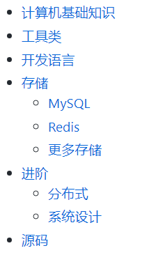
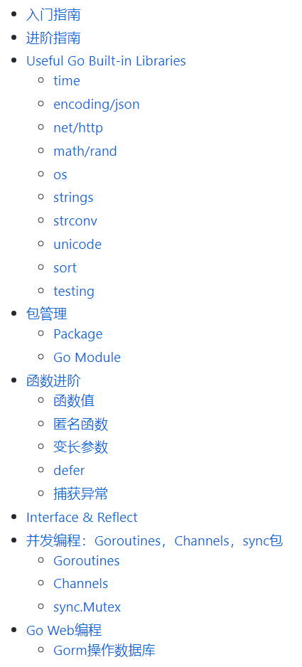
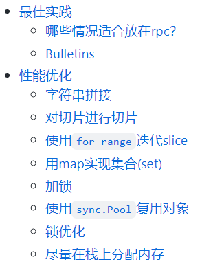
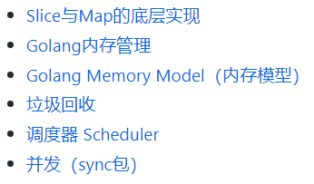
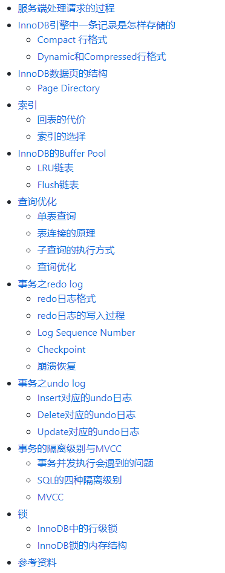
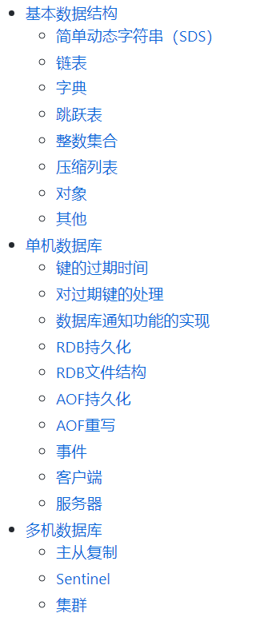
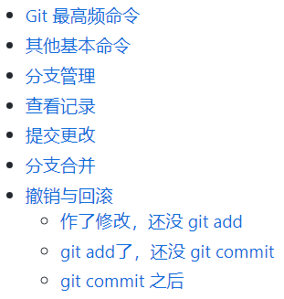

# Build-your-programming-skills
A learning road map for junior programmers focusing from basic to advanced technical skills

工作之后，应该如何规划自己的技术学习路线？可以学的太多，但我们不能什么都学，而是应该有一个清晰的roadmap，一步一步慢慢积累，这样才能获得最大的加速度

这个仓库主要是记录我的学习笔记，会随着我的技术学习不断更新。目前有以下部分的内容：

- [0. Roadmap - 技术学习路线总览](#0-技术学习-roadmap)
- [1. 深入语言 - Golang](#1-深入-golang)
    * [1.1 Effective Go](#11-effective-go)
    * [1.2 Golang 性能优化与最佳实践](#12-golang-性能优化与最佳实践)
    * [1.3 Golang 底层原理深入](#13-golang-底层原理深入)
- [2. 底层存储 - MySQL](#2-底层存储---mysql)
- [3. 底层存储 - Redis](#3-底层存储---redis)
- [4. 工具类](#4-工具类)
    * [4.1 Git 基础](#41-git-基础)
    * [4.2 Linux 常用命令](#42-linux-常用命令)
    * [4.3 脚本语言 - Python]
- [5. 零碎topic]
    * [etcd, raft]
    * [Elastic Search]
    * [Zookeeper]
    * [Service Mesh]
- 6.未完待续...

关于**个人成长**，推荐两篇我自己的思考：

- 战略篇：[理解个人成长的加速度](https://mp.weixin.qq.com/s?__biz=MzU2OTk2Mzg3Mg==&amp;mid=2247483797&amp;idx=1&amp;sn=a4d52d6b959fccdcf3a1628ac7d8422e&amp;chksm=fcf7e59acb806c8cfab11ecdbddce9a111941093bbdb4168ff19880758f5144e101795899327)
- 执行篇：[个人成长，知行合一](https://mp.weixin.qq.com/s?__biz=MzU2OTk2Mzg3Mg==&amp;mid=2247483832&amp;idx=1&amp;sn=89089add5c36939adde10c28fa374033&amp;chksm=fcf7e5b7cb806ca16933ab01daf7b082cc6bb8facf85ac233bdb0fb25c570fb2bc8e93536fda)

</img>

--------

# 0. [技术学习 Roadmap](./Roadmap.md)

<a href="./Roadmap.md" target="_blank"></img></a>

# 1. 深入 Golang
## 1.1 [Effective Go](./Effective-go.md)

<a href="./Effective-go.md" target="_blank"></img></a>

## 1.2 [Golang 性能优化与最佳实践](./Go-Best-Practice.md)

<a href="./Go-Best-Practice.md" target="_blank"></img></a>

## 1.3 [Golang 底层原理深入](./Go-dive.md)

<a href="./Go-dive.md" target="_blank"></img></a>

# 2. [底层存储 - MySQL](./MySQL.md)

<a href="./MySQL.md" target="_blank"></img></a>

# 3. [底层存储 - Redis](./Redis.md)

<a href="./Redis.md" target="_blank"></img></a>

# 4. 工具类
## 4.1 [Git 基础](./Git-basic.md)

<a href="./Git-basic.md" target="_blank"></img></a>

## 4.2 [Linux 常用命令](./Linux-from-scratch.md)

# 5. 零碎topic
