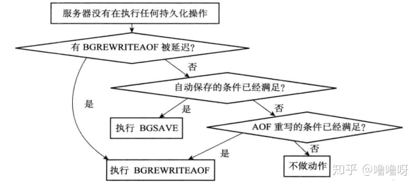

# Redis

Redis 学习我使用的主要是《Redis 设计与实现》这本书。

- [基本数据结构](#基本数据结构)
    - [简单动态字符串（SDS）](#简单动态字符串sds)
    - [链表](#链表)
    - [字典](#字典)
    - [跳跃表](#跳跃表)
    - [整数集合](#整数集合)
    - [压缩列表](#压缩列表)
    - [对象](#对象)
    - [其他](#其他)
- [单机数据库](#单机数据库)
    - [键的过期时间](#键的过期时间)
    - [对过期键的处理](#对过期键的处理)
    - [数据库通知功能的实现](#数据库通知功能的实现)
    - [RDB持久化](#rdb持久化)
    - [RDB文件结构](#rdb文件结构)
    - [AOF持久化](#aof持久化)
    - [AOF重写](#aof重写)
    - [事件](#事件)
    - [客户端](#客户端)
    - [服务器](#服务器)
- [多机数据库](#多机数据库)
    - [主从复制](#主从复制)
    - [Sentinel](#sentinel)
    - [集群](#集群)

# 基本数据结构
Redis中基本的数据结构，以及底层实现。包括字符串、链表、跳跃表、字典等等，这些数据机构是 Redis 实现 字符串、有序集合等等对象的基础。

## 简单动态字符串（SDS）
全称是 Simple Dynamic String，是Redis自己实现的一种字符串数据结构：

```c
struct sdshdr {
    int len; // 记录buf中已使用字节的数量
    int free; // 记录buf中未使用字节的数量
    char buf[]; // 字节数组，用于保存字符串
}
```

Redis在保存字符串时，底层使用的就是SDS。相比于普通的C字符串，它有以下的特性和好处：

- 常数复杂度获取字符串长度（直接取`len`属性）
- 对字符串进行修改（比如拼接）时会先检查容量是否满足要求，如果容量不够会先扩容，避免了缓冲区溢出
- 空间预分配（多分配一些空闲空间）和惰性空间释放（缩短字符串时不立即释放多余的空间）可以减少内存重分配的次数，提升性能
- 二进制安全，可以存储任意格式的数据，因为读取字符串不是靠空字符`\0`来判断结束，而是依靠`len`属性

## 链表
Redis 中的列表，底层实现就是用的链表。

```c
typedef stuct list {
    listNode *head; // 表头节点
    listNode *tail; // 表尾节点
    unsigned long len; // 节点数量
    // 下面还有三个函数：
    // dup 用于节点值复制
    // free用于释放节点值
    // match用于对比节点值和另一个值
} list;
```

Redis 的链表实现的特性可以总结如下：

- 双端链表
- 无环，表头的prev指针和表尾的next指针都指向null
- 带有表头指针和表尾指针
- 带有链表长度计数器
- 多态，可以保存不同类型的值

## 字典
Redis 作为一种键值对数据库，它的数据库底层实现本身就是字典；Redis 中还有哈希键这种数据类型，字典也是其中一种底层实现。

```c
// 哈希表的定义
typedef struct dictht {
    // 哈希表数组
    dictEntry **table;
    unsigned long size; // 哈希表大小
    unsigned long sizemask; // 用于计算索引值，总是等于size-1
    unsigned long used; // 哈希表已有节点的数量
} dictht;

// 字典数据结构定义
typedef struct dict {
    // 为多态字典设置
    dictType *type;
    void privdata;
    
    // 哈希表
    dictht ht[2];
    int trehashidx; // rehash索引，当rehash不在进行中时，值为-1
} dict;
```

Redis 的字典这种数据结构底层主要就是两张哈希表，ht[0]和ht[1]，其中一般情况下只使用ht[0]哈希表，只有在进行rehash的时候才会用到ht[1]哈希表。

当要添加一个新的键值对时，会先计算出key的哈希值，然后计算出在哈希表中的索引值，将其放到哈希表的对应索引上。当多个键产生冲突时，Redis 会使用拉链地址法解决冲突，即多个索引相同的节点用单向链表保存，新节点总是被添加到链表的表头位置。

为了让哈希表的负载因子维持在一个合理的范围内，需要进行rehash操作，进行扩展或收缩。当进行rehash操作时，会使用到ht[1]哈希表，首先计算出需要给ht[1]分配的空间，然后将ht[0]中的所有键值对rehash到ht[1]上，迁移完成后，释放ht[0]，将ht[1]设置为ht[0]，在ht[1]创建一个空白哈希表。

为了避免影响服务器性能，整个rehash操作是渐进式完成的。开始rehash时，会将`rehashidx`设置为0，逐渐递增，从0开始将ht[0]哈希表上的键值对rehash到ht[1]，完成之后将`rehashidx`置为-1. 在这个过程中，如果需要查找，会先找ht[0]再找ht[1]，而新添加的键值对一律会被保存到ht[1]。

## 跳跃表
跳跃表（skiplist）是 Redis 有序集合的底层实现之一。同一个跳跃表中多个节点可以包含相同的分值，但每个节点的成员对象必须是唯一的。跳跃表中的节点按照分值大小进行排序，分值相同是按照成员对象的大小进行排序。

## 整数集合
当一个只包含整数的集合中的元素数量不多时，redis 就会使用整数集合（intset）作为集合的底层实现：

```c
typedef struct intset {
    uint32_t encoding; // 编码方式
    uint32_t length; // 集合包含的元素数量
    int8_t contents[]; // 保存元素的数组
} intset;
```

`contents`数组是保存集合元素的地方，按照从小到大的顺序有序排列，并且不存在重复项。

如果新添加到集合的元素的类型比集合中现有元素的类型都要长时（比如现有元素最长是int32，要添加int64），整个集合需要先进行升级，扩展空间大小，将现有元素转换成新的类型并放到正确的位置上，然后添加新元素。时间复杂度为O(N)。整数集合不支持降级操作。

整数集合的好处在于支持整数的各种类型（int16, int32, int64）十分灵活，并且只有在需要的时候才会升级，节省内存。

## 压缩列表
当redis中的列表或者哈希键只包含少量元素，并且每个元素要么是小整数值，要么是短字符串时，redis就会使用压缩列表（ziplist）这种数据结构作为底层实现。压缩列表是由连续内存块组成的顺序型数据结构，包含多个节点，每个节点保存一个字节数组或者一个整数值。

压缩列表的每个节点有`previous_entry_length`、`encoding`、`content`三个属性。`previous_entry_length`记录了前一个节点的长度，所以可以从后往前遍历列表（压缩列表有一个`zltail`属性记录了表尾节点距起始地址的偏移量，可以确定表尾节点的地址）。`encoding`用不同的编码表示存放的不同类型。

添加或删除节点，可能会在压缩列表中引发连锁更新（略），但出现几率不高并且总节点数并不多，不会影响性能。

## 对象
上面介绍的链表、字典等都是Redis中的底层数据结构，Redis在这些数据结构的基础上实现了对象。在Redis中，一共有字符串对象、列表对象、哈希对象、集合对象和有序集合对象这五种类型的对象。在创建键值对时，键就是一个字符串对象，而值就是上面的五种对象之一。

```c
typedef struct redisObject {
    unsigned type:4; // 类型，五种类型之一
    unsigned encoding:4; // 编码，表示底层使用了什么数据结构实现，因为一种对象类型可能有不同的实现
    void *ptr; // 指向底层实现数据结构的指针
    // ...
} robj;
```

- 字符串对象（string）

字符串对象的编码有`int`, `raw`, `embstr`三种，其中`int`用来保存整数值；`raw`用来保存比较长的字符串值，`embstr`用来保存长度小于等于39字节的字符串值。浮点数也是作为字符串值来存储的。`embstr`相比于`raw`的好处是字符串对象和指针指向的sdshdr底层结构是在一片连续的内存空间，申请和释放都只需要一次，性能更好。

`int`和`embstr`在条件满足的情况下，会被转换成`raw`编码的对象。比如使用`append`在`int`后面追加了一个字符串值。而`embstr`是只读的，因此进行修改总是会变成`raw`编码的对象。

- 列表对象（list）

列表的底层实现是链表或者压缩列表。当列表中的元素数量比较少并且每个元素的长度也比较小时，会使用压缩列表，不满足条件时会从压缩列表转换为链表

- 哈希对象（hash）

类似列表，底层实现是压缩列表或者hashtable，当使用压缩列表实现时，同一个哈希对象的键和值是相邻的，保存键的节点在前。

- 集合对象（set）

当所有元素都是整数值时并且元素数量不多时，使用intset实现，否则使用hashtable作为底层实现。

- 有序集合对象（sorted set）

底层实现是压缩列表或者跳跃表。当使用压缩列表时，每个集合元素用两个相邻的节点来保存，第一个节点保存元素的成员（member），第二个节点保存元素的分值（score）。当使用跳跃表作为底层实现时，会同时使用字典，跳跃表中按照分值从小到大保存元素，字典中键为元素的成员，值为对应的分值。

同时使用跳跃表和字典实现是为了让范围型操作和查找操作都能更快的执行。

## 其他
1. 多态命令的实现

执行命令比如`del`, `expire`, `lrange`等之前，会先检查需要操作的对象类型，然后决定是否返回错误或者如何执行

2. 内存回收

基于引用计数的内存回收机制，每个对象的计数信息在`refcount`属性中维护。创建时初始化为1，不再被程序使用时减一，被新程序使用时加一。计数值变为0时内存会被释放。

3. 对象共享

redis在初始化服务器时，会创建0到9999的一万个字符串对象，当有这些范围内的字符串对象被创建时，就会直接共享这些对象，引用计数+1，而不会创建新的对象。

4. 对象的空转时长

每个对象还有一个`lru`属性记录了最后一次被程序访问的时间，可以用`object ideltime`打印出空转时长。

# 单机数据库
一个数据库里用一个字典保存了键值对，称为键空间。键空间的键是一个字符串对象，值是上面五种redis对象之一。

## 键的过期时间
redis中有一个字典保存了键的过期时间（毫秒时间戳）。

过期键删除策略对比：

1. 定时删除

即在设置过期时间的同时，创建一个timer，一到过期时间就对键进行删除

好处是能快速释放内存，坏处是如果同一时间大量删除操作，会影响CPU性能

2. 惰性删除

即在访问键的时候再删除。对CPU友好但对内存不友好，而且有些键可能之后再也不会访问到

3. 定期删除

在Redis中，实际使用的是配合惰性删除和定期删除策略。所有对键的访问都会先触发惰性删除策略。除此之外，定期删除的任务每次运行时，都按顺序从一定数量的数据库中随机取出一定数量的键进行检查并删除过期键。定期任务到达时间上限时就会停止，等待下一次执行。

## 对过期键的处理

- RDB功能对过期键的处理

之后会介绍RDB和AOF持久化功能。在生成RDB文件时，会对过期键进行检查，已过期的键不会被保存到RDB文件中。在载入RDB文件时，对于主服务器，会先检查过期键从而不会载入过期键，对于从服务器则不会检查（不过最终会从主服务器同步）

- AOF功能对过期键的处理

只有某个过期键被惰性删除或者定时删除之后，AOF文件会追加一条DEL命令来记录该键已经被删除。加载AOF文件时，也会先检查已过期的键

- 主从复制模式

主服务器在删除一个过期键之后，会显示的向所有从服务器发送一个DEL命令。从服务器只有接收到DEL命令后才对键进行删除，不会主动进行惰性删除或者定期删除

## 数据库通知功能的实现

数据库通知功能可以让客户端订阅给定的频道或者模式，来获知数据库中键的变化。一种是键空间通知（key-space notification），获取某个键执行了什么命令，还有一种是键事件通知（key-event notification），获取的是某个命令被什么键执行了。

实现方式就是在各种命令的实现函数中，比如`SADD`，`DEL`等命令，都有一个`notifyKeyspaceEvent`函数，如果命令执行成功则会进入这个函数，函数会将事件名称（命令的名称）、键的名称以及数据库编号拼接成频道的名称，然后进行键空间通知和键事件通知的发送。

## RDB持久化
Redis是内存数据库，因此需要有持久化功能来保存数据库状态，否则一旦服务器退出数据就会丢失。RDB持久化是通过`SAVE`或者`BGSAVE`命令将某个时间点上的数据库状态保存到RDB文件的一个功能，生成的RDB文件是一个经过压缩的二进制文件。

`SAVE`命令和`BGSAVE`的区别在于前者会阻塞服务器进程直到RDB文件生成完毕，而后者不会阻塞。在执行`BGSAVE`命令期间，不会接收更多的`SAVE`或者`BGSAVE`命令。而对于RDB文件的载入，并没有一个专门的命令，是在服务器启动时，如果检测到有RDB文件，就会自动载入，载入期间也处于阻塞状态。

服务器还可以配置自动保存，需要配置多少时间内进行了多少次修改的保存条件，如果满足条件，服务器就会自动执行`BGSAVE`命令，默认的配置条件为：

```
save 900 1 // 即在900s内进行了至少1次修改
save 300 10
save 60 10000
```

上面设置的保存条件会记录在一个数组中，数组的每个元素有秒数和修改数两个属性。服务器会维护一个dirty计数器以及一个lastsave属性，前者用于记录在上一次成功`save`或者`bgsave`之后，进行了修改的次数，后者记录上一次`save`或者`bgsave`成功执行的时间，服务器每成功执行一个修改命令就会对这两个值进行更新。

```c
struct redisServer {
    // ...
    long long dirty; // dirty计数器
    time_t lastsave; // 上一次执行保存的时间
    // ...
}
```

Redis的轮询函数`serverCron`默认每100ms执行一次，其中一项工作就是遍历配置的保存条件，检查是否满足，满足则触发`BGSAVE`命令。

## RDB文件结构
接下来简单介绍，其中常量用全大写表示

- REDIS：“REDIS”五个字符
- db_version：4字节字符串整数，版本号
- database
- EOF：1字节
- check_sum：8字节校验和

其中database部分，如果所有数据库为空，那么database也为空；如果有数据库不为空，database部分会保存多个非空数据库，每个数据库的保存格式如下：

- SELECTDB：1字节
- db_number：数据库编号
- key_value_pairs：保存了该数据库中所有的键值对数据
    - EXPIRETIME_MS：1字节常量。不带过期时间的键值对不保存此值
    - ms：过期时间戳，只有带过期时间的键值对保存此值
    - TYPE
    - key
    - value：不同对象类型和编码的value的格式是不同的，具体格式在《Redis设计与实现》的10.3.3 "value的编码"部分，这里略

## AOF持久化
AOF（Append Only File）持久化功能是通过记录服务器所执行的命令来记录数据库状态的。比如执行了`SADD`、`DEL`、`SET`等修改的命令，这些命令就会一条一条的记录到AOF文件中。服务器启动时，会创建一个不带网络连接的伪客户端来执行AOF文件中的命令，从而通过AOF文件还原数据库的状态。如果服务器开启了AOF持久化，那么会优先加载AOF文件而不是RDB文件。

一条修改命令从成功执行，到最终被写入AOF文件，可以分为以下三个步骤：

1. 该命令被写入缓冲区

```c
struct redisServer {
    // ...
    sds aof_buf; // AOF缓冲区
}
```

2. 将`aof_buf`缓冲区中的内容写入到AOF文件，注意这时实际上只是调用操作系统的函数写入，而通常操作系统并不会直接写入文件，而是会先保存到一个内存缓冲区中，等满足一定条件之后再写入文件。所以这一步相当于内容只写到了操作系统的内存缓冲区中
3. 根据服务器的`appendfsync`配置来决定是否调用操作系统的`fsync`/`fdatasync`强制将内存缓冲区的内容写入到硬盘。`appendfsync`有三种配置：
    a. `always`：总是强制同步到硬盘
    b. `everysec`：如果上次同步的时间超过1s，则再次同步。是默认配置
    c. `no`：不强制同步，等待操作系统同步

## AOF重写
随着执行的写命令越来越多，AOF文件的体积也会越来越大，因此Redis提供了AOF文件重写的功能，通过一个新的AOF文件来代替旧的，两者所保存的数据库状态相同，但新的AOF文件不会包含任何冗余命令。

在旧的AOF文件中，对同一个键，可能会有很多条写命令，比如对列表先创建再添加再删除再添加等等，这样会产生很多命令，而在新的AOF文件中，只会用一条命令来记录这个列表的最终状态，这样就做到了不记录冗余命令，节省空间。因此，新的AOF文件的生成方式，就是遍历数据库，对每个数据库遍历其中所有的键，根据键的类型对键进行重写，如果带有过期时间，则也会重写。因此新的AOF文件在生成时，只会有`SET`, `SADD`, `RPUSH`, `HMSET`, `ZADD`等命令（如果一个键值对的元素过多超过了Redis限制，会拆分成多个命令）。

AOF重写会创建一个子进程，会在后台运行，不会阻塞（`BGREWRITEAOF`命令）；当开始AOF重写后，执行成功的写命令也会写入一个AOF重写缓冲区。重写完成后，AOF重写缓冲区的内容会被写入到新AOF文件中，以保证新AOF文件保存的数据库状态与当前数据库状态一致；之后，对新的AOF文件改名，原子的覆盖现有的AOF文件。重写完成后执行的这两个操作是阻塞的。

（这里有个问题，比如有一个list，重写期间，还没有扫描到这个list，客户端进行了一次RPUSH，那么按照上面的解释这个RPUSH会被记录到AOF重写缓冲区，之后扫描到这个list时，会将list最新的值进行记录，最后完成重写时，又多记录了一个RPUSH，这样岂不是会出问题？）（答案就在于创建的子进程，子进程和父进程只会共享创建时候的内存，详细的可以看看这篇文章，强烈推荐：[为什么 Redis 快照使用子进程](https://draveness.me/whys-the-design-redis-bgsave-fork/)）

## 事件
Redis服务器是一个事件驱动程序，包括文件事件比如客户端的请求，以及时间事件比如Redis服务器中的周期任务。

对于文件事件，采用IO多路复用来同时监听多个套接字。相应的操作有连接应答（accept）、读取（read）、写入（write）、关闭（close），这些操作都会产生一个文件事件，文件事件分派器会根据事件类型调用相应的事件处理器：

- 连接应答：对连接服务器的各个客户端进行应答；连接应答处理器
- 读取：接收客户端的命令请求；命令请求处理器
- 写入：向客户端返回命令的执行结果； 命令回复处理器
- 主从复制：复制处理器

对于时间事件，主要有自增ID、执行时间戳、处理函数（时间事件处理器）几个属性；所有时间事件都放在一个无序链表中，每当时间事件执行器运行时，就遍历整个链表找到所有已到达的时间事件（已到达是指执行时间戳小于等于当前时间），并调用相应的处理函数（因为目前基本上只有serverCron一个时间事件，所以遍历不会影响性能）；处理完之后，如果这是一个周期任务（根据处理函数的返回值判断），还会更新该事件的执行时间戳属性。

serverCron函数的主要工作有：

- 更新服务器的各类统计信息
- 清理过期键值对
- 关闭连接失效的客户端
- 尝试进行AOF或RDB操作
- 如果是主服务器，对从服务器定期同步

文件事件和时间事件是同步执行的，不会进行抢占。服务器会计算离最近的时间事件开始的时间间隔，在这个期间监听文件事件，如果有文件事件，执行完文件事件之后会执行所有已到达的时间事件（因此时间事件的处理时间通常会比设定的要晚一些），如果没有已到达的时间事件，则重复上面的步骤。

## 客户端
服务器中用`redisClient`结构体记录了客户端的状态，所有`redisClient`用一个链表记录，新创建的`redisClient`添加到链表的末尾。下面介绍一下`redisClient`中的常见属性

```c
typedef struct redisClient {
    // ...
    int fd; // 套接字描述符，伪客户端为-1比如加载AOF文件时的伪客户端，普通客户端为大于-1的整数
    
    robj *name; // 客户端名字，默认没有设置名字
    
    int flags; // 一些标志，比如是否为主/从客户端
    
    sds querybuf; // 输入缓冲区，用于保存客户端发送的命令请求。缓冲区大小是动态的，但不能超过1G否则客户端将被关闭
    robj **argv; // 解析得到的命令参数，是一个数组，每个元素都是字符串，比如"set" "key" "value"
    int argc; // argv数组的长度
    struct redisCommand *cmd; // 根据argv[0]的值对应的命令实现函数，比如set
    
    // 输出缓冲区
    char buf[REDIS_REPLY_CHUNK_BYTES]; // 输出缓冲区，固定大小，默认为16k
    int bufpos; // 记录了buf已使用的字节数
    list *reply; // 输出缓冲区，可变大小，当回复无法放进buf时，会放入该链表中，链表中元素是字符串对象
    
    // 时间相关
    time_t ctime; // 客户端的创建时间
    time_t lastinteraction; // 最后一次交互时间，可以是客户端向服务端也可以是相反
    time_t obuf_soft_limit_reached_time; // 输出缓冲区第一次达到软性限制的时间。如果输出缓冲区的大小超过了硬性限制那么客户端将会被立即关闭。如果超过了软性限制而没超过硬性限制，则该属性会记录到达软性限制的时间，如果在指定时间内不再超出软性限制，则客户端不会被关闭，并且该属性重置为0，否则客户端会被关闭
} redisClient;
```

## 服务器
首先介绍一下服务器如何执行客户端的命令。

1. 在解析得到客户端的argv属性后，命令执行器首先会根据argv[0]参数，在命令表中查找参数对应的命令，命令表是一个字典，键是命令的名字，值是一个个`redisCommand`结构，该结构中有一个`proc`属性指向命令的实现函数；
2. 命令执行器会进行一些预备操作，包括：
    * 检查客户端的`cmd`指针是否指向NULL，是的话直接返回错误
    * 检查命令的参数个数是否正确，不正确则直接返回错误
    * 检查客户端是否已经通过了身份验证，未通过验证则只能执行AUTH命令
    * 很多其他的一些预备操作，略过
3. 调用命令的实现函数，将回复保存到客户端的输出缓冲区
4. 执行后续工作，比如
    * 检查是否需要添加慢日志
    * 更新`redisCommand`结构中的`milliseconds`属性（命令执行时长）和`calls`属性（命令执行次数）
    * 是否进行AOF持久化
    * 是否将命令发送给从服务器

接下来介绍一下`serverCron`函数，默认每100ms运行一次，有以下工作，大部分都涉及到`redisServer`结构中的属性：

1. 更新服务器时间缓存，在一些精度要求不高的场景减少系统调用，比如打印日志、计算uptime、计算键的idle time等，对于过期时间等场景还是需要获取准确的时间
2. 更新服务器每秒执行命令次数。根据抽样进行估算，略
3. 更新服务器内存峰值记录
4. 处理SIGTERM信号。当服务器接收到SIGTERM信号时，`redisServer`中的`shutdown_asap`会被置为1，`serverCron`如果检测到该值为1，就会进行RDB持久化，然后关闭服务器
5. 管理客户端资源。比如连接超时释放客户端，释放客户端输入缓冲区
6. 关闭输出缓冲区大小超出限制的客户端
7. 管理数据库资源。比如删除过期键
8. 执行被延迟的`BGREWRITEAOF`。如果在执行`BGSAVE`期间有`BGREWRITEAOF`命令，那么`redisServer`中的`aof_rewrite_scheduled`会被置为1，`serverCron`会检查是否可以执行`BGREWRITEAOF`
9. 将AOF缓冲区中的内容写入AOF文件
10. 如果有`BGREWRITEAOF`或者`BGSAVE`命令在运行（通过`redisServer`中记录两者的pid的属性查看），检查是否有信号到达，如果有则表示AOF已经重写完毕或者新的RDB文件已经生成完毕，则执行后续操作，进行新旧文件的替换。如果没有这两个命令在运行，则检查是否有`BGREWRITEAOF`被延迟了，如果没有，检查是否满足自动保存的条件（`BGSAVE`），如果不满足，检查是否满足AOF重写的条件。如图：



最后介绍一下服务器的初始化：

1. `initServerConfig`，初始化一些基本属性，载入配置
2. `initServer`，初始化一些数据结构，创建共享对象，设置进程信号处理器，打开监听端口，为`serverCron`函数创建时间事件，等等
3. 还原数据库状态，AOF或者RDB文件载入
4. 执行事件循环

# 多机数据库
## 主从复制
通过向服务器发送`SLAVEOF <master_ip> <master_port>`命令，可以让其变成一个从服务器，去复制主服务器。在真正开始同步前，会有以下操作：

- 将主服务器的地址和端口信息保存到`redisServer`结构体的属性中
- 和主服务器建立套接字连接
- 发送PING命令检查主服务器能否正常处理命令请求。如果不行则会重新创建套接字
- 身份验证。如果主从服务器都未设置身份验证，或者都设置了身份验证且密码相同才能验证通过，否则验证不通过
- 从服务器向主服务器发送端口信息，主服务器将其记录在`redisClient`的`slave_listening_port`字段中。因为之后主服务器需要向从服务器发送命令，所以需要端口信息

接下来就会进行复制操作，可以分为同步和命令传播两个操作。同步操作是为了将从服务器的数据库状态更新至主服务器当前所处的数据库状态，命令传播操作是为了主服务器状态被修改时，让两者的数据库状态保持一致。

同步操作可以分为完整重同步（full resynchronization）和部分重同步（partial resynchronization）两种模式，前者用于初次复制的情况，后者用于处理断线后复制的情况

- 完整重同步时，从服务器会向主服务器发送`PSYNC ? -1`命令。主服务器会返回`+FULLRESYNC <runid> <offset>`，然后进行完整重同步。主服务器会执行`BGSAVE`命令，在后台生成RDB文件，并使用一个缓冲区记录从现在开始执行的所有写命令。生成完RDB文件后，主服务器会将其发送给从服务器，从服务器接收并载入。然后主服务器将记录在缓冲区里的所有写命令发送给从服务器让从服务器执行，使从服务器的状态更新为主服务器的状态

- 部分重同步时，从服务器会向主服务器发送`PSYNC <runid> <offset>`命令，其中`runid`就是之前主服务器发送回来的主服务器的运行id，主服务器会判断该id是否是自己的运行id（每个服务器在启动时会生成自己的运行id），如果相同说明从服务器之前复制的就是自己，如果不是则说明需要进行完整重同步操作。`offset`代表复制偏移量，主服务器每传播N个字节的数据，就将自己的复制偏移量加N；从服务器每收到N个字节的数据，将自己的复制偏移量加N。

主服务器进行命令传播时，不仅会将写命令发送给所有从服务器，还会将其写入一个固定长度的先进先出队列，叫做复制积压缓冲区，默认大小为1M。当从服务器发出部分重同步请求时，主服务器会检查从服务器发送过来的`offset`+1的偏移量是否还在复制积压缓冲区里，如果存在，则执行部分重同步操作，将复制积压缓冲区里offset之后的数据都发给从服务器；如果不存在，那么将执行完整重同步操作。

在命令传播阶段，从服务器会以默认一秒的频率，向主服务器发送命令：`REPLCONF ACK <replication_offset>`，其中`replication_offset`是从服务器当前的复制偏移量，该命令主要有三个作用：

- 心跳检测，检测主从服务器之间的连接状态，检测lag
- 辅助实现`min-slaves`选项。即lag大于多少时，主服务器拒绝执行写命令
- 检测命令丢失，主服务器会将丢失的命令从复制积压缓冲区里找到，再次发送给从服务器

## Sentinel
Sentinel系统由一个或多个Sentinel实例组成，负责监视任意多个主服务器，以及这些主服务器下面的所有从服务器。当主服务器下线时，Sentinel会自动将其下面的某个从服务器升级为主服务器，并让其他的从服务器成为新的主服务器的从服务器；Sentinel还会继续监视之前下线的主服务器，如果重新上线，会将其设置为新的主服务器的从服务器。

启动一个Sentinel实例时，本质上就是启动一个特殊的Redis服务器，不过有一些地方不同，比如不会载入AOF或RDB，不支持很多命令比如Get、Set等；监视的主服务器的信息会从配置文件初始化到一个字典中进行保存，字典的键是主服务器的名字，值是一个`sentinelRedisInstance`结构，该结构代表一个被该Sentinel监视的Redis服务器实例，可以是主服务器、从服务器或者另一个Sentinel

```c
typedef struct sentinelRedisInstance {
    int flags; // 比如主服务器为SRI_MASTER，从服务器为SRI_SLAVE
    
    char *name; // 实例的名字，主服务器在配置文件中设置，从服务器自动设置，格式为ip:port
    char *runid;
    
    uint64_t config_epoch; // raft选举使用
    
    sentinelAddr *addr; // 实例地址，记录了ip, port
    
    mstime_t down_after_period; // 实例无响应多少ms后被判断为主观下线
    int quorum; // 判断实例客观下线需要的投票数量
    // ...
} sentinelRedisInstance;
```

这些属性初始化完成之后，Sentinel会创建向被监视主服务器的网络连接，一个是命令连接用于向其发送命令；一个是订阅连接，专门用于订阅`__sentinel__:hello`频道。

Sentinel会默认以每10s一次的频率，通过命令`INFO`获取主服务器的信息，包括`run_id`，以及主服务器属下所有从服务器的信息等，并对相应的信息进行更新。从服务器的信息记录在主服务器的`sentinelRedisInstance`结构中的`slaves`字典中。Sentinel还会创建和从服务器的命令连接和订阅连接，也是默认每10s发送`INFO`命令获取从服务器的信息。

如果有多个Sentinel实例在监视同一台服务器，那么这些Sentinel可以通过订阅频道互相发现对方。Sentinel默认会以2s的频率向订阅频道发送命令，包含了自身的信息和监视的主服务器的信息。其他Sentinel收到这些信息后，如果不是自身发送的信息，则会提取并更新信息。每个Sentinel实例都用一个sentinels字典保存了其他Sentinel实例的信息。除此之外，Sentinel实例之间还会互相建立命令连接，可以互相发送命令请求。因此，最终监视同一主服务器的多个Sentinel将会互相连接。

当Sentinel将一个主服务器判断为主观下线之后（`down_after_period`属性），它会向其他Sentinel询问，以确认该服务器是否客观下线。当确认该服务器下线的Sentinel数量达到`quorum`配置的数量时，Sentinel会将该主服务器的flag标记为客观下线状态。不同Sentinel判断主观下线、客观下线的条件都可能不同。

当主服务器被判断为客观下线时，整个Sentinel系统会选举出一个领头Sentinel，对其进行故障转移操作。选举的方式就是raft算法，半数以上的支持就能成为领头Sentinel。领头Sentinel接下来会对下线的主服务器进行故障转移操作，包括以下步骤：

- 在从服务器里挑选出新的主服务器。会先排除掉掉线、最近5s内没有回复过Sentinel、与已下线主服务器断开连接过长的从服务器；然后在剩下的从服务器中，选出优先级最高的，优先级为，配置好的优先级、复制偏移量最大的、run_id
- 选好之后，会向其发送`slaveof no one`的命令，之后会以每秒一次的频率（之前是每10s一次）发送`INFO`命令观察其是否已经升级为主服务器
- 接下来让其他从服务器开始复制新的主服务器
- 最后，还会监视原先已下线的主服务器，当其重新上线时，使其成为新的主服务器的从服务器

## 集群
一个Redis集群由多个节点（node）组成，一个节点就是一个运行在集群模式下的Redis服务器，大部分功能都和单机模式下的服务器相同。使用`cluster meet <ip> <port>`命令可以将新的节点添加到集群。

每个节点都有一个`clusterState`结构保存了自身视角下集群的一些信息，比如其中用一个字典保存了集群中所有节点的信息`clusterNode`

集群通过分片的方式来保存数据库中的键值对，集群中的节点只能使用0号数据库，整个数据库被分为16384个槽（slot），用2048个字节保存，每个节点处理0~16384个槽，数据库中的每个键都会对应到16384个槽的其中一个，分配到对应节点进行处理。当16384个槽都有节点对应时，集群处于上线状态，否则处于下线状态。使用`cluster addslots <slots...>`可以将多个槽指派给节点，不能将已经指派的槽指派给其他节点。

在保存节点信息的`clusterNode`结构中，有一个二进制位数组`slots`保存了该节点负责的槽信息，在该数组索引i上的值为1表示该节点负责处理槽i，因此保存和检查某个节点的槽信息的复杂度都是O(1)。当节点之间发送消息时，消息头里会带上自己的槽指派信息，因此节点可以利用消息来更新保存的其他节点的槽信息。

除了`clusterNode`保存了每个节点的槽信息外，`clusterState`结构中也用一个`slots`数组保存了16384个槽对应的节点信息，索引i指向一个`clusterNode`结构，指向的节点管理槽i。这样记录也是为了高效的查找槽i是否被指派或者负责槽i的节点。

当客户端发送与键值对有关的命令时，节点会先计算出给定键属于哪个槽：`CRC16(key) & 16383`，然后判断该槽是否由自己负责，如果是则执行命令，不是则会返回`MOVED`错误，将客户端重定向至正确的节点（客户端不会显示报错，而是会自动重定向后发送命令）。

集群的重新分片操作可以对各个节点管理的槽进行重新分配，并且相关槽所属的键值对也会进行转移，重新分片操作可以在线进行，是由 redis-trib 负责执行的。对单个槽进行重新分片的操作如下：

- 目标节点准备导入槽的键值对
- 源节点准备迁移槽的键值对
- 将源节点的每个键值对迁移到目标节点
- 迁移完成后，将槽指派给目标节点

在迁移过程中，如果客户端请求的键刚好属于被迁移的槽，那么首先会在源节点中查找，找到的话执行客户端命令，如果没有找到，则会向客户端返回`ASK`错误，将客户端重定向到目标节点（同样，客户端不会显示报错）。客户端会先向目标节点发送一个`ASKING`命令，然后才会发送原本的命令，因为这时这个槽还没有指派给目标节点，正常情况下目标节点会返回`MOVED`错误，先发送`ASKING`命令可以让目标节点继续执行这个槽的命令。

Redis 集群中的节点分为主节点和从节点，前者用于处理槽，后者用于复制某个主节点，并在主节点下线时代替主节点。集群中的每个节点都会定期向其他节点发送PING消息，如果规定时间内没有收到PONG回复，则会标记为疑似下线。集群中的各个节点会互相通过消息交换各个节点的状态信息，当一个主节点通过消息得知半数以上的主节点都将某个节点x标记为疑似下线时，该主节点就会将这个节点x的状态标记为已下线，并向集群广播一条节点x的FAIL消息，所有收到这条FAIL消息的节点都会将节点x标记为已下线。

当一个主节点已下线时，其下属的从节点会广播要求所有具有投票权的主节点投票，还是raft算法，最终会有一个从节点被选举成新的主节点，将已下线主节点的槽全部指派给自己，然后向集群广播一条PONG消息，让其他节点知道它已经由从节点变成了主节点，故障转移完成。

最后介绍一下节点之间的消息，前面说过节点通过消息头可以带上自己保存的槽信息，各个节点会互相通过消息交换各个节点的状态信息，等等。消息主要有以下五种：

- MEET消息
- PING消息
- PONG消息
- FAIL消息
- PUBLISH消息

其中，在节点之间发送MEET、PING和PONG消息时，发送者都会从自己的已知节点中随机选出两个节点，并将这两个节点的信息发送出去，因此，接收者可以更新对于这些节点的认知，比如如果是新节点则记录下来，已知节点则更新信息，比如是否为疑似下线等。
