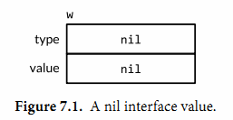

# Golang Interface & Reflect

# 什么是interface

关于interface（接口）这种抽象类型，只需要记住并且理解这一句最关键的话：

**一个类型如果拥有一个interface需要的所有方法，那么这个类型就实现了这个interface**

比如我们自定义一种interface类型：

```go
type SortItem interface {
    Len() int
    Less(i, j int) bool
    Swap(i, j int)
}
```

我们的 `SortItem` 包含了 `Len()` 、 `Less()` 、 `Swap()` 三个方法，那么，只要有某个类型实现了自己的 `Len()` 、 `Less()` 、 `Swap()` 方法，这个类型就可以看作是这个interface，比如我们自己定义了一种类型 `ItemPrice` ：

```go
type ItemPrice []int32

func(p *ItemPrice) Len() int {
    return len(p)
}
func(p *ItemPrice) Less(i, j int) bool {
    return p[i] < p[j]
}
func(p *ItemPrice) Swap(i, j int) {
    p[i], p[j] = p[j], p[i]
}
```

我们不止可以用例子里的 `[]int32` 类型去实现这些方法，结构体或者其他的类型也行。可以看到我们的 `ItemPrice` 类型实现了 `Len()` 、 `Less()` 、 `Swap()` 方法，因此，它就可以作为 `SortItem` 这种interface被使用：

```go
var temp SortItem // 定义了一个SortItem类型的变量
var priceList ItemPrice // 定义了一个ItemPrice的变量
temp = priceList
```

如果有一个函数的输入参数是 `SortItem` 这种interface，那么我们就可以把我们实现的 `ItemPrice` 类型的变量传入这个函数，比如：

```go
func Sort(data SortItem) {
    // ...
    // do quickSort(data)...
}
```

其实，golang的sort包就是用类似的方式实现的排序，可以对我们自定义的类型进行排序，可以发现，好处就在于，不同类型我们需要的比较方式，即 `Less()` 方法可能是不一样的，而通过interface，sort包里的Sort函数可以对不同的类型按照我们需要的方式进行排序。

# 如何描述一个interface

在go语言内部，一个interface类型的变量实际上存储了两个值：该变量存储的值（value）和这个值的实际类型（type）：



# interface{}类型

之前我们说过， **一个类型如果拥有一个interface需要的所有方法，那么这个类型就实现了这个interface。** 那么，对于 `interface{}` 这种类型来说，它的内部不包含任何方法，因此可以认为所有的类型天然就实现了 `interface{}` 这种类型。

在我们需要存储任意类型的数值的时候， `interface{}` 相当有用

当定义一个变量的时候，如果不能确定这个变量是什么类型，就可以将其定义为一个interface{}，比如一个函数的输入输出参数，定义为interface{}就可以接收和返回任意的类型；比如定义一个slice或者map的时候，可以让slice里面存不同的类型。举例：

```go
var m1 map[string]interface{}
m1["name"] = "XXX"  // value可以是string类型
m1["age"] = 24  // value可以是int类型
m1["male"] = true  // value可以是bool类型
```

# 类型断言

也许我们定义了一个interface{}类型的变量之后可以一路用下去，但总会遇到有些时候需要将它转换成我们想要的特定类型比如int32，这个时候可以使用类型断言（type assertion），用来判断变量是什么类型，比如下面这个例子：

```go
func ConvertF32(i interface{}) float32 {
   var fi float32
   switch i.(type) {
   case float32:
      fi = i.(float32)
   case float64:
      fi = float32(i.(float64))
   case int32:
      fi = float32(i.(int32))
   case int64:
      fi = float32(i.(int64))
   case int:
      fi = float32(i.(int))
   case string:
      fj, _ := strconv.ParseFloat(i.(string), 64)
      fi = float32(fj)
   }
   return fi
}
```

另一种写法是：
```go
var i interface{}
var j int32
val, ok := i.(int32)
if ok {
    j = val
}
```

# 反射（Reflect）

先推荐一篇讲reflect讲的不错的文章： [https://blog.golang.org/laws-of-reflection](https://blog.golang.org/laws-of-reflection)

反射可以让我们在运行时检查变量的状态。golang提供了反射的包 `reflect`

## 1.基本操作 reflect.TypeOf & reflect.ValueOf

`reflect.TypeOf` 返回 `reflect.Type` 类型：
```go
package main

import (
    "fmt"
    "reflect"
)

func main() {
    var x float64 = 3.4
    fmt.Println("type:", reflect.TypeOf(x)) // 输出：type: float64
}
```

`reflect.ValueOf` 返回 `reflect.Value` 类型，该类型下有很多方法可以使用：
```go
var x float64 = 3.4
v := reflect.ValueOf(x)
fmt.Println("type:", v.Type())
fmt.Println("kind is float64:", v.Kind() == reflect.Float64)
fmt.Println("value:", v.Float())
```
输出为：
```powershell
type: float64
kind is float64: true
value: 3.4
```

## 2.将reflect.Value转换为interface{}

通过上文的方法得到 `reflect.Value` 类型之后，我们还可以将该类型再转换回 `interface{}` 类型：
```go
var x float64 = 3.4
v := reflect.ValueOf(x)
fmt.Println(v.Interface())
```

## 3.修改reflect.Value

`reflect.Value` 类型还有对应的修改方法，但是，下面的写法会报panic：
```go
var x float64 = 3.4
v := reflect.ValueOf(x)
v.SetFloat(7.1) // Error: will panic.
```

其实，我们可以通过 `CanSet()` 方法来判断是否能修改：
```go
var x float64 = 3.4
v := reflect.ValueOf(x)
fmt.Println("settability of v:", v.CanSet()) // false
```

那么这里为什么不能修改呢？其实就和函数传值类似，当我们进行值传递而不是引用传递时，就算在函数内部修改了变量，对外部调用者来说也是不可见的，这里的 `reflect.Value` 也是同理，它创建了对一个原始值的拷贝而不是引用，所以直接修改 `reflect.Value` 并不能对原始值产生影响。

正确的修改方法是使用引用创建 `reflect.Value` ：
```go
var x float64 = 3.4
p := reflect.ValueOf(&x) // Note: take the address of x.
fmt.Println("type of p:", p.Type()) // *float64
fmt.Println("settability of p:", p.CanSet()) // false

v := p.Elem()
fmt.Println("settability of v:", v.CanSet()) // true

v.SetFloat(7.1) // 还有SetString, SetInt...
fmt.Println(x) // x已经被修改为7.1了
```

