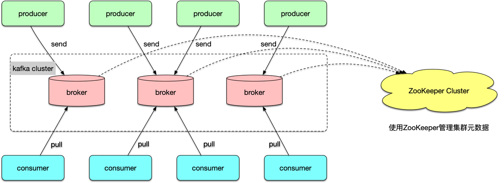
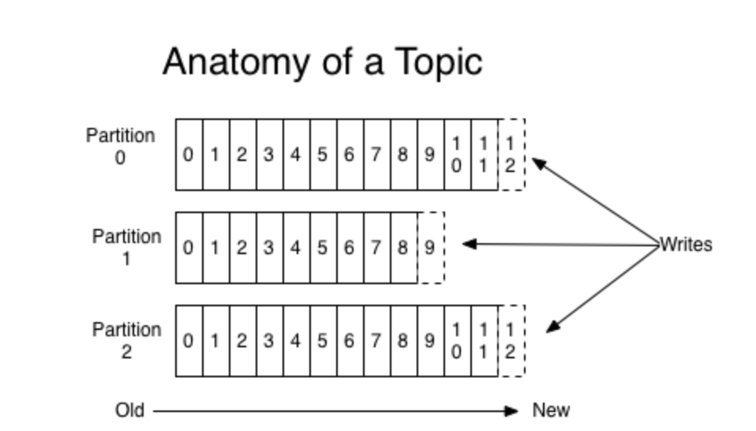
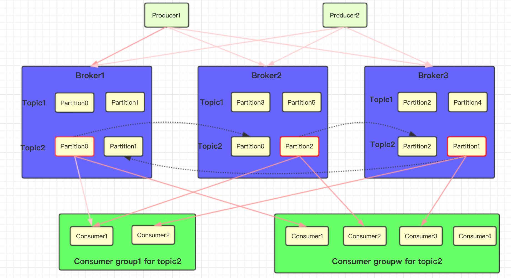
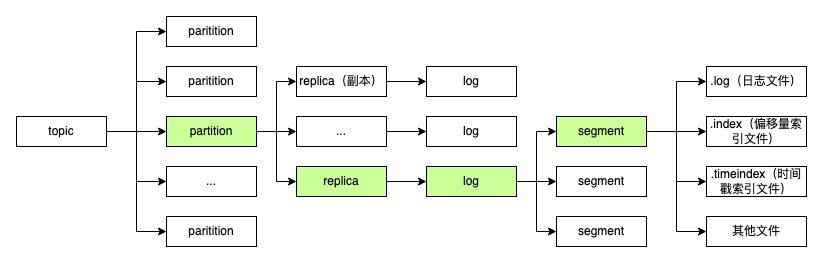

# Kafka学习笔记

- [简介](#简介)
- [基础概念](#基础概念)
- [Producer](#producer)
    - [消息累加器](#消息累加器)
    - [发送方式](#发送方式)
    - [发送确认](#发送确认)
    - [分区器](#分区器)
- [数据存储](#数据存储)
- [Consumer](#consumer)
    - [Rebalance 再均衡](#rebalance-再均衡)
    - [offset的提交](#offset的提交)
- [可靠性保证](#可靠性保证)
    - [数据同步可能出现的问题](#数据同步可能出现的问题)
    - [leader epoch](#leader-epoch)
- [Exactly once语义](#exactly-once语义)
- [Controller](#controller)
    - [Topic管理](#topic管理)
    - [分区分配](#分区分配)
    - [Leader选举](#leader选举)
    - [集群成员管理](#集群成员管理)
    - [数据服务](#数据服务)
- [高性能Kafka](#高性能kafka)
- [参考](#参考)

# 简介

*   高吞吐：非常普通的硬件Kafka也能够支持每秒百万级的消息
    

*   容错性：允许集群中n-1个节点失败，n为副本数
    

*   低延迟：O(1)的消息持久化
    

*   顺序性：单partition内消息有序
    

  

# 基础概念

*   **producer：**生产者，负责将消息投递到kafka中。
    

*   **consumer：**消费者，通过拉的方式获取消息进行业务处理。
    

*   **broker：**一个独立的Kafka服务节点或实例，多个broker组成kafka集群。
    

通过Zookeeper管理集群配置，leader选举、partition分配、协调者选举、集群元信息存储、topic管理、rebalance等。

  

*   一个topic可以包含多个partition，每个partition对应一个文件夹，而每个partition又可以包含多个segment，每个segment对应一个文件
    

*   每个partition有多个副本(Replica)，其中有且仅有一个作为Leader，Leader是当前负责数据的读写的partition，而follower只复制leader的消息。从而实现高可用
    

*   生产者以append-only的方式往partition写数据(顺序写盘的速率 ≈ 随机读内存速率)，消费者消费时从低位开始消费，消息符合FIFO
    

*   一个topic可以配置多个partition，可以存储任意多的数据
    

*   每个partition都可以设置消息有效期，到期后，消息无论是否被消费都会被清除
    

*   每条消息被发送到分区后都会指定一个offset，该**offset在分区中递增**
    

*   消费者组（ConsumerGroup）是一个消费者的集合，同一个消费者组里的消费者只能消费同个topic中同一条消息一次，不同消费者组的消费者可以消费同一条消息多次
    

  

可以看到，topic是逻辑概念，一个broker中可以保存多个不同topic的partition

  

`为什么要有分区？

1.  提高消息吞吐量：每个topic中的消息被组织成多个partition，partition均匀分配到集群server中。生产、消费消息的时候，会被路由到指定partition，减少竞争，增加了程序的并行能力。
    

2.  高可用性： topic下有多个partition，partition放在不同的服务器，再通过副本策略，即使有broker挂掉，不至于服务不可用。
    

3.  增加可扩展性：每个topic中保留的消息可能非常庞大，通过partition将消息切分成多个子消息，并通过负责均衡策略将partition分配到不同server。这样当机器负载满的时候，通过扩容可以将消息重新均匀分配。
    

思考：一般消息队列消费消息可以通过push和pull两种方式，Kafka consumer使用pull而不是push的原因是什么？

1.  push模式很难适应消费速率不同的消费者，因为消息发送速率是由broker决定的。push模式的目标是尽可能以最快速度传递消息，但是这样很容易造成consumer来不及处理消息，而pull模式则可以根据consumer的消费能力以适当的速率消费消息。
    

2.  另一方面，pull模式可简化broker的设计，broker可以不必维护consumer的情况；consumer可自主控制消费消息的速率，同时consumer可以自己控制消费方式——即可批量消费也可逐条消费，同时还能选择不同的提交方式从而实现不同的传输语义。
    

注意kafka不支持consumer开多线程拉取消息

mq的应用场景：

*   解耦
    

*   异步处理
    

*   流量削峰
    

  

Kafka VS RocketMQ

在topic个数较小时Kafka性能是优于RocketMQ的，但随着topic个数增加，Kafka性能大打折扣，远远不如RocketMQ。Why？

1.  topic较少时：由于Kafka在发送端做了批处理，producer会将多条消息封装成一个批次，然后发给broker。
    

2.  topic较多时：Kafka的文件模型为一个partition对应一个文件，而RocketMQ是所有queue共享一个CommitLog。所以在多topic下，Kafka消息的分散落盘策略会导致磁盘IO竞争成为瓶颈，而RocketMQ则是顺序写磁盘，速度很快。
    

Kafka如何实现高吞吐？

对于生产者，生产者可以将消息投递到不同的partition；对于消费者，可以同时消费多个partition。通过分区的负载均衡，可以大大提高生产者和消费者的吞吐量。

  

Kafka如何实现高可用（High Availability，HA）？

通过副本策略，一个partition有多个replica，相同parition的不同副本尽量分布在不同的 Broker 上，解决broker宕机导致消息丢失以及可用性的问题。`

  

# Producer

## 消息累加器

消息累加器主要用来缓存消息以便Sender线程可以批量发送，以减少网络传输的资源消耗以提升性能，缓存的消息大小默认为32MB。

在消息累加器的内部为每个分区都维护了一个双端队列，主线程中发送过来的消息都会被追加到某个双端队列中，队列中的内容就是批量消息（ProducerBatch），包含多条生产者创建的消息，批量消息的大小可由参数控制。消息写入双端队列的尾部，sender从头部读取。

当一条新的消息到达累加器时，会先根据分区找到对应的双端队列，然后在双端队列尾部寻找producerBatch，如果不存在则新建；如果存在，则判断producerBatch是否还能容纳新的消息，如果能则写入，如果不能则新建producerBatch。

## 发送方式

*   同步发送：发送消息后producer会一直阻塞等待broker的响应，如果发生可重试错误Kafka会自动重试，其底层也是调的异步发送。
    

*   异步发送：异步发送消息，producer只发送消息，并不关心返回值，可以注册回调函数对异常情况进行处理。
    

## 发送确认

acks参数指定了一条消息被多少个分区副本同步后才能被认为写入成功，其取值情况如下：

*   acks=0，这种情况生产者不等待broker响应，不保证消息被同步到broker。这种模式下吞吐量最大，但丢消息的可能性最大。
    

*   acks=1，只要分区的master成功写入这条消息就会被认为写入成功。这种情况下不保证消息被同步到其他副本，同时也存在丢消息的可能性。
    

*   acks=all，必须等待在isr中的所有分区副本都成功写入这条消息才会被认为写入成功。这种情况下吞吐量最低，单丢消息的概率也最低。
    

## 分区器

1.  如果指定了partition字段，则根据分区字段写入指定分区。
    

2.  如果没有分区字段，但指定了key，对Key进行哈希计算，根据哈希值来计算分区号，分区数不变的情况下，可保证相同Key的消息写入同一分区。
    

3.  如果没有指定分区和key，以轮询（Round-Robin）的方式发送到各个可用的分区。
    

  

# 数据存储

> 什么情况下会创建新的日志分段？
> 
> *   当前日志分段文件的大小超过了设定的值，默认1GB。
>     
> 
> *   当前日志分段中消息的最大时间戳与当前系统的时间戳的差值大于设定值，默认为7天。
>     
> 
> *   偏移量索引文件或时间戳索引文件的大小达到设定值，默认为10M。
>     
> 
> *   追加的消息的偏移量与当前日志分段的偏移量之间的差值大于Integr.MAX\_VALUE。
>     

日志文件有两种索引：偏移量索引和时间戳索引，采用了稀疏索引的方式，只保存了部分的对应关系，因此不能一次定位到其在数据文件的位置，从而需要做一次顺序扫描，但是这次顺序扫描的范围就很小了。查找某个offset的消息存储位置有如下过程：

1.  首先是用二分查找确定它是在哪个LogSegment中。
    

2.  读取index文件，也是用二分查找找到offset小于或者等于指定offset的索引条目中最大的那个offset，得到对应的position。
    

3.  读取数据文件，从位置为position的那个地方开始顺序扫描直到找到目标offset的那条消息。
    

  

# Consumer

## Rebalance 再均衡

Consumer在启动时就会被指定消费的分区（由消费者协调器实现，GroupCoordinator），如果消费者组中消费者数量发生变化就会触发分区重分配，会**重新计算每个消费者所消费的分区**，这就是再均衡。**在这期间，消费者组对外不可用**，不会消费消息。

> 注：kafka2.4支持增量式rebalance。大致思想是允许单个consumer实例采用渐进式的方式进行Rebalance，避免全局的STW。在有新的join group请求加入consumer group时并不会让其他的consumer马上停止消费当前分配的partition。在rebalance过程中将新的分配方案跟之前的方案对比，保证partition均匀分配的前提下，尽量减少partition的变动和迁移。

  

一个新消费者加入消费者组的大致过程为：

1.  寻找GroupCoordinator：消费者需要找到它所属的消费组对应的GroupCoordinator所在的broker并创建与该broker的连接。
    

> consumer如何确定Group Coordinator位于哪个broker？
> 
> 每个Group都会选择一个Coordinator来完成自己组内各Partition的Offset信息，选择的规则如下：
> 
> *   根据group name hash计算Group对应在\_\_consumer\_offsets上的Partition
>     
> 
> *   根据对应的Partition寻找该Partition的leader所对应的Broker，该Broker上的Group Coordinator即就是该Group的Coordinator
>     

2.  consumer向Group Coordinator请求加入消费组。Group Coordinator会通过heartbeat通知到其他consumer重新发送join group请求，coordinator进入preparing rebalance状态并等待一段时间，等待所有consumer加入group，然后从中选择一个consumer担任leader的角色，并把组成员信息以及订阅信息发给该leader，leader收到消息后分配分区分配策略（由GroupCoordinator决定）。
    

> 如果当前组内没有leader，那么第一个加入消费组的则为leader。如果leader挂掉，组协调器会从内部维护的HashMap（消费者信息，key为member\_id）中选择第一个key作为新的leader。
> 
>   
> 
> 每个消费者可能会上报多个分区分配策略，选举过程如下：
> 
> 1.  收集各个消费者支持的所有分配策略，组成候选集。
>     
> 
> 2.  每个消费者从候选集找出第一个自身支持的策略，为其投上一票。
>     
> 
> 3.  选票数最多的策略即为当前消费组的分配策略。
>     

3.  leader分配消费方案，指定consumer应该消费topic的哪个partition。leader会将这个方案通过SyncGroup请求中发给coordinator。coordinator接收到方案之后会把方案同步给各个consumer。这样组内的所有成员就都知道自己应该消费哪些分区了。
    

4.  消费者收到具体的分区分配方案后，会开启心跳任务，定期向组协调器发送心跳请求确定彼此在线。
    

  

## offset的提交

消费者通过往一个特殊的topic：`__consumer_offsets`中发消息，来记录自己消费到的偏移量offset，一般情况下没什么用处，但是如果出现重启后要继续上次消费或者rebalance等情况，就需要从这个topic中读取上一次的偏移量，然后从指定的offset处开始处理。

  

如果已经提交到这个topic的偏移量小于实际消费的偏移量，那两个offset之间的消息就会被重复处理；如果大于，则会出现消息丢失

  

一般有两种偏移量提交方式：

*   自动提交：消费者每隔5s轮询已经拉到的最大的offset然后提交这个offset，重复消费和消息丢失的情况都可能出现
    

*   同步提交：每次消费后主动调用函数进行提交
    

*   异步提交：消费完后调用函数提交，但是不阻塞
    

  

# 可靠性保证

前面说到一个topic有多个partition，而每个partition都可以有多个副本replica，副本之间是一主多从的关系，副本处于不同的broker。通过多副本机制，实现了高可用。

  

几个概念：

*   leader：leader副本负责处理读写请求
    

*   follower：和leader是一主多从的关系。follower副本只负责与leader副本的消息同步，不负责处理请求
    

*   AR（Assigned Replicas） partition中所有副本列表
    

*   ISR（In-Sync Replicas ）partition中与leader保持同步的副本列表（可以配置一定落后范围内的都算作同步）。只有ISR中的副本才有可能成为leader。
    

*   OSR（Out-of-Sync Replicas ）partition中没有保持同步状态的副本列表。判断一个replica是否需要被从ISR中移除是根据落后时间&落后条数来判断的
    

*   LEO（LogEndOffset）表示每个副本的log最后一条Message的位置。每个副本都存储自己的LEO，而leader不仅记录自己的LEO，也存储它的follower副本的LEO。
    

*   HW（HighWatermark）等于ISR列表副本中最小的LEO，**consumer只能消费HW之前的消息**，每个副本都有保存HW。leader会维护所有follower的LEO，选取其中的最小值作为HW
    

  

思考：为什么要有HW?

1.  consumer只能消费HW之前的数据，如果没有HW，那么有可能consumer消费的leader数据还没有同步给follower，此时leader宕机后，选举出来的follower并没有包含consuemr消费过的数据，并且此时consumer group-topic-partition->offset会大于新leader的LEO。
    

2.  leader挂掉后重启，会去同步新选举出来的leader，如果没有HW，仅仅根据LEO来同步剩余的数据那会导致数据不一致。
    

  

## 数据同步可能出现的问题

异常情况：

*   当follower匿机重启之后，会根据自身的HW位置做日志截断，将LEO调整为HW位置，之前所保存的HW之后的日志就被删除了
    

*   当leader匿机之后，会从其他的ISR中选取新的leader，新的leader自身不会截断日志，但是会发送指令让其他follower用新leader的HW来截断日志，即只保存HW及之前的日志
    

  

这样的机制可能会带来**消息丢失**的问题：

*   初始状态，假设 leader和follower的HW都是1，leader的LEO=2，follower的LEO=1
    

*   follower从leader拉取消息进行同步，此时follower的LEO更新为2，并返回给leader ack
    

*   leader收到ack之后，将HW更新为2，并返回给follower响应
    

*   此时如果follower挂机，没有收到之前leader将HW更新为2的响应，则follower重启之后还是根据HW=1进行日志截断，自身的LEO变成了1
    

*   follower会向leader进行数据拉取，此时如果leader挂机，follower成为leader，用自己的HW=1来截断日志，则之前第二条消息就彻底丢了
    

当然出现这种情况的概率非常小，首先必须满足只有一个follower副本，其次follower与leader在几乎同一时间宕机。

还有可能出现**消息不一致**的问题：

当前 leader 副本为 A，follower 副本为 B，A 中有2条消息 m1 和 m2，并且 HW 和 LEO 都为2，B 中有1条消息 m1，并且 HW 和 LEO 都为1。假设 A 和 B 同时“挂掉”，然后 B 第一个恢复过来并成为 leader。这个时候时候B 写入消息 m3，并将 LEO 和 HW 更新至2（假设所有场景中的 min.insync.replicas 参数配置为1）。此时 A 也恢复过来了，根据前面数据丢失场景中的介绍可知它会被赋予 follower 的角色，并且需要根据 HW 截断日志及发送 FetchRequest 至 B，不过此时 A 的 HW 正好也为2，那么就可以不做任何调整了。 这样 A 和 B 就出现了数据不一致的情形。

  

## leader epoch

Kafka 0.11版本引入了leader epoch来彻底解决上面的问题。leader epoch由两个部分组成，副本会保存（epoch，start offset）到内存中，并且定期写入到checkpoint文件中。

*   Epoch：一个单调增加的版本号。每当leader发生变更时，都会增加该版本号。小版本号的 Leader 被认为是过期 Leader，不能再行使 Leader 权力。
    

*   Start Offset：Leader 副本在该 Epoch 值上写入的首条消息的偏移量。
    

  

在follower重启之后，follower会将自己记录的最新epoch发送给leader，leader根据follower的epoch与自己的epoch来判断follower的log需要截取到的offset：

*   如果epoch相等则截取到新leader的LEO
    

*   如果不相等，则根据请求的epoch，在所有比它大的leader epoch（cache中有多个leaderEpoch和startOffset二元组）中找出最小的一个，返回其对应的start Offset（follower收到后truncate日志）。
    

  

kafka如何保证高可靠性

1.  多副本机制，副本数越多可靠性越强，但过多副本也会带来性能的下降，一般而言副本数为3能满足大多数场景下多可靠性的要求，更高的场景可以设置为5。
    

2.  producer的ack机制。
    

3.  还有个参数unclean.leader.election.enable可控制让非ISR列表中的副本成为leader,这样会造成数据丢失，影响了可用性，但起码还有存活的副本。
    

4.  生产重试机制。可设置重试次数和两次重试之间的间隔，通过适当调大重试间隔来提高生产成功率。
    

5.  消费端的位移提交控制。
    
    1.  自动提交位移会导致数据丢失和重复消费的问题。
        
    2.  手动提交位移不会导致数据丢失。
        

  

# Exactly once语义

*   最多一次（at most once）：消息可能会丢失，但绝不会被重复发送。
    

*   至少一次（at least once）：消息不会丢失，但有可能被重复发送。
    

*   精确一次（exactly once）：消息不会丢失，也不会被重复发送。
    
    *   对于消费者，还是要靠业务方自己保证幂等
        
    *   对于生产者，每个新的Producer在初始化的时候会被分配一个唯一的PID，这个PID对用户是不可见的。
        
    *   Sequence Numbler：（对于每个PID，该Producer发送数据的每个<Topic, Partition>都对应一个从0开始单调递增的Sequence Number
        

  

# Controller

在Kafka的早期版本中，集群管理依赖于Zookeeper，每个broker都会在Zookeeper上为分区和副本注册大量的监听器，当分区或者副本状态变化时，会唤醒很多不必要的监听器，导致zookeeper压力过大。新版本中，集群中的一个broker会被选举为Controller，它负责管理集群中所有分区和副本的状态，减轻了zookeeper的压力。

  

## Topic管理

  主题管理（创建、删除、增加分区），就是指控制器帮助我们完成对 Kafka 主题的创建、删除以及分区增加的操作。

## 分区分配

*   在partition leader多次选举过后，可能会导致partition leader在broker上发布不均衡，导致一些broker压力较大，所以需要对partition重新分配。
    

*   Kafka集群增加broker后，Topic的Partition不会因为集群中broker的增而自动增加。可将分布在整个集群上的Partition重新分配到某些机器上。
    

## Leader选举

  Partition leader宕机后，controller会通过zookeeper watcher感知，并重新选举出partition的leader。

## 集群成员管理

  自动检测新增 Broker、Broker 主动关闭及被动宕机。利用 Watch机制检查 ZooKeeper 的 /brokers/ids 节点下的子节点数量变更。

## 数据服务

  controller保存了最全的集群元数据信息，其他所有 Broker 会定期接收控制器发来的元数据更新请求，从而更新其内存中的缓存数据。

  

# 高性能Kafka

*   CopyOnWriteMap
    

*   零拷贝
    

*   内存池
    

*   分段加锁
    

  

# 参考

*   [Kafka 技术分享](https://bytedance.feishu.cn/wiki/wikcn3qJMxUHHHN6pXu189OQRLf)
    

*   [一文带你深入Kafka基本原理](https://tech.bytedance.net/articles/6934285990068649992)
    

*   [Kafka-进阶篇](https://tech.bytedance.net/articles/6943046104032215047)
    

*   进一步深入：[Kafka知识大纲](https://bytedance.feishu.cn/wiki/wikcn2cSzJG6GoiXgWW6KOtYe8d)