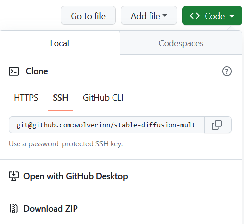
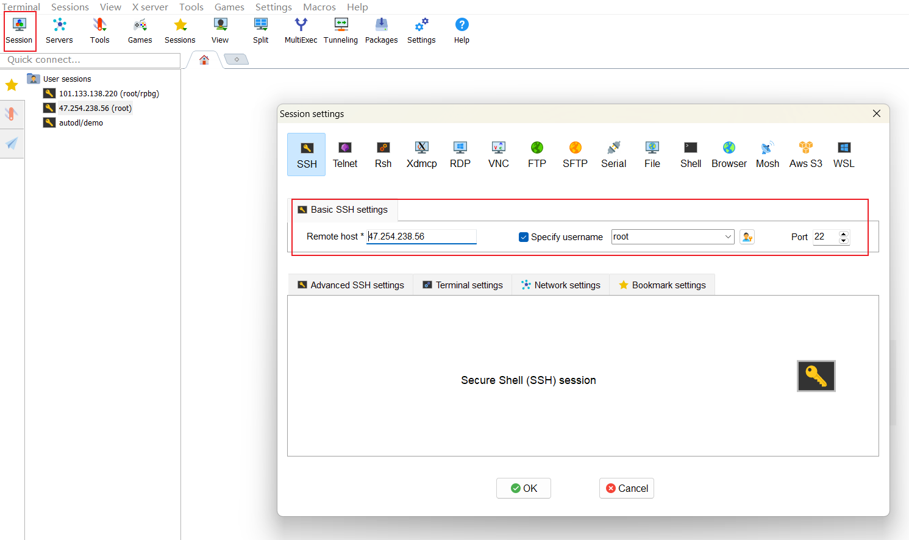
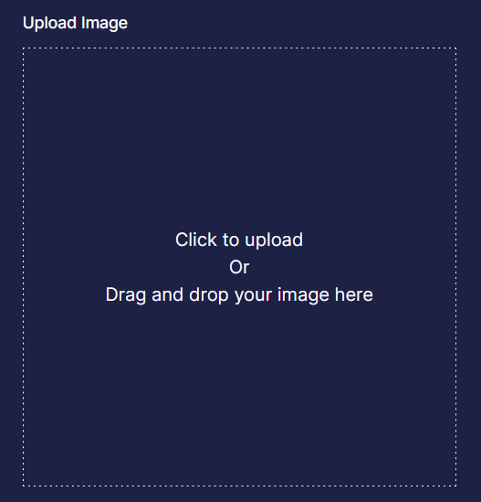
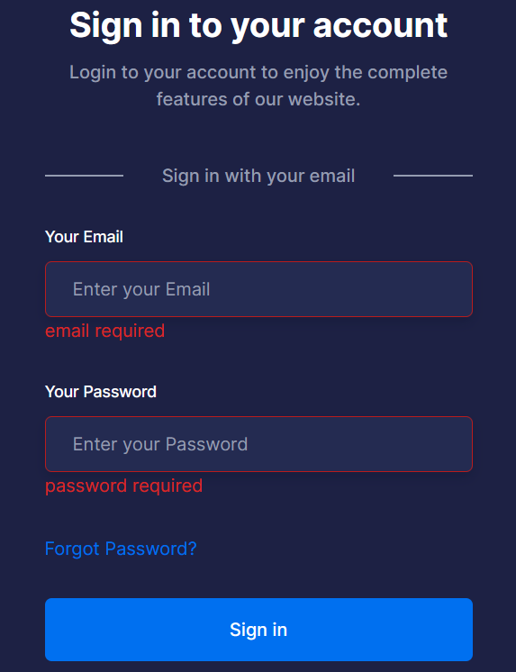

# 项目前置准备

我是按照我最近做个人项目的路径来写的这个教程，所以只会涉及特定的技术栈，但是对于不涉及客户端、游戏的项目来说，也基本够用了。

# 开发技能

## Git相关知识

参考：[git basic](../Git-basic.md)

首先，在本地安装git。然后在命令行中运行：

```bash
ssh-keygen
```

接下来一路enter，也不用设置密钥，然后就会生成一个SSH的密钥对。密钥对的位置在用户主目录`~/.ssh`下，有一个`id_ras`私钥和一个`id_rsa.pub`公钥文件。我们将公钥文件中的内容全部复制下来。

到GitHub的"Settings -- SSH and GPG keys"中，添加一个SSH key，将刚刚复制的公钥文件内容粘贴进去。这样，我们就能在本地对我们自己有权限的GitHub仓库作修改并push到远端了。

可以在GitHub上新建一个仓库，自己的项目的话可以选择private repository。建好之后来到仓库主页，复制code--clone--ssh下的命令：`git@github.com:{USERNAME}/{PROJECT}.git`



然后到自己的本地，用命令行运行：

```bash
git clone git@github.com:{USERNAME}/{PROJECT}.git
```

这样就将项目克隆到本地了，并且和远程的仓库链接了起来。

每次当我们在本地做出改动，可以依次运行：

```bash
git add .
git commit -m "{COMMIT_MESSAGE}"
git push
```

就能将改动push到GitHub远端仓库了。如果我们在远端仓库做出了改动，可以用`git pull`同步到本地。

使用`git diff`可以查看我们本次在本地的改动内容。

可以在仓库中建立一个`.gitignore`文件，```.gitignore```里可以添加不想提交的文件或者文件名匹配格式，比如```output/*```可以忽略output文件夹下的所有文件，这样git就不会对这个文件中的文件进行同步。适用于一些token文件的存储，这些文件我们最好不要同步到远端。比如我们可以将token都放在一个统一的`token.json`文件里进行存储，然后在`.gitignore`文件里添加上`*token.json`

## Linux

参考：[Linux basic](../Linux-from-scratch.md)

Windows可以用[mobaxterm](https://mobaxterm.mobatek.net/)软件进行ssh连接到服务器，连接之后也可以很方便的传文件。



手机可以下载阿里云用SSH工具连接，Mac可以直接用`ssh root@{IP}`进行SSH连接

在命令行中，`cd`和`cd ~`都可以直接来到用户主目录下；`cd ..`返回上一级目录；`cd -`返回到上一次在的目录；`pwd`可以查看当前的绝对路径；`mkdir XXX`可以创建文件夹；`ls`显示目录下的所有文件；`ls -lht`显示所有文件以及对应的权限；`du -h --max-depth=0`可以查看目录下的文件/文件夹大小；删除文件`rm XXX`；删除目录`rm -rf XXX`

按tab键可以快速补全一个命令；上下键可以快速找到之前的命令；如果在命令行启动了某个进程，按`control+c`可以强制结束进程；命令后面加上`| grep XXX`可以对命令的输出进行匹配搜索，比如`pip lists | grep torch`

如果执行某个命令没有权限，可以在前面加上`sudo`代表用超级管理员身份执行。

光标移动到行首：```ctrl+a```；光标移动到行尾：```ctrl+e```；```ctrl + u```：剪切光标位置到行首的文本

`wget {URL}`可以从URL下载文件到本地；`cp {SOURCE} {DEST}`可以复制文件；`mv {SOURCE} {DEST}`是剪切文件，也可以用于重命名文件/目录。

`vim {FILE}`可以打开文本文件进入阅读模式，再按`i`可以进入编辑模式，再按`ESC`退出编辑模式进入阅读模式。如果有改动，在阅读模式下按`:wq`可以退出，如果不想保存，按`:q!`退出，没有改动则直接`:q`退出。最好再看看vim的一些实用命令提高效率。

## Python3

参考：[python](https://www.liaoxuefeng.com/wiki/1016959663602400)

自己多写几个小项目就会熟悉了：[Python-tools](https://github.com/wolverinn/Python-tools)

```py
# 变量类型可以改变
a = ""
a = []

# 常用的实用package
import os
import time
import base64
import json

# 字符串操作
a = "asdf1-23243"
b = a[4:] # 截取
a.strip('34')
a.split('-')
b = a.replace('a', '1') # 替换
b = 3
a = str(b) # int转string
b = int(a) # string转int
b = "the msg is: {}".format(a)

# if
a = None
b = 0
if not a and not b: # 直接判空
    return

# for 循环
a = [1,2,3,4,5]
for x in a:
    print(x)
for index, x in enumerate(a):
    if index == 0:
        continue
    print(x)
for i in range(0,5): # 左闭右开
    print(i)
    
# 函数
def sum(a, b):
    c = a+b
    return c

```

## Next.js

Nextjs是在React基础上的一层框架，一般结合tailwind CSS做样式，同时可以方便的部署到vercel平台，是一个web前端开发的不错的选择。最好的参考就是它的官方文档：[nextjs docs](https://nextjs.org/docs)

首先需要一些JavaScript的基础语法：

```js
let aObj = {
    name: "",
    logged_in: false,
    credits: 0,
} // 可以定义一个object，object可以作为函数的输入/返回参数
if (aObj.logged_in) { // 用括号判断if条件
    console.log("success"); // 语句末尾可以打分号也可以不打
}

async function reqServer() {
    await new Promise((resolve) => setTimeout(resolve, 100)); // 一个实现time.sleep功能的语句，会sleep 100ms
    res = await fetch("https://host.com/path?query=XXX") // 只有在async函数中才能使用await
    if (res.ok) {
        return res.json()
    }
}

resJson = reqServer(); // 调用异步函数之后不会等待返回结果
```

基础的nextjs代码框架直接复制项目模板中的就行，在基础上改。拿到模板项目之后，本地先安装Node，然后进入到项目目录（包含`package.json`），运行`npm install`，就会安装相关的node包依赖到本地的`node_modules`目录下，一般`.gitignore`文件中都会包含`node_modules`文件夹防止巨大的包依赖被上传到git

如果要安装新依赖包，使用`npm install axios`来安装，然后包信息就会自动更新到`package.json`和`package-lock.json`

然后本地运行`npm run dev`就可以运行项目。

### 项目结构

Nextjs 13是默认用的 app router，也就是访问一个路径，比如`/home`，会去`app/home/page.tsx`寻找文件来渲染。nextjs的层级结构是，`app/layout.tsx`控制了所有页面的布局，比如我们有通用的header和footer就是放在这里，主路径`/`的页面是放在`app/page.tsx`中，其他路径就是在`app/`下建立各自文件夹，文件夹名字就是路径名，文件夹中包含一个`page.tsx`，每个`page.tsx`中要`export default XXX`，比如`export default function ExamplePage() {}`

Nextjs同时支持客户端和服务端，不过如果我的项目里只需要nextjs来写前端代码。Nextjs有些特性是专门针对服务端或客户端的。比如它的`useState`状态钩子特性，如果我们在前端页面代码中使用了`useState`等客户端特性，那么在代码文件的第一行，需要用`use client;`注明这是客户端代码。

但是对于好的项目结构来说，一般对于每个页面下的`app/XXX/page.tsx`文件，我们都最好将其保持为服务端代码，而如果实在要用到"use client"的客户端组件，我们可以将这部分代码统一打包放到一个单独的文件中，然后从`page.tsx` import进来，这样，就可以不在`page.tsx`中使用`use client`了，比如：

```tsx
// page.tsx
import {XXXPageClient} from "./client" // 假设将use client的部分全都放进同一目录下的client.tsx中并且export

export default function XXXPage() {
    return (
      <XXXPageClient />
    )
}
```

### 组件的概念

那么在nextjs中具体如何使用代码渲染页面呢，每个页面都可以看作一个函数，直接return对应的html就行，比如我们写一个简单的展示图片的页面`app/example/page.tsx`：

```tsx
"use client";
import Link from "next/link";

export default function ToolShowArea() {
  let outerDivClass =
    "flex justify-between items-center w-full flex-col sm:mt-10 mt-6 border-gray-500 border-b pb-7";
  let originPic =
    "https://replicate.delivery/pbxt/JV7RFNswGhUqe6jQqPBfZDJAAadBqgzPuRStQjY5JsMiucvT/1.jpeg";
  let genPic =
    "https://replicate.delivery/pbxt/1x7zt8yjFS7lGhttgjjvMefcg48bLFxCGABJs61VuIGJktiRA/149fedb2-4f80-11ee-ab94-8204e2f4a193.png";
  let redirect = "/";

  return (
    <>
        <div className="container">
        <div className={outerDivClass}>
            <div className="mt-4 mb-16 flex flex-col space-y-10">
            <div className="max-w-[570px]">
                <h1 className=" text-2xl font-bold text-black dark:text-white sm:text-3xl">
                XXX Tool
                </h1>
            </div>
            <div className="flex flex-col sm:flex-row sm:space-x-8">
                <div>
                <h3 className="mb-1 text-lg font-medium">Original Picture</h3>
                
                </div>
                <div className="mt-8 sm:mt-0">
                <h3 className="mb-1 text-lg font-medium">Generated Picture</h3>
                
                </div>
            </div>
            </div>
            <Link
            className="flex items-center justify-center rounded-md bg-primary py-4 px-9 text-base font-medium text-white transition duration-300 ease-in-out hover:bg-opacity-80 hover:shadow-signUp"
            href={redirect}
            >
            Try
            </Link>
        </div>
        </div>
    </>
  );
}
```

我们首先`export default function XXX`，这样在请求路径`/example`的时候就能找到这个函数进行渲染，然后我们可以用js的语法定义一些变量，并且在html语句中使用`{}`对变量进行引用，最后，我们return回去的html语句就会被渲染出页面，需要注意return中只能包含一个层级，所以我们用`<></>`把下面的层级包了起来。

用到了一些tailwind css语法，其实不用专门去学，有问题再搜索就行；另一个好用的方法就是想实现什么样式就去项目中抄就行了，比如想写一个表单的样式就去看SignIn页面的代码。而且VS-code中可以安装一个Tailwind CSS IntelliSense 插件，可以告诉你某个语句的真实css是什么含义。

在nextjs中，由于每个页面组件都可以写成函数，因此我们可以抽出通用的组件避免重复代码，比如上面的这个`ShowArea`我们就可以将其放到一个通用的组件中，比如放到`components/ShowArea/ShowArea.tsx`中（文件名随便取），并且可以让这个组件接收输入参数，以适配更多场景：

```tsx
"use client";
import Link from "next/link";

export default function ToolShowArea({
  tryButton,
}: {
  tryButton?: boolean;
}) {
  let outerDivClass =
    "flex justify-between items-center w-full flex-col sm:mt-10 mt-6 border-gray-500 border-b pb-7";

  let originPic =
    "https://replicate.delivery/pbxt/JV7RFNswGhUqe6jQqPBfZDJAAadBqgzPuRStQjY5JsMiucvT/1.jpeg";
  let genPic =
    "https://replicate.delivery/pbxt/1x7zt8yjFS7lGhttgjjvMefcg48bLFxCGABJs61VuIGJktiRA/149fedb2-4f80-11ee-ab94-8204e2f4a193.png";
  let redirect = "/";
  let toolName = "XXX Tool";
  if (!tryButton) {
    toolName = "Example"
  }

  return (
    <div className="container">
      <div className={outerDivClass}>
        <div className="mt-4 mb-16 flex flex-col space-y-10">
          <div className="max-w-[570px]">
            <h1 className=" text-2xl font-bold text-black dark:text-white sm:text-3xl">
              {toolName}
            </h1>
          </div>

          <div className="flex flex-col sm:flex-row sm:space-x-8">
            <div>
              <h3 className="mb-1 text-lg font-medium">Original Picture</h3>
              
            </div>

            <div className="mt-8 sm:mt-0">
              <h3 className="mb-1 text-lg font-medium">Generated Picture</h3>

              
            </div>
          </div>
        </div>

        {tryButton && (<Link
          className="flex items-center justify-center rounded-md bg-primary py-4 px-9 text-base font-medium text-white transition duration-300 ease-in-out hover:bg-opacity-80 hover:shadow-signUp"
          href={redirect}
        >
          Try {toolName}
        </Link>)}
      </div>
    </div>
  );
}
```

我们新增了一个`tryButton`的输入参数控制最后的button要不要展示，而在外层，如果我们想使用这个组件，只需要：

```tsx
// 注意这里import的路径直接指定到了文件
import ToolShowArea from "@/components/ShowArea/ShowArea";

export function XXX() {
    return (
      <>
        <ToolShowArea tryButton={true} />
      </>
    )
}
```


因为上面`ToolShowArea`是被以default的方式export的，所以这里import的方式就是直接指定名称就行，而如果我们想要在一个包里面export多个function，比如在`components/ShowArea/ShowArea.tsx`中，我们可以`export function func1; export function func2;`，那么在import的时候，就需要用`{}`指定import的function：

```tsx
import {func1} from "@/components/ShowArea/ShowArea";
```

### 变量状态控制

在上面`ShowArea`组件的代码中，还有一个：

```tsx
{tryButton && (<Link
  className="flex items-center justify-center rounded-md bg-primary py-4 px-9 text-base font-medium text-white transition duration-300 ease-in-out hover:bg-opacity-80 hover:shadow-signUp"
  href={redirect}
>
  Try {toolName}
</Link>)}
```

的写法，这种比较常用于想要控制某个组件是否展示，比如我们想要根据用户是否已登录来展示`Signin`或者`My Account`的不同按钮，就可以用这种写法：

```tsx
"use client";

import Link from "next/link";
import { useState } from "react";
import Cookies from "js-cookie";

export async function userSession(setLogin) {
  await new Promise((resolve) => setTimeout(resolve, 600));
  let sk = ""
  let sk_stored = Cookies.get('session_key')
  if (sk_stored) {
    console.log("get stored session key: ", sk_stored)
    sk = sk_stored
  } else {
    return
  }
  const res = await fetch("https://host.com" + "/api/web/get_session/?session_key=" + sk, {
    method: "GET",
    headers: {
      "Content-Type": "application/json",
    },
  });
  if (res.status !== 200) {
      console.log("get user session error: ", res.status)
  } else {
      let resJson = await res.json();
      if (resJson["logged_in"]) {
          setLogin(true);
      }
  }
}

export default function SigninButton() {
  const [logged_in, setLogin] = useState<boolean>(false);
  userSession(setLogin)
  return (
    <>
      {!logged_in && (
        <>
          <Link
            href="/signin"
            className="hidden py-3 px-7 text-base font-bold text-dark hover:opacity-70 dark:text-white md:block"
          >
            Sign In
          </Link>
        </>
      )}
      {logged_in && (
        <>
          <Link
            href="/account"
            className="flex cursor-pointer items-center justify-between py-2 text-base font-bold text-dark group-hover:opacity-70 dark:text-white lg:mr-0 lg:inline-flex lg:py-6 lg:px-0"
          >
            My Account
          </Link>
        </>
      )}
    </>
  );
}
```


在上面的示例代码中，我们使用了`logged_in`变量来控制到底是展示`Sign In`还是展示`My Account`，可以注意到`logged_in`变量是一个异步返回的值，所以这种写法就不要求在渲染页面的时候就确定好`logged_in`变量的取值，随着后续接口异步调用返回结果，`logged_in`变量的取值改变，页面中渲染的内容也会跟着改变。而相反，如果我们采用`if (logged_in) {}`这种写法，那么在页面渲染完成之后，即使`logged_in`的取值改变，页面内容也不会改变了。

因此这种写法比较适用于包含异步调用的场景，但是在讲异步调用之前，首先，我们需要掌握一个关键用法，那就是nextjs提供的`useState()`，我们可以用`useState()`定义一个变量和其相应的hook，比如：

```tsx
import { useState } from "react";

export function func1() {
    const [uri, setUri] = useState(''); // 第一个变量是变量，第二个可以用来set这个变量
}
```

就定义了一个`uri`变量和`setUri`这个函数用于改变这个变量的值。`setUri`本身也可以作为变量传递到其他函数中。就像上面的`SigninButton()`中将`setLogin`传递到了`userSession()`函数中一样。

有了`useState()`，我们可以实现很多东西，比如如果服务端返回了图片，我们就展示生成的图片，如果没有，就展示默认页面，我们可以定义一个`const [resImg, setResImg] = useState('')`；还有比如说如果用户点击了发送请求要开始请求服务端，我们就展示`...`的文字表示请求中，可以定义一个`const [loading, setLoading] = useState(false);`；然后在html中使用`{loading ? "Sending..." : "Send"}`来控制页面文字。同时，css中也可以使用变量：

```
className={`mt-3 ${loading ? "bg-grey" : "bg-blue"}`}
```

### 发送请求

接下来可以关注nextjs中如何发送接口请求。因为请求都是异步的，所以我们一般都要使用`async function`，在异步函数中进行`await`操作等待接口返回。比如上面的`userSession()`代码我们就使用`fetch`发起了get请求并await了返回结果。

我的项目中发送post请求是使用的`axios`库，一般发送请求和解析结果的写法为：

```tsx
"use client";

import { useState } from "react";
import { useRouter } from "next/navigation";
import axios from "axios";

async function signIn(formData) {
  const router = useRouter();
  const formDataPost = new FormData();
  formDataPost.append("email", formData.email);
  formDataPost.append("password", formData.password);
  const res = await axios("https://host.com" + "/api/web/sign_in/", {
    method: "POST",
    headers: {
      "Content-Type": "application/x-www-form-urlencoded",
    },
    data: formDataPost,
    validateStatus: function (status) {
      // return status < 500;
      return true;
    }
  });
  if (res.status !== 200) {
    console.log("get user session error: ", res.status);
  } else {
    let resJson = await res.data;
    if (resJson["code"]) {
      console.log("get error: ", resJson["code"]);
    } else {
      let sk = resJson["session_key"];
      console.log("login success, session key: ", sk);
      router.push("/account");
    }
  }
}
```

如果发送的不是json encode之后的数据的话，`Content-Type`就要使用`application/x-www-form-urlencoded`，如果发送了图片数据的话，就要使用`multipart/form-data`，使用`res.status`读取http状态码，使用`res.data`获取返回的数据。需要注意axios库默认会将非2xx的状态码作为异常抛出，需要我们进行异常处理，因此如果是非2xx状态码的话，就根本不会走到下面我们判断`res.status`的那一步，所以我们可以指定`validateStatus`，不管什么状态码都返回true，这样就能走到下面。

同时，上面的示例代码中，还展示了重定向的写法，使用`router.push("/path")`就可以实现客户端重定向。

而想要获取异步函数的结果，除了上面`userSession()`中展示的将`setLogin`传递到异步函数中等待函数来设置状态以外，我们还可以使用`useEffect`这个客户端特性。`useEffect`表示在页面加载时仅加载一次，我们可以在它里面等待异步函数的返回：

```jsx
"use client";

import { useEffect } from "react";

//userSession是一个异步函数，会返回一个object
useEffect(() => {
  userSession().then((data) => {
    if (data && data.logged_in) {
      router.push("/");
    }
  });
}, []);
```

### 表单输入

可以看到上面我们使用了箭头函数，也就是`() => {}`这种写法，相当于匿名函数，可以原地定义一个函数，比如说，读取表单输入，我们在nextjs中一般这样写：

```jsx
const [formData, setFormData] = useState({
  email: "",
  password: "",
  vercode: "",
});
<input
  type="text"
  name="vercode"
  onChange={(e) => {
    setFormData({ ...formData, vercode: e.target.value });
  }}
  value={formData.vercode}
  placeholder="Enter verify code"
  className={`w-full rounded-md border ${
    errMsg.vercode ? "border-red1" : ""
  } border-transparent py-3 px-6 text-base text-body-color placeholder-body-color shadow-one outline-none focus:border-primary focus-visible:shadow-none dark:bg-[#242B51] dark:shadow-signUp`}
/>
```

使用`input`元素的`onChange()`属性，我们就可以获取用户在表单中输入的值了。而对于图片上传（包括拖拽上传），也是类似的道理：

```jsx
const [image, setImage] = useState(null);
const [dragging, setDragging] = useState(false);
const onImageUpload = (e) => {
  setImage(e.target.files[0]);
  errMsg.img1 = ""
};

const onDragOver = (e) => {
  e.preventDefault();
  setDragging(true);
};

const onDragLeave = (e) => {
  e.preventDefault();
  setDragging(false);
};

const onDrop = (e) => {
  e.preventDefault();
  const files = e.dataTransfer.files;
  if (files.length) {
    setImage(files[0]);
  }
  setDragging(false);
};
const onClick = () => {
  document.getElementById("img_input").click();
};

<div
  onDragOver={onDragOver}
  onDragLeave={onDragLeave}
  onDrop={onDrop}
  onClick={onClick}
  className={`mt-3 ${
    dragging ? "bg-blue-200" : "bg-blue-100"
  } border-blue flex h-96 w-full cursor-pointer items-center justify-center border border-dashed`}
>
  {image && (
    
  )}
  {!image && (
    <p className="justify-center text-center">
      Click to upload <br /> Or <br /> Drag and drop your image
      here
    </p>
  )}
  <input
    id="img_input"
    type="file"
    accept="image/*"
    onChange={onImageUpload}
    className="text-gray-700 focus:shadow-outline hidden w-full appearance-none rounded border py-2 px-3 leading-tight focus:outline-none"
  />
</div>
```



对于表单提交之后的处理，一般对`<form>`添加`<form onSubmit={}>`来实现，或者不使用`form`，直接在`<button onClick={}>`中添加函数进行处理，然后在处理的函数中，就可以读取刚刚设置的输入值、发送请求等。

### 表单校验

除此之外，我们还需要对表单进行校验，比如校验为空输入，我们就需要用红色文字提示用户哪些输入部分是必填。而在用户点击提交之后，用红色文字提示也很简单：

```jsx
"use client";

import Link from "next/link";
import { useState } from "react";

const ResetPassPage = () => {
  const [formData, setFormData] = useState({
    old_pass: "",
    new_pass: "",
  });
  const [loading, setLoading] = useState<boolean>(false);
  const [sendMsg, setSendMsg] = useState("");
  const [errMsg, setErrMsg] = useState({
    oldpass: "",
    newpass: "",
  });

  async function resetPassword() {
    let validateForm = {
      oldpass: "",
      newpass: "",
    };
    setErrMsg(validateForm);
    if (!formData.old_pass) {
      validateForm.oldpass = "password required";
    }
    if (!formData.new_pass) {
      validateForm.newpass = "password required";
    }
    setErrMsg(validateForm);
    for (let [key, value] of Object.entries(validateForm)) {
      if (value) {
        console.log("field required");
        return;
      }
    }
    setLoading(true);
    // some logic here
    setLoading(false);

  const handleResetPass = async (e) => {
    e.preventDefault();
    resetPassword();
  };

  return (
    <>
      <section className="relative z-10 overflow-hidden pt-36 pb-16 md:pb-20 lg:pt-[180px] lg:pb-28">
        <div className="container">
          <div className="-mx-4 flex flex-wrap">
            <div className="w-full px-4">
              <div className="mx-auto max-w-[500px] rounded-md bg-primary bg-opacity-5 py-10 px-6 dark:bg-dark sm:p-[60px]">
                <h3 className="mb-3 text-center text-2xl font-bold text-black dark:text-white sm:text-3xl">
                  Change password
                </h3>
                <div className="mb-8">
                  <label
                    htmlFor="old_pass"
                    className="mb-3 block text-sm font-medium text-dark dark:text-white"
                  >
                    {" "}
                    Old Password{" "}
                  </label>
                  <input
                    type="password"
                    name="old_pass"
                    onChange={(e) => {
                      setFormData({ ...formData, old_pass: e.target.value });
                      if (formData.old_pass.length >= 0) {
                        errMsg.oldpass = "";
                      }
                    }}
                    value={formData.old_pass}
                    placeholder="Enter your old password"
                    className={`w-full rounded-md border ${
                      errMsg.oldpass ? "border-red1" : ""
                    } border-transparent py-3 px-6 text-base text-body-color placeholder-body-color shadow-one outline-none focus:border-primary focus-visible:shadow-none dark:bg-[#242B51] dark:shadow-signUp`}
                  />
                  <span className="text-red">{errMsg.oldpass}</span>
                </div>

                <div className="mb-8">
                  <label
                    htmlFor="new_pass"
                    className="mb-3 block text-sm font-medium text-dark dark:text-white"
                  >
                    {" "}
                    Your New Password{" "}
                  </label>
                  <input
                    type="password"
                    name="new_pass"
                    onChange={(e) => {
                      setFormData({ ...formData, new_pass: e.target.value });
                      if (formData.new_pass.length >= 0) {
                        errMsg.newpass = "";
                      }
                    }}
                    value={formData.new_pass}
                    placeholder="Enter your new Password"
                    className={`w-full rounded-md border ${
                      errMsg.newpass ? "border-red1" : ""
                    } border-transparent py-3 px-6 text-base text-body-color placeholder-body-color shadow-one outline-none focus:border-primary focus-visible:shadow-none dark:bg-[#242B51] dark:shadow-signUp`}
                  />
                  <span className="text-red">{errMsg.newpass}</span>
                </div>
                <div className="mb-6">
                  <button
                    onClick={handleResetPass}
                    className="flex w-full items-center justify-center rounded-md bg-primary py-4 px-9 text-base font-medium text-white transition duration-300 ease-in-out hover:bg-opacity-80 hover:shadow-signUp"
                  >
                    {loading ? "Processing..." : "Reset Password"}
                  </button>
                </div>
              </div>
            </div>
          </div>
        </div>
      </section>
    </>
  );
};

export default ResetPassPage;
```

上面的代码中，我们在每个`input`的下方，都创建了一个`<span>`用于展示错误提示信息，当用户点击提交按钮的时候，我们会对表单输入进行校验，如果为空，则会对`errMsg`进行赋值，从而使得`<span>`中的错误提示能够展现出来，同时，`<input>`输入框的边框颜色也会判断`errMsg`中是否有错误信息来展示默认颜色或者是红色。除此之外，当我们用红色提醒了用户，而之后用户重新在输入框中输入时，我们也要在输入框的`onChange()`中及时取消掉红色提醒，将对应的`errMsg`置为空。



可以看到上面在`input`的`className`中的`border-red1`属性将边框置为了红色，这是tailwind css的个性化颜色配置，具体可以参考：[customizing-colors](https://tailwindcss.com/docs/customizing-colors)。要配置个性化颜色，我们需要在项目的`tailwind.config.js`文件中，添加`colors`：

```js
module.exports = {
  content: [
    "./app/**/*.{js,ts,jsx,tsx}",
    "./pages/**/*.{js,ts,jsx,tsx}",
    "./components/**/*.{js,ts,jsx,tsx}",],
  darkMode: "class",
  theme: {
    colors: {
      current: "currentColor",
      transparent: "transparent",
      white: "#FFFFFF",
      black: "#090E34",
      dark: "#1D2144",
      primary: "#4A6CF7",
      yellow: "#FBB040",
      red: "#dc2626",
      red1: "#b91c1c",
      "body-color": "#959CB1",
    },
    extend: {},
  },
  plugins: [],
};
```

发送了表单请求之后，我们可能还希望加上的一个功能点是在网页上toast提示用户请求成功或者请求失败，以及失败的原因。这个时候可以使用一个[第三方库](https://blog.logrocket.com/using-react-toastify-style-toast-messages/)，很方便的实现这个功能，我们只需要：

```sh
npm install react-toastify
```

使用方式为，首先需要import这两行

```jsx
import { ToastContainer, toast } from "react-toastify";
import "react-toastify/dist/ReactToastify.css";
```

然后在页面/组件的html代码中加入：

```jsx
<ToastContainer />
```

使得toast可以正常渲染。最后在希望弹出toast的地方调用：

```jsx
// error
toast.error("Internal Error", {
    position: toast.POSITION.TOP_RIGHT,
});
// success
toast.success("success", {
  position: toast.POSITION.TOP_RIGHT,
});
```


### spinner组件

除了toast组件之外，另一个实用的组件是在loading的时候展示一个不断转圈的图案，也就是一个loading spinner，这个我们可以很方便的用`nextui-org`包下的spinner组件实现，而要在项目中使用`nextui-org`包，参考它官网的安装方式：[installation](https://nextui.org/docs/guide/installation)，注意最好保持本地的nodejs版本和项目的next包版本为最新，避免报错；spinner组件的官网使用示例：[spinner](https://nextui.org/docs/components/spinner)

比如我们可以在代码中，写一个提交按钮，和一个spinner组件，当用户点击前，展示提交按钮，不展示spinner，点击后，设置loading状态，隐藏提交按钮，展示spinner：

```tsx
// import {Spinner} from "@nextui-org/react";
// const [loading, setLoading] = useState<boolean>(false);
<button
  onClick={onSubmit}
  className={`disabled:bg-gray-400 ${loading? "hidden": ""} flex w-full items-center justify-center rounded-md bg-primary py-4 px-9 text-base font-medium text-white transition duration-300 ease-in-out hover:bg-opacity-80 hover:shadow-signUp`}
>
  Generate
</button>
{loading && (
  <>
    <Spinner label="Loading..." color="primary" className="flex relative py-2" />
  </>
)}
```


还有两个常用的函数，一个是查询当前页面的path，一个是查询当前url中的query parameters，用法如下：

```tsx
import { usePathname } from 'next/navigation';
import { useSearchParams } from "next/navigation";

export function XXPage() {
    // 比如当前页面路径为host.com/signin, 下面会得到"/signin"，trim之后得到“signin”
    const pathname = usePathname().trim().replace('/', '');
    console.log("pathname: ", pathname)
    
    // 比如页面url为host.com/signin?redirect=/rpbg, 下面会得到"/rpbg"
    const searchParams = useSearchParams();
    const redirect = searchParams.get("redirect") || "";
    console.log("redirect param: ", redirect);
}
```

最后，说一下nextjs的页面SEO，只需要知道页面的标题如何展示、metadata如何编写，以及网站的icon如何展示。首先，网站的favicon，我们需要把icon文件`.ico`等格式的图片放到`/app`目录下，并且命名为`/app/icon.ico`，然后在`/app/layout.tsx`文件的`head`部分，使用如下head：

```tsx
<>
  <title>AIGC Image Tolols - ZLAI</title>
  <meta content="width=device-width, initial-scale=1" name="viewport" />
  <meta name="description" content="ZLAI is a cutting-edge, AIGC powered web application for image processing." />
  <link rel="icon" href="/icon.ico" />
</>
```

### title和metadata

上面就是整个网站的favicon、标题。至于每个页面的[标题和metadata](https://www.slingacademy.com/article/next-js-how-to-set-page-title-and-meta-description/)，我们需要到每个页面的`page.tsx`中去添加，首先，我们需要保证这个文件没有使用`use client`，具体方法上面说过了。然后，我们可以在这个文件中这样添加metadata和title：

```tsx
import { Metadata } from "next";

export const metadata: Metadata = {
  "title": 'Sign In | ZLAI',
  "description": 'ZLAI signin page',
}
```

## Django

Django是一个基于python的web服务端框架，我们可以用它来写后端。具体的django教程可以参考：[django系列教程](https://www.jianshu.com/nb/30051783)

首先需要安装python3，然后`pip3 install django django-cors-headers`，然后本地创建一个新的django项目或者使用已有的。django项目的目录结构大致如下：

```
- manage.py
- requirements.txt
- db.sqlite3
- project_dir // 随便取项目名字
   |--setttings.py // 一些配置项，比如db、缓存、邮件、app等
   |--urls.py // 注册路由path
- app_dir // 这里随便取app的名字
   |
   |--urls.py // 注册path和对应的handler，需要从project_dir下的urls.py路由过来
   |--handler.py // 存放handler的处理函数，默认叫做views.py
   |--models.py // 存放sql表定义
   |--admin.py // 注册管理后台可以管理的sql表
```

从`project_dir/urls.py`将path路由到`app_dir/urls.py`的方法如下：

```py
from django.urls import path,include

urlpatterns = [
    path('zlai/',include('app_dir.urls')),
]
```

之后在`app_dir/urls.py`注册新path的方法如下：

```py
from django.urls import path
from . import handler

urlpatterns = [
    path('api/test/', handler.json_test),
]
```

每个path都指定了一个函数进行处理，`handler.py`中的处理逻辑：

```py
from django.http import JsonResponse
def json_test(request):
    # 解析request
    wx_code = request.POST.get("code")
    session_key = request.POST.get("session_key")
    # response
    data = {
        "data": session_key,
    }
    return JsonResponse(data)
```

有时候我们也需要用到数据库，django项目的默认数据库是本地的sqlite3，我们也可以在`settings.py`中设置远程的数据库。要新增表需要先在`models.py`中增加表结构定义，比如：

```py
from django.db import models

# Create your models here.
# user
class User(models.Model):
    uid = models.AutoField(primary_key=True)
    wx_openid = models.CharField(max_length=256)
    session_key = models.CharField(max_length=256, db_index=True)
    email = models.EmailField(null=True, db_index=True)
    send_to_mail = models.BooleanField(null=True)
    password = models.CharField(db_index=True, max_length=30)
    credits = models.FloatField(default=10.0)
    credits_updated_at = models.DateTimeField(auto_now=True)
    extra = models.TextField(null=True)
```

新增了表结构之后，需要在命令行中运行：

```sh
python3 manage.py makemigrations
python3 manage.py migrate
```

之后在代码中对表进行增删查改，参考：[Django中数据库的使用](https://www.jianshu.com/p/eb9d5136ee92)

# 代码框架

先介绍一下这次我使用到的技术栈，具体的用法之后再详细介绍

1. 服务端

server我用的框架是python的网络框架django

2. 前端

前端用的nextjs+tailwind css+nextui
