# 前后端完整模板

实时体验：https://image.stable-ai.tech/

所有前端页面都已适配手机端，并且包含基本的组件，比如表单校验、toast提示、loading动效等等。

目录：

* [首页](#首页)
    * [第一屏](#第一屏)
    * [网站介绍-样式1](#网站介绍-样式1)
    * [网站介绍-样式2](#网站介绍-样式2)
    * [充值介绍](#充值介绍)
    * [提交工单](#提交工单)
    * [Footer](#footer)
    * [下拉菜单](#下拉菜单)
* [功能主页面](#功能主页面)
* [登录/注册页面](#登录注册页面)
* [个人中心（登录后）](#个人中心登录后)
* [案例展示页面](#案例展示页面)
* [充值页面（登录后）](#充值页面登录后)
* [关于、联系我们、FAQ](#关于联系我们faq)
* [付费版模板与免费版对比](#付费版模板与免费版对比)

# 首页

## 第一屏

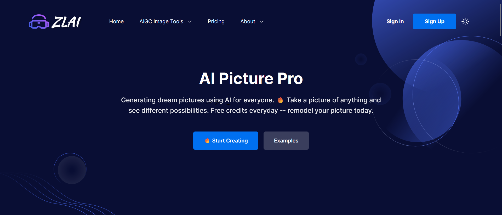

其中用户登录之后，右上角的"Sign in/Sign up"会变为"My Account"，点击可进入个人中心。

## 网站介绍-样式1

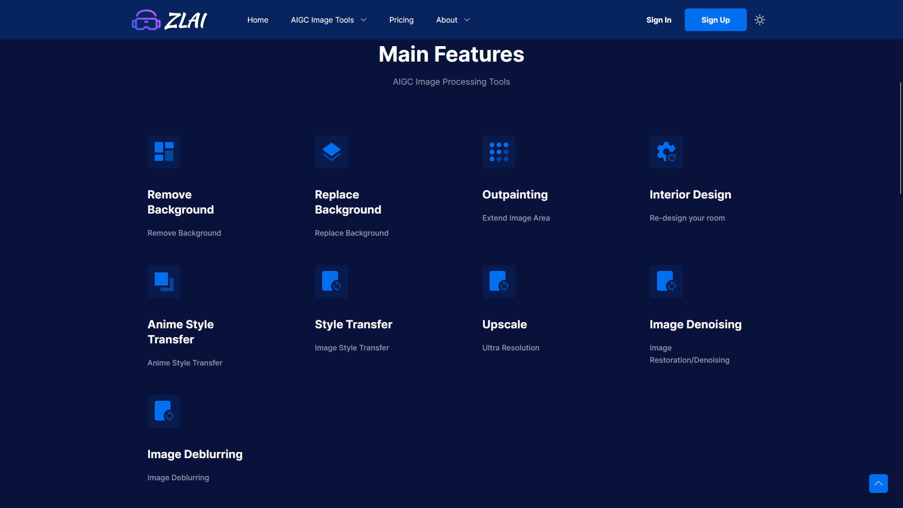

点击对应标题可以跳转到具体的功能页面。

## 网站介绍-样式2

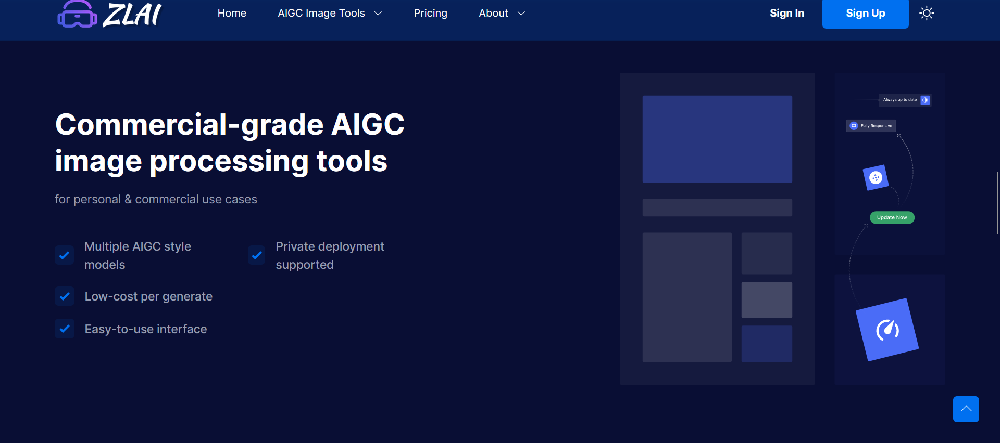

## 充值介绍

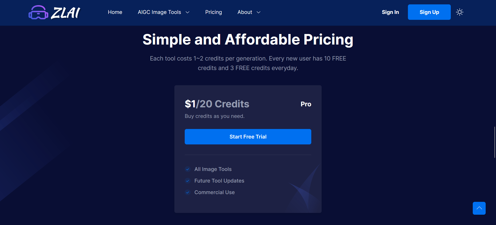

未登录状态下展示"Start Free Trial"点击登录，登录状态下可直接充值。

## 提交工单

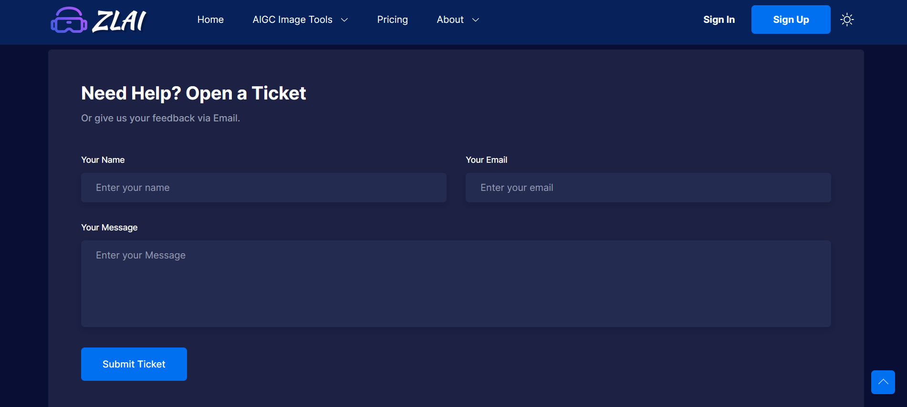

## Footer

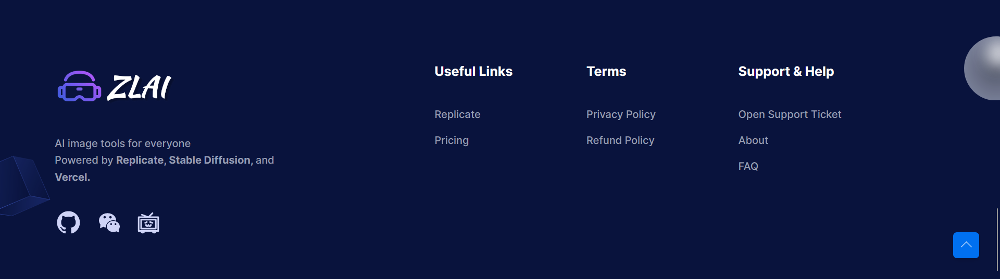

## 下拉菜单

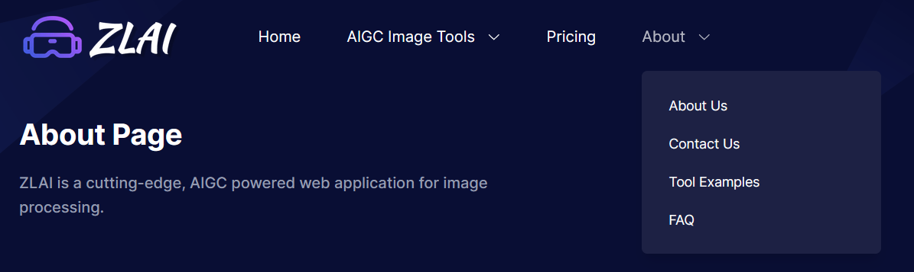

# 功能主页面

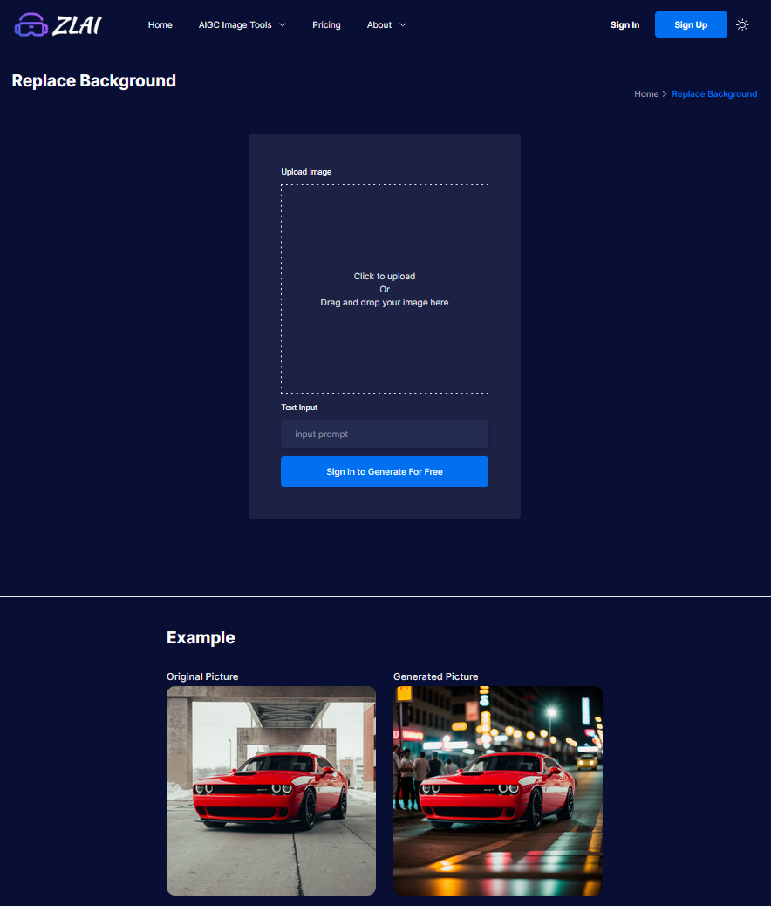

# 登录/注册页面

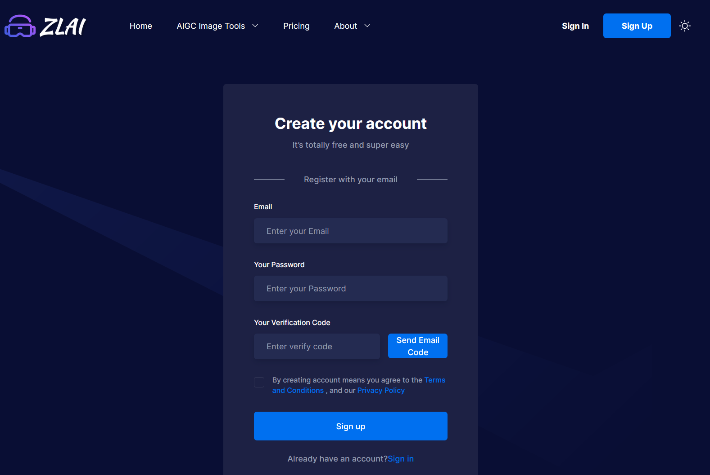

# 个人中心（登录后）

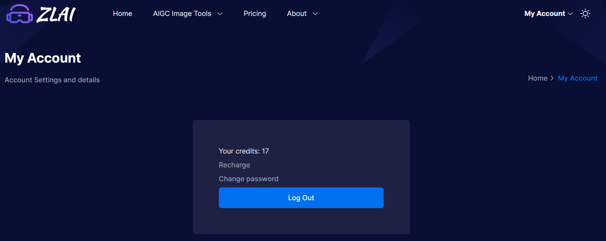

# 案例展示页面

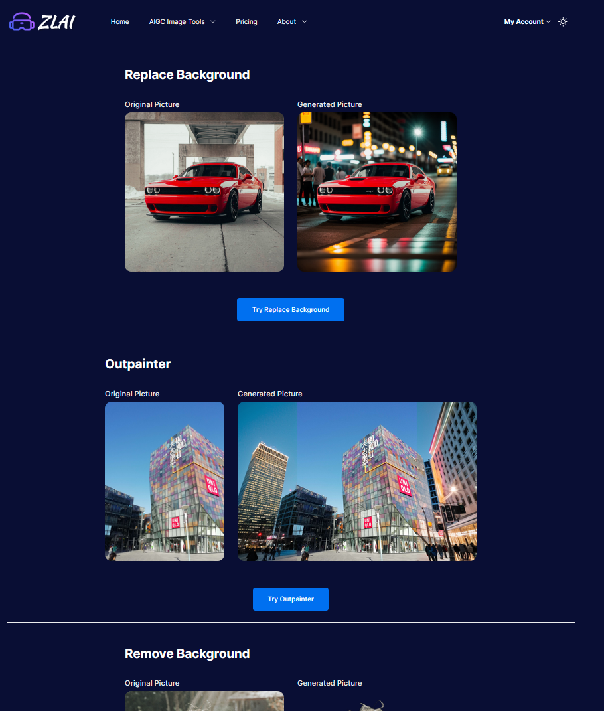

# 充值页面（登录后）

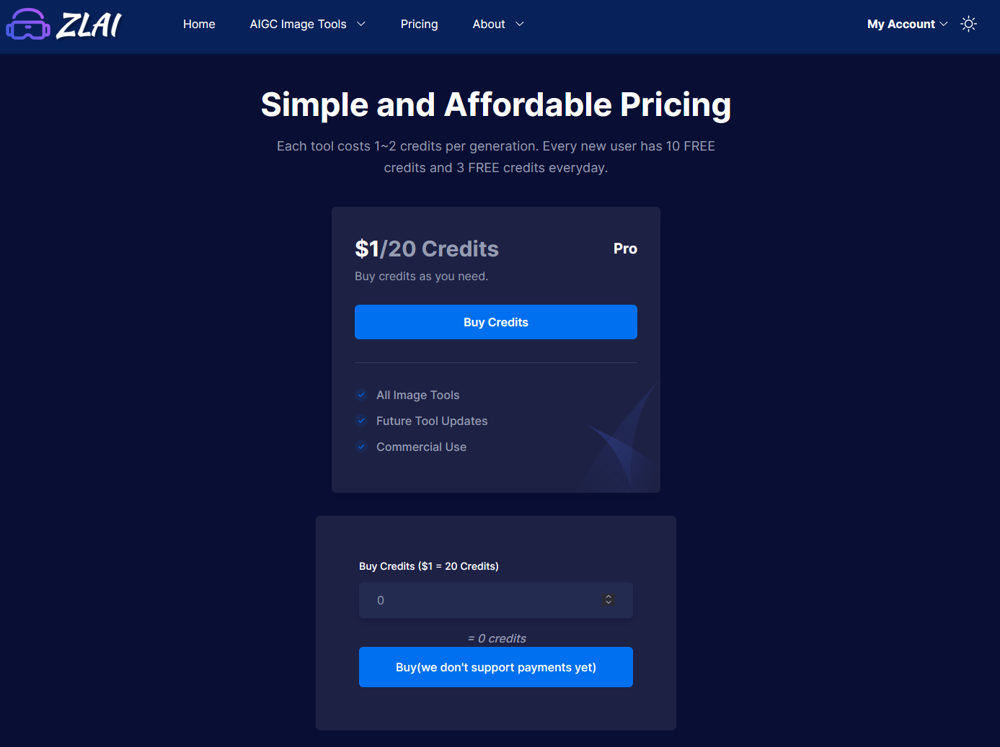

# 关于、联系我们、FAQ页面

关于和联系我们页面与主页展示的差不多，这里就不放图了。FAQ页面：

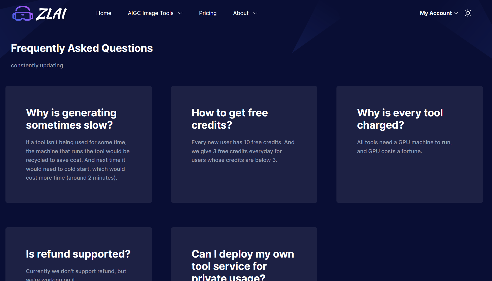

# 付费版模板与免费版对比

## 免费版

1. 登录态

免费版没有登录后的展示逻辑，包括功能页面、充值页面、个人中心。免费版模板只能看到登录前的页面，且没有登录功能

2. 登录/注册页面

免费版有登录注册页面，但是点击按钮无法登录，也没有注册页面发送邮件验证码的逻辑

3. 接口频控
   
免费版的服务端没有接口频控逻辑

4. 额度扣减

因为没有登录后的逻辑，所以免费版也没有额度计算的逻辑

## 付费版

付费版有着全面的功能，包括：

- 未登录下展示引导登录文案，登录后可进行操作
- 有着全面的登录注册、发送验证码、修改密码的逻辑
- 有额度赠送、额度扣减的逻辑
- 接口频控
- 功能主页面可使用（提供了去除背景、背景替换的功能，需要其他功能可以联系我）
- 保存用户生成历史，图片上传到对象存储
- 接入了stripe的收银台，点击支付可以跳转到收银台（支付回调通知需要自己接入）
