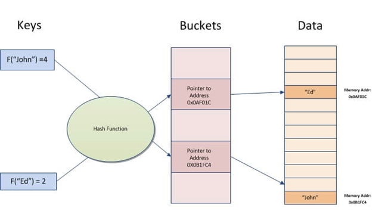
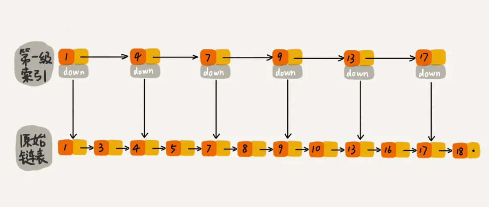
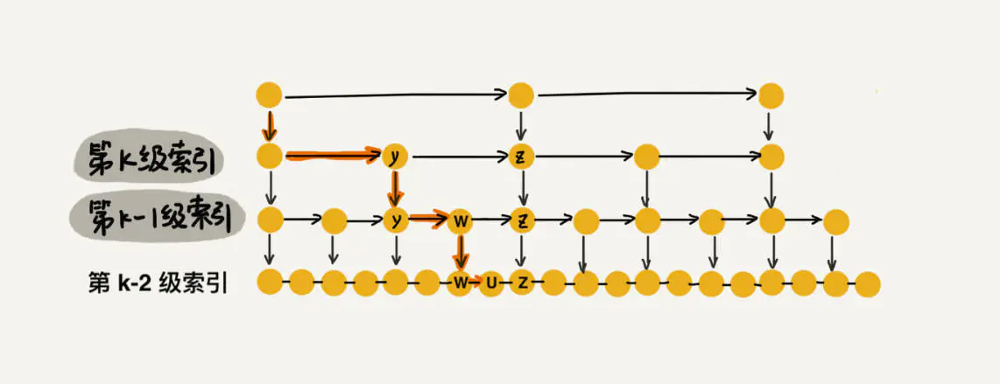

# 数据库中常用索引介绍

这篇文章准备对几种数据库中常用的索引进行介绍并进行对比：

*   跳表 Skip List
    
*   B+树
    
*   LSM树
    
索引其实就是数据的一种组织形式，它的目的是让我们能够高效的定位到一条记录。但是没有一种索引能够完美的满足所有场景的要求，比如**时间/空间复杂度、写入性能、磁盘查找性能、范围查找等等要求**。因此对于有不同场景要求的数据库，也就使用了各自不同的索引方式。

本文选取了一些常用数据库中使用的索引方式，对这些索引的特性进行介绍，你会发现它们有一些相似之处，而它们之间的差异也都是为了解决各自特定的问题。

  

# 哈希索引

在进入主题之前，我们可以先来看一下最熟悉的hash索引方式，更好的理解为什么我们需要适用于不同场景的其他索引方式。

哈希索引底层采用一个数组，定位一条元素时，首先通过一个hash函数计算得到数组下标，然后直接通过下标到数组中索引到对应的元素，时间复杂度是O(1)

  

哈希索引看起来已经很完美了，但其实，它适用的场景依然是有限的：

*   它的数据操作只适用于**纯内存场景**，如果数据量太大需要使用硬盘存储，则无法使用hash索引的方式来组织
    

*   只能适用于**精确查找**元素，不能支持范围查询
    

  

上面两个场景显然就无法满足MySQL的需求，因为MySQL一般数据量比较大，一个库可能有几百GB，并且需要支持where语句中`a > ?`这类的范围查询，因此，MySQL不能使用hash索引来组织数据。

  

但是，上述场景却能满足Redis的需求，Redis是纯内存数据库，并且是一个key-value型数据库，查找键值对时只需要精确查找，因此，整个Redis的键值对空间就是使用的hash表来存储。

  

# Skip List 跳表

## 原理

跳表的原始数据是存放在一个**有序链表**中的，但是这样查找效率很低。为了提高查找效率，我们可以每隔几个元素就抽出来加一层索引，指向原始链表，如图：

这样查找元素需要遍历的次数就少了很多，当数据量变多时，第一级索引的链表长度也会变得很长，因此我们可以为每一级索引再建一层索引，最终会建立多层索引：

如果每隔两个元素就抽出来往上建立一层索引，那总的层数就是`logn`，查找一个元素，时间复杂度就是【总层数\*每一层需要遍历的元素个数】。由于每层最多只会遍历不超过三个元素（因为我们是每两个元素就往上抽出一层索引），因此查找的时间复杂度就是**O(logn)**。

  

插入/删除操作的时间复杂度这里就不分析了，其实主要还是跟层数有关，都是O(logn)

  

## 场景

跳表其实就是一个支持二分查找的有序链表。相比哈希索引，它的时间复杂度有所上升，但是由于底层是有序链表，使得其可以支持范围查找（定位到起点，在原始链表中往后遍历就行了），因此适用于**既需要精确查找也需要范围查找**的场景。

  

Redis中的有序集合这种数据结构，就需要支持精确查找与范围查找，并且数据都是存放在内存中，因此底层采用跳表非常合适。

  

除此之外，跳表实现起来也比红黑树之类的简单得多，因此，如果我们需要一种底层有序、查找时间复杂度低的数据结构，跳表就是一种不错的选择。

  

# B+树

## 原理

B+树的最底层数据，可以看成是一个有序链表，为了能够快速定位到一个元素，将这个链表分为了很多组，每一组包含了多条数据，我们这里就用MySQL中的实现方式，将这些分组称为“数据页”，也就是，底层的有序链表被分在了多个数据页中。

  

一个数据页中能存放的记录条数跟记录的大小有关，假设一个数据页是16KB，一条记录是100Byte，那么一个数据页内就能存下大约160条记录。

  

如果有上百万条记录，那么这个时候底层链表分组得到的数据页依然会很多，因此我们可以为这些数据页建立一个上层的目录项，目录项依然以数据页的形式进行组织，目录项中不包含具体的记录数据，只包含每个数据页中最小的一条记录的值大小以及指向对应数据页的指针：

  

  

这样定位一条记录的过程就是：先从目录项定位到所在的数据页，再在数据页中定位到记录。

  

当记录条数不断增多，存储目录项的页也会增多，所以不得不在目录项的上层再添加更多的目录项，最终，记录和目录项就组成了一个B+树：

  

## 场景

可以看出，B+树的设计思想与跳表有一些相似的地方，底层都是有序链表（支持范围查询），并且都对其进行了分组，每一组数据往上抽出了一层索引。但不同之处在于，跳表还是一种纯内存的数据结构，而B+树的数据组织方式使其对于与磁盘交互的场景非常适合。

  

在与磁盘交互的场景下，B+树可以以数据页为单位从磁盘读取数据，根据空间局部性原理，可以**减少后续频繁读取磁盘**。

  

同时，B+树的目录项（非叶子节点）中不存放具体的记录，只存放用于比较大小的值以及对应的指针，使得目录项可以存放更多的数据，在数据多的时候，能够保持树的层数更少，使得B+树更加矮胖。

假设非叶子节点的一个数据页可以存放1000条记录，而叶子节点中一个数据页可以存放100条记录，那么一个层数为4的B+树已经可以存放：1000^3\*100条记录。

  

如果读取一个数据页需要一次磁盘IO，那么一次查找元素的操作所需要的磁盘IO次数，其实就是B+树的层数，而B+树尽量做到了矮胖，因此**大大减少了磁盘IO次数**。在实际应用中，B+树基本上4层就够用了。

  

对于MySQL，它的索引需要支持两大场景：

*   高效的基于磁盘的查找：因为MySQL存储的数据量是很大的，并且支持事务（持久化特性），也就意味着数据存储要和磁盘交互，因此需要一种能够基于磁盘快速查找的索引方式，能够减小索引一条数据的过程中的磁盘IO次数
    

*   支持范围查询
    

  

因此，B+树就非常适用于存放MySQL的聚簇索引和二级索引

  

# LSM树

## 原理

LSM树的数据存储分为两部分，新写入的数据存放在内存的**Memtable**中，Memtable可以是任何一种有序的数据结构，比如跳表、红黑树等，因此，Memtable中的数据已经是有序的，可以按照O(logn)的时间复杂度查找元素。

  

当Memtable中的数据达到某个阈值时，会将其中的数据写入到磁盘中，然后在内存中使用一个新的Memtable用于后续数据的写入。

由于Memtable本身是有序的，因此可以直接往磁盘顺序写数据，写入的文件内部也是有序的，这种基于仅追加写的、数据有序的文件叫做**排序字符串表（Sorted String Table）**，简称 `SSTable`

  

随着数据的不断累积，将会产生越来越多的Segment，因此需要进行段文件的合并。合并时，因为段文件内部都是有序的，因此可以使用**归并排序**的方式对其进行合并，时间复杂度为O(n)。

合并过程中，对于重复的key仅保留键值对的最新数据，因此，合并后的文件大小也会变小。

  

当需要查找一条数据时，首先会从Memtable中查找，Memtable中没找到会去SSTable中查找，在每一个段文件内部，因为是有序的，所以查找效率是 $$$$O(\\log n)$$$$，但是因为段文件很多，一个个找并不现实，因此实际上还会在内存中维护一个**稀疏索引（sparse index）**，仅对各个段文件开头的一条数据做索引。

  

有了稀疏索引之后，可以先在索引表中使用二分查找快速定位某个 key 位于哪一个段文件中，然后仅从磁盘中读取这一块数据即可获得最终查询结果。

  

## 场景

LSM树的最大一个特点就是极高的**写入性能**，因为它每次将Memtable写入磁盘时，都是仅在文件末尾进行追加写入，这种追加形式的写入符合磁盘的物理特性（顺序写入），写入时磁盘无需进行寻址，因此比随机写入更加的高效。

  

和MySQL使用的B+树相比，LSM树的查询效率无法达到理想的O(logn)，但仍然可以接受；而在写入方面，B+树每次插入一条数据，理论上都需要一次磁盘随机IO，LSM树相当于是牺牲了一部分查询效率，换来了极高的写入效率。因此，LSM树**适用于频繁写**的场景，比如日志型数据库。

  

# 参考

*   [Skip List--跳表 - 简书](https://www.jianshu.com/p/9d8296562806)
* 本仓库的MySQL系列