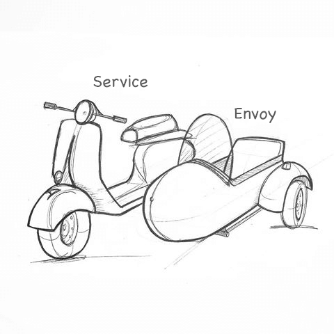
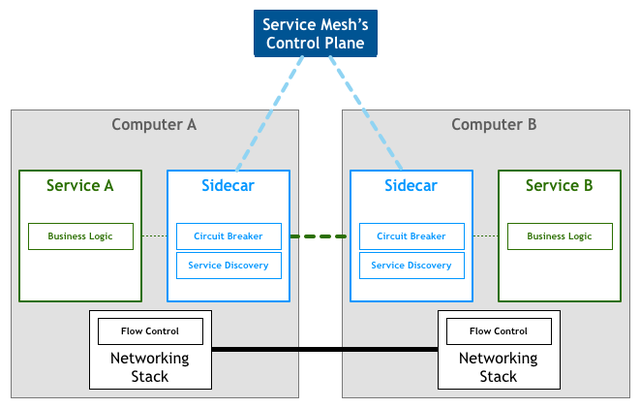

# Service Mesh

# 什么是Service Mesh

Service Mesh是一个***基础设施层*****，用于处理服务间通信**。在实践中，Service Mesh 通常以轻量级网络代理的形式实现，这些代理与应用程序代码部署在一起，对应用程序来说无需感知代理的存在。

  
# 为什么需要Service Mesh

随着微服务架构的兴起，服务与服务之间有了依赖和关联，微服务除了关注业务逻辑外，还需要开始关注一些更基础的功能，比如：

*   负载均衡
    
*   服务发现

*   流量调度

*   认证授权

*   监控追踪

*   流量控制

*   服务熔断

*   ...

最初，这些服务注册、服务发现、负载均衡、安全治理等功能均实现在服务框架中，由框架团队维护开发，业务方依赖于服务框架，再实现相应的业务逻辑。但是人们逐渐意识到以下问题：

*   **语言碎片化**

微服务编程语言比较分散（Go/Python/Java/C++/Rust...），微服务框架的一些功能（服务发现、服务治理）需要使用每种语言实现一遍，这将会导致巨大的开发成本和维护成本。而且由于语言本身的差异，各种服务治理规则无法完全对齐。

*   **更新困难**

推动用户升级框架往往是一件非常困难的事情，框架以lib形式集成在业务代码中，没有解耦。

*   **协议多样化，难兼容**

线上的流量是HTTP, Thrift, gRPC, MySQL等协议并存。流量的协议不一样，但很多流量管理的需求却是类似的，如超时配置、跨机房流量调度等，开发者很想对不同的协议施加统一的管理能力。

*   **服务治理消耗巨大**

以Python为例，Python是一种解释性语言，它的性能是向来被人诟病的。上述超时控制、熔断、限流等一系列服务治理规则用python实现一遍，资源消耗非常高。

*   **业务侵入性强**

框架向业务程序注入了很多与业务无关的代码。服务发现、治理在业务进程中，影响性能和问题排查。

为了解决微服务的一系列问题，大佬们提出了 Sidecar Pattern。

**边车模式**，将应用程序的组件部署到单独的进程或容器中以提供隔离和封装。

服务治理等一系列功能被抽离出来，单独实现成一个应用程序。该应用程序与服务以 Sidecar 模式部署到一起，与服务共享相同的生命周期，**接管和代理服务的所有流量**，为服务完成服务注册、服务发现、限流熔断、过载保护、流量调度等功能。

  

# Service Mesh的原理

主要可以分为**数据面（data plane/proxy/****sidecar****）、控制面（control plane）**两部分

## 数据面

服务启动时会在同一个pod中启动这么一个proxy进程，作用是替代了原来通过sdk来做的一些流量代理工作，proxy在内部通过socket与业务进程通信，代理整个服务的入流量和出流量。

服务仅与接管服务流量的 Proxy 交互，而服务与服务之间不再是直接通信，而是通过 Proxy 相互通信。众多 Sidecar 容器组成了一张网格，这就是所谓的 Service Mesh。

## 控制面

> 控制面与proxy交互，告知proxy需要的服务发现、服务治理规则等信息

通过服务平台设置的治理规则修改会通过http请求最终落库，control plane会每隔5s刷新治理规则的数据到本地缓存中。

控制面采用了以下手段保证稳定性：

*   **多级缓存**

*   **异步刷新**：仅首次获取规则同步请求控制面，后续每隔 x 秒异步拉取规则。